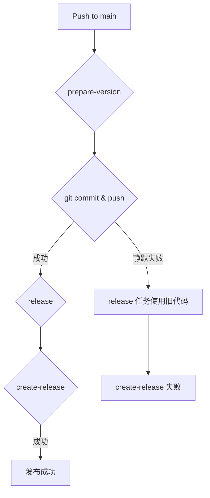

## 产品概述

本计划旨在修复 `.github/workflows/release.yml` 中的自动化发布工作流。当前工作流在持续集成(CI)通过后，无法可靠地创建新的 GitHub Release，导致版本发布停滞。

## 核心功能

- **可靠的发布创建**: 确保在代码合并到 `main` 分支并且 CI 成功后，能够自动、可靠地创建 GitHub Release。
- **明确的错误处理**: 修复 `prepare-version` 任务中 `git push` 命令的静默失败问题，当推送失败时，工作流应立即以失败状态终止。
- **工作流状态可见性**: 保证版本号更新和标签推送的任何失败都会在 GitHub Actions 的检查中明确标识为失败，以便快速定位问题。

## 技术栈

- **核心技术**: GitHub Actions
- **配置文件格式**: YAML

## 技术架构

`release.yml` 工作流由三个主要任务 (`jobs`) 组成：`prepare-version`, `release`, 和 `create-release`。它们按顺序依赖执行，以完成版本计算、构建和最终发布。

- `prepare-version`: 负责计算下一个版本号，更新项目文件（如 `package.json`, `Cargo.toml`），然后提交这些变更并创建一个新的 git 标签，最后将提交和标签推送到 `main` 分支。
- `release`: 等待 `prepare-version` 成功后，在多个平台（Linux, macOS, Windows）上并行构建应用。
- `create-release`: 等待 `release` 任务成功构建所有产物后，下载这些产物并创建一个新的 GitHub Release。

### 数据流和问题点



当前的问题出在 `C (git commit & push)` 步骤。在第 107 和 114 行，`git push` 命令即使因为分支保护规则等原因失败，也不会使整个步骤失败。这导致工作流继续执行 `D (release)` 任务，但使用的是旧的、未经版本更新的代码，最终导致 `G (create-release 失败)`，因为找不到预期的版本标签。

## 解决方案

为了解决此问题，我们将修改 `prepare-version` 任务中的 `run` 脚本，为 `git push` 命令添加显式的错误处理。如果推送失败，脚本将以非零状态码退出，从而使该步骤和整个工作流失败。

### 关键代码修改

将在 `.github/workflows/release.yml` 文件的 `prepare-version` 任务中进行以下修改：

```
# 在第 106 行之后
- name: Commit and push changes
  run: |
    # ... git commit 命令 ...
    if git diff --staged --quiet; then
      echo "No version changes to commit"
    else
      git commit -m "chore: bump version to $VERSION [skip ci]"
      # 为 git push 添加错误处理
      git push origin main || { echo "Failed to push commit to main. Check branch protection rules and token permissions."; exit 1; }
      echo "Pushed version bump commit"
    fi

    # 在第 113 行之后
    if ! git rev-parse "v${VERSION}" >/dev/null 2>&1; then
      git tag "v${VERSION}"
      # 为 git push tag 添加错误处理
      git push origin "v${VERSION}" || { echo "Failed to push tag v${VERSION}."; exit 1; }
      echo "Created and pushed tag: v${VERSION}"
    else
      echo "Tag v${VERSION} already exists"
    fi
```

此更改将确保在 `git push` 失败时，工作流会立即停止，并提供清晰的错误消息，从而解决了静默失败的问题。同时，`permissions` 字段中已包含 `contents: write`，这通常是足够的，但如果问题仍然存在，则可能需要检查仓库的分支保护规则。