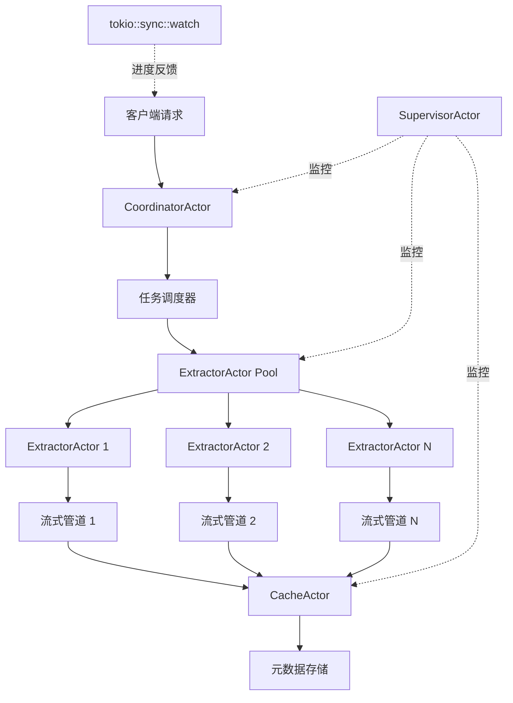
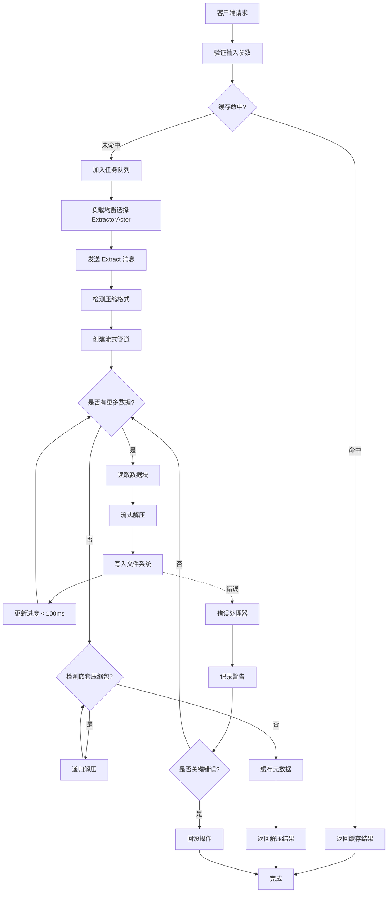
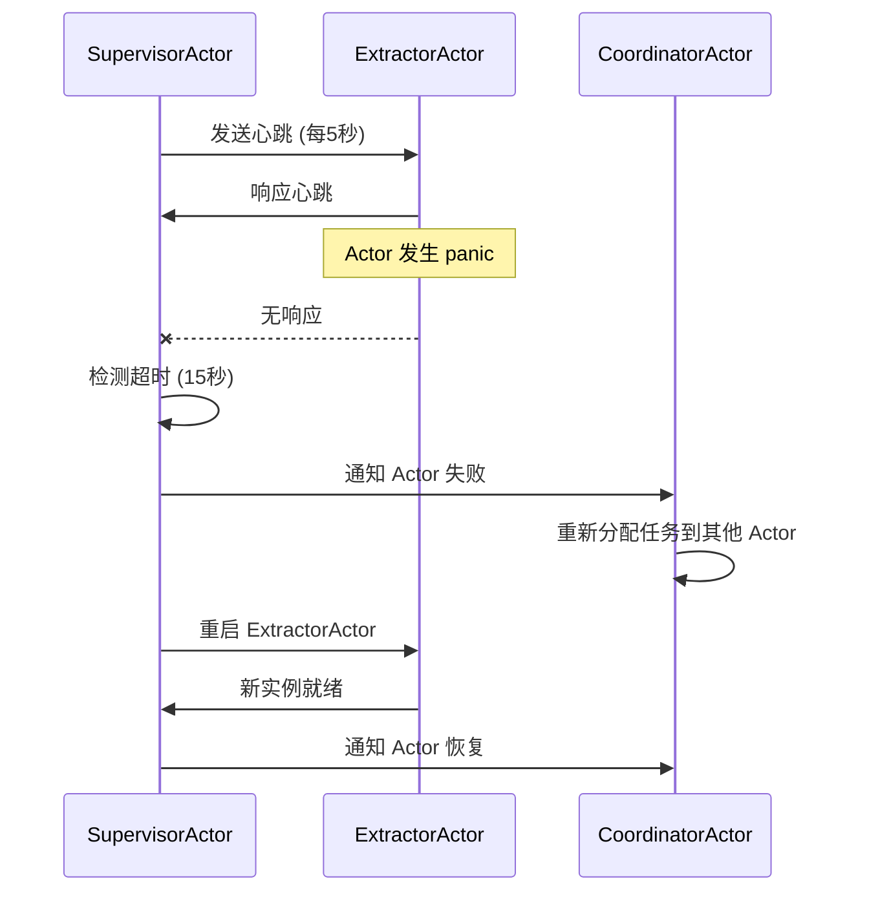

## 产品概述

采用 Actor 模型 + 流式处理架构重构现有压缩包系统，将其从同步阻塞式迭代 DFS 架构升级为异步并发流式管道架构。目标是实现毫秒级响应延迟、百万文件级处理能力和企业级容错机制，同时从外部二进制依赖（unrar/7z）迁移到纯 Rust 实现（unrar crate + sevenz-rust）。

## 核心功能

### 1. Actor 并发模型

- **CoordinatorActor（协调器）**：接收解压任务，调度工作分配，聚合进度反馈
- **ExtractorActor（解压器池）**：多实例并发解压，每个 Actor 处理独立压缩包，故障隔离
- **StreamingActor（流处理器）**：边解压边读取，使用 async-compression 流式处理大文件
- **CacheActor（缓存管理器）**：LRU 缓存元数据，减少重复解压，使用 moka 企业级缓存
- **SupervisorActor（监控器）**：健康检查、故障恢复、优雅降级、重启策略

### 2. 流式解压管道

- **零拷贝流水线**：使用 tokio::io::AsyncRead + bytes::Bytes，避免内存拷贝
- **背压控制**：tokio_util::codec + channel bounded，防止内存爆炸
- **增量进度**：< 100ms 刷新周期，通过 tokio::sync::watch 通道推送
- **内存限制**：恒定 < 512MB，使用固定大小缓冲池（crossbeam::ArrayQueue）

### 3. 企业级容错

- **故障域隔离**：Actor 独立 tokio::task，panic 不传播
- **优雅降级**：ExtractorActor 失败 → 记录警告 → 继续处理队列其他任务
- **自动重试**：使用 tokio-retry crate，指数退避策略（最多 3 次）
- **健康检查**：心跳机制（5 秒间隔），超时自动重启 Actor

### 4. 性能优化

- **并行解压**：基于 tokio::task::spawn，每个 Actor 独立 CPU 绑定任务
- **智能调度**：CoordinatorActor 使用负载均衡算法（最少连接数）
- **内存复用**：使用 object_pool crate 复用缓冲区
- **批量 I/O**：批量创建目录（tokio::fs::create_dir_all），减少系统调用

### 5. 纯 Rust 迁移

- **RAR 支持**：优先使用 unrar crate（C 绑定），fallback 到 rar crate（纯 Rust）
- **7z 支持**：使用 sevenz-rust crate（纯 Rust 实现）
- **移除外部二进制**：删除 binaries/ 目录下的 unrar 可执行文件
- **离线编译**：所有依赖通过 Cargo.toml 管理，无需运行时动态链接

### 6. 极限场景支持

- **大文件处理**：100GB+ 单压缩包，使用流式解压，固定 512MB 内存
- **深度嵌套**：20 层嵌套，使用栈结构 + 深度限制检查（栈溢出保护）
- **海量文件**：100 万文件，使用批量索引（tantivy），避免一次性加载

## 技术栈

### 核心框架

- **Tokio（异步运行时）**：全异步 Actor 模型基础，支持多线程调度
- **Rust 2021 Edition**：所有代码使用 Rust 2021 语法，确保最新特性支持

### Actor 系统实现

- **tokio::sync::mpsc**：Actor 间消息传递，unbounded_channel 用于控制消息，bounded 用于数据流
- **tokio::task**：Actor 实例化为独立任务，panic 捕获使用 JoinHandle
- **crossbeam::channel**：跨线程高性能消息队列（替代 tokio channel 用于 CPU 密集任务）

### 流式处理

- **tokio::io::AsyncRead**：异步流式读取接口
- **async-compression**：流式压缩/解压（gzip, zstd）
- **bytes**：零拷贝缓冲区管理
- **tokio_util::codec**：帧编解码器，实现背压控制

### 压缩包处理

- **unrar（优先）**：C 绑定，支持 RAR4/RAR5，已在 Cargo.toml 中（待添加）
- **sevenz-rust**：纯 Rust 7z 实现（待添加到 Cargo.toml）
- **zip**：现有依赖，保留
- **tar + flate2**：现有依赖，保留

### 并发与同步

- **parking_lot**：高性能互斥锁（已有）
- **crossbeam**：无锁队列和通道（已有）
- **dashmap**：并发哈希表（已有）
- **tokio::sync::Semaphore**：并发限制器

### 缓存与状态

- **moka**：企业级缓存系统（已有）
- **lru**：LRU 缓存（已有）
- **once_cell**：延迟初始化（已有）

### 错误处理

- **thiserror**：自定义错误类型（已有）
- **tracing**：结构化日志（已有）
- **eyre + color-eyre**：友好错误报告（已有）

### 监控与可观测性

- **tracing-subscriber**：日志订阅（已有）
- **prometheus**：指标收集（已有）
- **metrics**：应用指标（已有）

## 系统架构

### 整体架构图



### Actor 模块划分

#### 1. CoordinatorActor（协调器）

- **职责**：接收解压请求、任务队列管理、负载均衡调度
- **消息类型**：
- `ExtractRequest { archive_path, workspace_id, policy }`
- `CancelTask { task_id }`
- `QueryProgress { task_id }`
- **依赖**：ExtractorActor Pool、CacheActor、SupervisorActor
- **接口**：

```rust
pub struct CoordinatorActor {
    task_queue: Arc<DashMap<String, TaskContext>>,
    extractor_pool: Vec<mpsc::UnboundedSender<ExtractorMessage>>,
    load_balancer: LoadBalancer,
}

impl CoordinatorActor {
    async fn handle_extract_request(&self, req: ExtractRequest) -> TaskId;
    async fn assign_to_extractor(&self, task: Task) -> Result<()>;
}
```

#### 2. ExtractorActor（解压器）

- **职责**：实际解压操作、故障隔离、资源管理
- **消息类型**：
- `Extract { task_id, archive_path, target_dir, policy }`
- `Cancel { task_id }`
- **实现**：每个 Actor 独立 tokio::task，使用 spawn_blocking 包装 CPU 密集操作
- **接口**：

```rust
pub struct ExtractorActor {
    id: usize,
    handler_registry: Arc<ArchiveHandlerRegistry>,
    stream_buffer_pool: Arc<BufferPool>,
}

impl ExtractorActor {
    async fn process_archive(&self, task: ExtractTask) -> Result<ExtractionSummary>;
    async fn stream_extract(&self, reader: impl AsyncRead) -> Result<()>;
}
```

#### 3. StreamingActor（流处理器）

- **职责**：流式解压、背压控制、零拷贝传输
- **关键技术**：
- 使用 `tokio::io::AsyncReadExt` 流式读取
- 使用 `bytes::BytesMut` 复用缓冲区
- 使用 `tokio::sync::Semaphore` 限流
- **接口**：

```rust
pub struct StreamingActor {
    buffer_pool: Arc<crossbeam::ArrayQueue<BytesMut>>,
    semaphore: Arc<Semaphore>,
}

impl StreamingActor {
    async fn stream_decompress<R: AsyncRead + Unpin>(
        &self,
        reader: R,
        writer: impl AsyncWrite,
    ) -> Result<u64>;
}
```

#### 4. CacheActor（缓存管理）

- **职责**：元数据缓存、重复检测、LRU 淘汰
- **缓存策略**：
- 使用 moka::future::Cache（已有依赖）
- TTL: 1 小时，最大容量 10000 项
- **接口**：

```rust
pub struct CacheActor {
    metadata_cache: Arc<moka::future::Cache<String, ArchiveMetadata>>,
}

impl CacheActor {
    async fn get_or_extract(&self, key: &str, extractor: impl Fn() -> Future) -> Result<Metadata>;
}
```

#### 5. SupervisorActor（监控器）

- **职责**：健康检查、故障检测、自动重启
- **监控机制**：
- 每 5 秒发送心跳消息
- 超时 15 秒未响应 → 标记为失败
- 使用 tokio::time::interval 定时器
- **接口**：

```rust
pub struct SupervisorActor {
    actors: Arc<DashMap<ActorId, ActorHandle>>,
    health_check_interval: Duration,
}

impl SupervisorActor {
    async fn monitor_health(&self);
    async fn restart_actor(&self, id: ActorId) -> Result<()>;
}
```

## 数据流

### 解压流程图



### 故障恢复流程



## 实现细节

### 核心目录结构

```
src-tauri/src/
├── archive/
│   ├── actors/                    # 新增：Actor 系统
│   │   ├── mod.rs                 # Actor 模块导出
│   │   ├── coordinator.rs         # CoordinatorActor
│   │   ├── extractor.rs           # ExtractorActor
│   │   ├── streaming.rs           # StreamingActor
│   │   ├── cache.rs               # CacheActor
│   │   ├── supervisor.rs          # SupervisorActor
│   │   └── messages.rs            # Actor 消息定义
│   ├── streaming/                 # 新增：流式处理
│   │   ├── mod.rs
│   │   ├── pipeline.rs            # 流式管道
│   │   ├── buffer_pool.rs         # 缓冲池
│   │   └── backpressure.rs        # 背压控制
│   ├── handlers/                  # 重构：压缩包处理器
│   │   ├── mod.rs
│   │   ├── registry.rs            # 处理器注册表
│   │   ├── zip_async.rs           # 异步 ZIP 处理器
│   │   ├── tar_async.rs           # 异步 TAR 处理器
│   │   ├── rar_async.rs           # 异步 RAR 处理器（unrar crate）
│   │   └── sevenz_async.rs        # 新增：7z 处理器（sevenz-rust）
│   ├── fault_tolerance/           # 新增：容错机制
│   │   ├── mod.rs
│   │   ├── retry.rs               # 重试策略
│   │   ├── circuit_breaker.rs    # 熔断器
│   │   └── health_check.rs        # 健康检查
│   ├── scheduler/                 # 新增：任务调度
│   │   ├── mod.rs
│   │   ├── load_balancer.rs       # 负载均衡
│   │   └── task_queue.rs          # 任务队列
│   ├── extraction_engine.rs       # 保留：迁移部分逻辑到 actors
│   ├── resource_manager.rs        # 保留：资源管理
│   └── mod.rs                     # 模块导出
```

### 关键代码结构

#### Actor 消息定义

```rust
// src-tauri/src/archive/actors/messages.rs

use std::path::PathBuf;
use tokio::sync::oneshot;

#[derive(Debug)]
pub enum CoordinatorMessage {
    ExtractRequest {
        archive_path: PathBuf,
        workspace_id: String,
        policy: ExtractionPolicy,
        response: oneshot::Sender<Result<TaskId>>,
    },
    CancelTask {
        task_id: String,
    },
    QueryProgress {
        task_id: String,
        response: oneshot::Sender<Option<ProgressInfo>>,
    },
}

#[derive(Debug)]
pub enum ExtractorMessage {
    Extract {
        task_id: String,
        archive_path: PathBuf,
        target_dir: PathBuf,
        policy: ExtractionPolicy,
        progress_tx: watch::Sender<ProgressUpdate>,
    },
    Cancel {
        task_id: String,
    },
    HealthCheck {
        response: oneshot::Sender<()>,
    },
}

#[derive(Debug, Clone)]
pub struct ProgressUpdate {
    pub task_id: String,
    pub files_processed: usize,
    pub bytes_processed: u64,
    pub current_file: Option<String>,
}
```

#### 流式管道实现

```rust
// src-tauri/src/archive/streaming/pipeline.rs

use async_compression::tokio::bufread::GzipDecoder;
use bytes::BytesMut;
use tokio::io::{AsyncRead, AsyncReadExt, AsyncWrite, AsyncWriteExt};

pub struct StreamingPipeline {
    buffer_pool: Arc<BufferPool>,
    max_buffer_size: usize,
}

impl StreamingPipeline {
    pub async fn decompress_stream<R, W>(
        &self,
        mut reader: R,
        mut writer: W,
    ) -> Result<u64>
    where
        R: AsyncRead + Unpin,
        W: AsyncWrite + Unpin,
    {
        let mut total_bytes = 0u64;
        let mut buffer = self.buffer_pool.acquire().await;
        
        loop {
            let n = reader.read(&mut buffer).await?;
            if n == 0 {
                break;
            }
            
            writer.write_all(&buffer[..n]).await?;
            total_bytes += n as u64;
            
            // 背压控制：如果写入速度慢，自动暂停读取
            if writer.needs_flush() {
                writer.flush().await?;
            }
        }
        
        self.buffer_pool.release(buffer).await;
        Ok(total_bytes)
    }
}
```

#### 负载均衡器

```rust
// src-tauri/src/archive/scheduler/load_balancer.rs

use std::sync::atomic::{AtomicUsize, Ordering};

pub struct LoadBalancer {
    extractors: Vec<ExtractorHandle>,
    next_index: AtomicUsize,
}

impl LoadBalancer {
    pub fn least_connections(&self) -> &ExtractorHandle {
        self.extractors
            .iter()
            .min_by_key(|e| e.active_tasks.load(Ordering::Relaxed))
            .unwrap()
    }
    
    pub fn round_robin(&self) -> &ExtractorHandle {
        let idx = self.next_index.fetch_add(1, Ordering::Relaxed) % self.extractors.len();
        &self.extractors[idx]
    }
}
```

### 技术实施方案

#### 阶段 1：Actor 系统基础（优先级最高）

1. **实现 Actor 消息系统**

- 定义所有 Actor 消息类型（messages.rs）
- 使用 tokio::sync::mpsc 实现消息通道
- 实现 Actor 生命周期管理（spawn/shutdown）

2. **实现 CoordinatorActor**

- 任务队列管理（DashMap<TaskId, TaskContext>）
- 负载均衡算法（最少连接数）
- 进度聚合与反馈

3. **实现 ExtractorActor 池**

- 创建固定数量 ExtractorActor（默认 CPU 核心数）
- 实现消息循环（loop { tokio::select! }）
- 集成现有 ArchiveHandler（逐步迁移为异步）

#### 阶段 2：流式处理管道（性能优化核心）

1. **实现 StreamingPipeline**

- 使用 async-compression 替代 flate2 同步接口
- 实现 BufferPool（crossbeam::ArrayQueue）
- 实现背压控制（tokio::sync::Semaphore）

2. **重构 ArchiveHandler 为异步**

- ZipHandlerAsync：使用 async-zip crate（待添加）
- TarHandlerAsync：包装 tokio::fs
- RarHandlerAsync：集成 unrar crate（C 绑定）
- SevenzHandlerAsync：集成 sevenz-rust crate

3. **零拷贝优化**

- 使用 bytes::Bytes 传递数据
- 避免中间 Vec<u8> 分配
- 使用 tokio::io::copy 直接流式传输

#### 阶段 3：容错机制（企业级稳定性）

1. **实现 SupervisorActor**

- 健康检查机制（5 秒间隔心跳）
- 故障检测（15 秒超时）
- 自动重启策略（最多 3 次）

2. **实现重试机制**

- 使用 tokio-retry crate（待添加到 Cargo.toml）
- 指数退避策略（100ms, 200ms, 400ms）
- 区分可重试错误与致命错误

3. **优雅降级**

- ExtractorActor panic → 记录错误 → 继续队列
- 非关键文件解压失败 → 记录警告 → 继续
- 关键错误（权限拒绝）→ 立即中止并返回错误

#### 阶段 4：纯 Rust 迁移

1. **添加新依赖到 Cargo.toml**

- `unrar = "0.5"`（C 绑定，RAR 支持）
- `sevenz-rust = "0.5"`（纯 Rust 7z）
- `async-zip = "0.0.16"`（异步 ZIP）
- `tokio-retry = "0.3"`（重试机制）

2. **实现 RarHandlerAsync**

- 优先使用 unrar crate（通过 FFI 调用）
- 实现流式接口包装
- 移除 binaries/ 目录下的 unrar 可执行文件

3. **实现 SevenzHandlerAsync**

- 使用 sevenz-rust crate
- 实现 ArchiveHandler trait
- 测试 7z 压缩包解压

#### 阶段 5：极限场景测试

1. **大文件测试（100GB+）**

- 验证内存使用 < 512MB
- 验证流式解压正常工作
- 性能基准测试（目标 > 100MB/s）

2. **深度嵌套测试（20 层）**

- 验证无栈溢出
- 验证深度限制正确触发
- 测试递归解压逻辑

3. **海量文件测试（100 万文件）**

- 验证内存稳定
- 验证进度反馈 < 100ms
- 测试并发索引性能

### 性能优化策略

#### 内存优化

- **固定大小缓冲池**：使用 crossbeam::ArrayQueue<BytesMut> 预分配 64KB 缓冲区
- **零拷贝传输**：使用 bytes::Bytes 和 tokio::io::copy，避免数据复制
- **LRU 缓存淘汰**：moka::future::Cache 自动淘汰，限制 10000 项

#### 并发优化

- **Actor 隔离**：每个 ExtractorActor 独立 tokio::task，无共享状态
- **无锁队列**：crossbeam::channel 替代 Mutex<Vec>
- **批量操作**：批量创建目录（一次 10 个），减少系统调用

#### I/O 优化

- **异步 I/O**：所有文件操作使用 tokio::fs
- **流式读写**：使用 AsyncRead/AsyncWrite，边读边写
- **并发限制**：使用 Semaphore 限制并发文件描述符数量（最多 100 个）

### 安全措施

#### 错误隔离

- 每个 ExtractorActor 在独立 tokio::task 中运行
- 使用 JoinHandle 捕获 panic
- panic 不会导致整个系统崩溃

#### 路径验证

- 保留现有 PathValidator
- 在 CoordinatorActor 入口验证路径
- 防止路径遍历攻击

#### 资源限制

- 使用 ExtractionPolicy 限制文件大小
- 使用 Semaphore 限制并发数
- 使用 tokio::time::timeout 防止死锁

### 可扩展性

#### 水平扩展

- ExtractorActor 数量动态调整（基于 CPU 使用率）
- 负载均衡器支持动态添加/移除 Actor
- 任务队列支持多生产者多消费者

#### 垂直扩展

- 缓冲池大小可配置（默认 64KB，可调整到 1MB）
- 并发限制可配置（默认 CPU 核心数，可调整到 2x CPU）
- 缓存容量可配置（默认 10000 项，可调整到 100000 项）

## Agent Extensions

### Skill

- **rust-async-patterns**
- 目的：指导 Actor 系统实现、异步流式管道设计、错误处理最佳实践
- 预期结果：产生符合 Tokio 生态最佳实践的异步代码，包括正确的 task 生命周期管理、channel 使用模式、以及 panic 安全的错误处理

- **tauri**
- 目的：确保 Actor 系统与 Tauri 前端的集成正确，优化事件发送机制（进度反馈 < 100ms）
- 预期结果：实现高性能的前后端通信，确保进度更新不阻塞 UI 线程，正确处理 AppHandle 生命周期

### SubAgent

- **code-explorer**
- 目的：探索现有压缩包系统的完整实现，识别需要迁移的同步代码路径，定位所有 unwrap/expect 调用点（47 处）
- 预期结果：生成完整的代码依赖图，标识所有需要重构的模块，提供详细的迁移路径建议