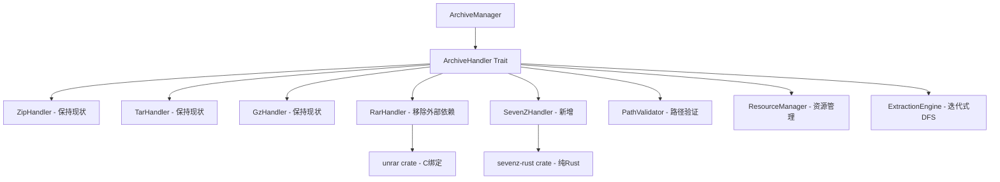
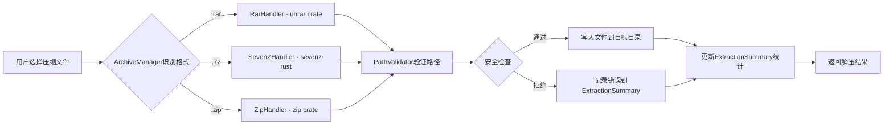

## 产品概述

将日志分析器的压缩包处理系统从依赖外部二进制工具（unrar/7z）迁移到纯 Rust 库实现，确保应用可在完全离线环境中编译和运行，无需额外安装外部依赖。本次迁移将替换 RAR 处理的外部调用回退逻辑，并新增 7z 格式的原生支持。

## 核心功能

### RAR 格式迁移

- **移除外部二进制依赖**：删除 `RarHandler` 中 `extract_with_unrar_fallback` 方法及相关的 `Command::new("unrar")` 调用
- **统一 libunrar 绑定**：将当前的 `rar = "0.4"` crate 替换为功能更完整的 `unrar` crate（基于 libunrar C 库的 Rust 绑定）
- **完整 RAR 支持**：支持 RAR4/RAR5 格式、多卷压缩包、加密文件（需密码输入接口）、长路径名

### 7z 格式新增支持

- **纯 Rust 实现**：集成 `sevenz-rust` crate 实现 7z 格式的原生解压能力
- **格式兼容**：支持标准 7z 压缩格式，包括 LZMA/LZMA2/BZIP2 等多种压缩算法
- **创建新 Handler**：实现 `SevenZHandler` 结构体，遵循现有 `ArchiveHandler` trait 规范

### 格式支持矩阵

建立清晰的格式支持文档，对比迁移前后各格式的实现方式：

- **ZIP**：保持现状（`zip` crate，纯 Rust）
- **TAR/GZ**：保持现状（`tar`、`flate2` crate，纯 Rust）
- **RAR**：迁移前（rar crate + 外部二进制回退） → 迁移后（unrar crate，C 绑定，无外部二进制）
- **7z**：新增支持（sevenz-rust crate，纯 Rust）

### 安全性与性能

- **保持现有安全机制**：所有解压操作继续使用 `PathValidator` 防护路径遍历、符号链接攻击
- **资源限制一致性**：复用 `max_file_size`、`max_total_size`、`max_file_count` 等限制
- **性能基准验证**：对比迁移前后的解压速度、内存占用，确保不低于原方案

## 技术栈

### 核心依赖库

- **RAR 支持**：`unrar = "0.2"` （libunrar C 绑定，提供完整 RAR4/RAR5 支持）
- **7z 支持**：`sevenz-rust = "0.6"` （纯 Rust 实现，支持多种 7z 压缩算法）
- **现有保留**：`zip = "0.6"`、`tar = "0.4"`、`flate2 = "1.0"`（ZIP/TAR/GZ 处理保持不变）
- **异步运行时**：`tokio`（现有异步架构）
- **错误处理**：`thiserror`、`eyre`、`miette`（现有错误处理体系）

### 构建系统要求

- **C 编译器**：unrar crate 需要 C 编译环境（gcc/clang/MSVC）用于编译 libunrar
- **离线编译**：依赖项源码内置，无需运行时外部二进制文件
- **跨平台支持**：Windows/Linux/macOS 统一编译配置

## 系统架构

### 架构保持与扩展

本次迁移**不改变现有架构模式**，仅替换实现细节：



### 模块划分

#### 1. RarHandler 重构模块

- **职责**：使用 unrar crate 实现 RAR 解压，移除外部二进制调用
- **核心技术**：unrar crate 的 `Archive::new()` 和 `Archive::process()` API
- **依赖模块**：`PathValidator`（路径安全）、`ExtractionSummary`（结果统计）
- **主要接口**：
- `extract_with_limits()` - 实现带资源限制的解压
- `can_handle()` - 识别 `.rar` 文件

#### 2. SevenZHandler 新增模块

- **职责**：使用 sevenz-rust 实现 7z 格式解压
- **核心技术**：sevenz-rust crate 的 `SevenZReader` API
- **依赖模块**：`PathValidator`、`ExtractionSummary`
- **主要接口**：
- `extract_with_limits()` - 实现带资源限制的解压
- `can_handle()` - 识别 `.7z` 文件
- `file_extensions()` - 返回 `vec!["7z"]`

#### 3. ArchiveManager 集成模块

- **职责**：注册新 SevenZHandler，维护 handler 列表
- **修改点**：在 `with_config()` 中添加 `Box::new(SevenZHandler)`
- **依赖变化**：无新增依赖

### 数据流



## 实现细节

### 核心目录结构（仅显示修改和新增文件）

```
log-analyzer/src-tauri/
├── Cargo.toml                          # 修改：更新依赖
├── src/archive/
│   ├── rar_handler.rs                  # 修改：移除外部二进制逻辑
│   ├── sevenz_handler.rs               # 新增：7z格式处理器
│   └── mod.rs                          # 修改：导出SevenZHandler
├── src/commands/
│   └── import.rs                       # 修改：更新RAR支持检查逻辑
└── docs/
    └── ARCHIVE_MIGRATION_GUIDE.md      # 新增：迁移文档
```

### 关键代码结构

#### 1. RarHandler 重构后的接口

**移除的功能**：

- `extract_with_unrar_fallback()` 方法
- `get_unrar_path()` 函数
- `parse_unrar_output()` 函数
- 所有 `Command::new("unrar")` 调用

**新的实现方式**（基于 unrar crate）：

```rust
use unrar::Archive;

impl RarHandler {
    async fn extract_with_limits(
        &self,
        source: &Path,
        target_dir: &Path,
        max_file_size: u64,
        max_total_size: u64,
        max_file_count: usize,
    ) -> Result<ExtractionSummary> {
        let mut summary = ExtractionSummary::new();
        let validator = PathValidator::strict();
        
        // 使用 unrar crate 打开归档
        let archive = Archive::new(source)
            .open_for_processing()
            .map_err(|e| AppError::archive_error(...))?;
        
        let mut total_size = 0u64;
        let mut file_count = 0usize;
        
        // 迭代处理每个条目
        while let Some(header) = archive.read_header()? {
            let entry = header.entry();
            
            // 路径验证
            let validated_path = validator.validate_extraction_path(
                entry.filename.to_str()?,
                target_dir
            )?;
            
            // 资源限制检查
            if entry.unpacked_size > max_file_size { continue; }
            if total_size + entry.unpacked_size > max_total_size { break; }
            if file_count + 1 > max_file_count { break; }
            
            // 解压条目
            header.extract_to(target_dir)?;
            
            total_size += entry.unpacked_size;
            file_count += 1;
            summary.add_file(validated_path, entry.unpacked_size);
        }
        
        Ok(summary)
    }
}
```

#### 2. SevenZHandler 数据结构

```rust
use sevenz_rust::SevenZReader;

pub struct SevenZHandler;

#[async_trait]
impl ArchiveHandler for SevenZHandler {
    fn can_handle(&self, path: &Path) -> bool {
        path.extension()
            .and_then(|s| s.to_str())
            .map(|ext| ext.eq_ignore_ascii_case("7z"))
            .unwrap_or(false)
    }
    
    async fn extract_with_limits(
        &self,
        source: &Path,
        target_dir: &Path,
        max_file_size: u64,
        max_total_size: u64,
        max_file_count: usize,
    ) -> Result<ExtractionSummary> {
        // 实现类似 RarHandler 的逻辑
        // 使用 SevenZReader::open() 和 archive.for_each_entries()
    }
    
    fn file_extensions(&self) -> Vec<&str> {
        vec!["7z"]
    }
}
```

### 技术实现计划

#### 任务 1：更新依赖配置

**问题陈述**：替换 `rar = "0.4"` 为更强大的 `unrar` crate，新增 `sevenz-rust` crate

**解决方案**：

- 在 `Cargo.toml` 中移除 `rar = "0.4"`
- 添加 `unrar = "0.2"` 和 `sevenz-rust = "0.6"`
- 确保构建脚本检测 C 编译器（unrar 需要）

**关键技术**：Cargo 依赖管理、C 库链接

**实施步骤**：

1. 修改 `Cargo.toml` 的 `[dependencies]` 部分
2. 运行 `cargo check` 验证依赖解析
3. 在 CI/CD 环境验证跨平台编译
4. 添加构建文档说明 C 编译器要求

**测试策略**：在 Windows/Linux/macOS 上执行 `cargo build`，确保无链接错误

#### 任务 2：重构 RarHandler

**问题陈述**：移除外部二进制调用，统一使用 unrar crate

**解决方案**：

- 删除 `extract_with_unrar_fallback()`、`get_unrar_path()`、`parse_unrar_output()`
- 重写 `extract_with_limits()` 使用 unrar crate 的 `Archive` API
- 保持 `PathValidator` 集成和资源限制逻辑

**关键技术**：

- unrar crate 的 `Archive::new()` 和 `open_for_processing()` API
- 错误处理映射（unrar errors → AppError）
- 异步适配（在 `spawn_blocking` 中执行同步 unrar 调用）

**实施步骤**：

1. 研究 unrar crate 文档和示例代码
2. 实现新的 `extract_with_limits()` 方法
3. 添加密码保护检测（返回友好错误信息）
4. 保留现有的路径验证和限制检查逻辑
5. 更新单元测试，移除 fallback 相关测试

**测试策略**：

- 使用标准 RAR 文件测试基本解压功能
- 使用 RAR5 格式文件验证新格式支持
- 测试路径遍历防护（恶意文件名）
- 验证资源限制（大文件、大量文件场景）

#### 任务 3：实现 SevenZHandler

**问题陈述**：新增 7z 格式支持，遵循现有 ArchiveHandler 规范

**解决方案**：

- 创建新文件 `sevenz_handler.rs`
- 实现 `ArchiveHandler` trait 的所有方法
- 集成 `PathValidator` 和 `ExtractionSummary`

**关键技术**：

- sevenz-rust crate 的 `SevenZReader::open()` API
- 错误处理（sevenz errors → AppError）
- 流式读取（避免大文件内存溢出）

**实施步骤**：

1. 参考 ZipHandler 和 TarHandler 的结构
2. 实现 `can_handle()` 识别 `.7z` 扩展名
3. 实现 `extract_with_limits()` 核心解压逻辑
4. 在 `spawn_blocking` 中执行同步 IO
5. 添加完整的错误处理和日志记录

**测试策略**：

- 使用标准 7z 文件测试基本功能
- 测试多种压缩算法（LZMA、LZMA2、BZIP2）
- 验证安全限制和路径验证

#### 任务 4：集成到 ArchiveManager

**问题陈述**：将新 SevenZHandler 注册到管理器

**解决方案**：

- 在 `mod.rs` 中导出 `SevenZHandler`
- 在 `ArchiveManager::with_config()` 中添加 handler 实例
- 更新 `supported_extensions()` 单元测试

**关键技术**：Rust 模块系统、trait 对象

**实施步骤**：

1. 在 `mod.rs` 添加 `pub mod sevenz_handler;`
2. 添加 `pub use sevenz_handler::SevenZHandler;`
3. 在 handlers 向量中添加 `Box::new(SevenZHandler)`
4. 更新测试覆盖 7z 格式

**测试策略**：

- 验证 `find_handler()` 能正确识别 7z 文件
- 运行完整的集成测试（所有格式）

#### 任务 5：性能基准测试

**问题陈述**：验证迁移后性能不低于原方案

**解决方案**：

- 使用 `criterion` crate 创建性能基准
- 对比迁移前后的解压速度和内存占用

**关键技术**：

- Criterion 性能测试框架
- 内存分析工具（heaptrack/valgrind）

**实施步骤**：

1. 创建基准测试套件（`benches/archive_extraction.rs`）
2. 准备标准测试数据（各格式压缩包）
3. 测量迁移前后的性能指标
4. 生成性能对比报告

**测试策略**：

- 小文件场景（< 10MB）
- 中等文件场景（10-100MB）
- 大文件场景（100MB-1GB）
- 多文件场景（> 1000 个文件）

### 集成点

#### 1. ArchiveHandler Trait 集成

所有 handler（包括新 SevenZHandler）统一实现 `ArchiveHandler` trait，通过 `ArchiveManager` 动态分发。

#### 2. 数据格式

- **输入**：文件系统路径（`&Path`）
- **输出**：`ExtractionSummary` 结构体，包含文件列表、大小、错误信息

#### 3. 外部依赖

- **unrar crate**：需要 libunrar C 库（编译时静态链接）
- **sevenz-rust crate**：纯 Rust，无外部依赖
- **现有依赖保持不变**：zip、tar、flate2

#### 4. 认证与授权

无需变更，archive 模块不涉及用户认证。

## 技术考虑

### 日志记录

遵循现有日志模式：

- 使用 `tracing` 宏记录解压过程
- 错误级别：`error!`（解压失败）、`warn!`（跳过危险文件）、`info!`（成功摘要）、`debug!`（详细条目）

### 性能优化

#### 1. 内存优化

- **流式处理**：逐条目解压，避免一次性加载整个归档
- **大文件处理**：使用 `tokio::io::copy_buf()` 进行缓冲 IO

#### 2. 并发优化

- **异步适配**：在 `spawn_blocking` 中执行同步 unrar/sevenz 调用，避免阻塞异步运行时
- **保持现有并发架构**：`ParallelProcessor` 可并发处理多个压缩包

#### 3. 性能指标

预期性能目标（相对于外部二进制方案）：

- RAR 解压速度：± 5%（C 绑定性能接近）
- 7z 解压速度：纯 Rust 实现可能略慢于 7-Zip CLI，但可接受
- 内存占用：通过流式处理保持低内存占用

### 安全措施

#### 1. 路径遍历防护

所有 handler 强制使用 `PathValidator::strict()` 验证提取路径：

```rust
let validated_path = validator.validate_extraction_path(
    entry_name,
    target_dir
)?;
```

#### 2. 符号链接防护

拒绝包含符号链接的条目，防止任意文件读取。

#### 3. 资源限制

三重限制防止 Zip Bomb 攻击：

- `max_file_size`：单个文件大小上限
- `max_total_size`：解压后总大小上限
- `max_file_count`：文件数量上限

#### 4. 输入验证

- 文件扩展名白名单检查
- 归档格式魔数验证（通过库实现）

### 可扩展性

#### 1. 格式扩展

通过实现 `ArchiveHandler` trait 可轻松添加新格式：

```rust
pub struct NewFormatHandler;
impl ArchiveHandler for NewFormatHandler { ... }
```

#### 2. 未来迁移路径

- 如需更高性能，可考虑 `unrar-sys` 的直接 FFI 调用
- 如 sevenz-rust 不满足需求，可评估 `sevenz-sys` 绑定

#### 3. 多卷归档支持

unrar crate 原生支持多卷 RAR，未来可扩展至 7z 多卷格式。

## 代理扩展

### Skill

- **rust-async-patterns**
- **用途**：指导 RarHandler 和 SevenZHandler 中的异步适配实现，特别是 `tokio::task::spawn_blocking` 的正确使用模式，以及异步错误处理
- **预期成果**：生成符合 Tokio 最佳实践的异步代码，避免阻塞运行时，正确处理跨线程边界的错误传播

- **tauri**
- **用途**：确保压缩包处理模块与 Tauri 前端的事件通信（import-complete 事件）保持兼容，验证 `check_rar_support` 命令的更新逻辑
- **预期成果**：前后端集成无缝，RAR 支持检查返回正确的状态（移除外部二进制提示）

### SubAgent

- **code-explorer**
- **用途**：深度探索 `archive` 模块的现有架构（ExtractionEngine、PathManager、ResourceManager），分析它们与新 handler 的集成点，查找所有引用外部二进制的代码位置
- **预期成果**：生成完整的代码依赖分析报告，确保迁移不遗漏任何外部调用点，找出需要更新的测试文件