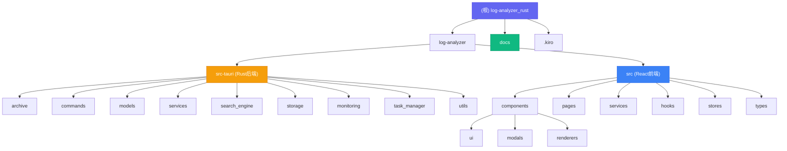

# Log Analyzer - AI 上下文文档

> **项目**: log-analyzer_rust - 高性能桌面日志分析工具
>
> **版本**: 0.0.71
>
> **技术栈**: Tauri 2.0 + Rust + React 19 + TypeScript
>
> **最后更新**: 2025-12-27 23:31:06

---

## 📋 目录

- [项目愿景](#项目愿景)
- [架构总览](#架构总览)
- [模块结构图](#模块结构图)
- [模块索引](#模块索引)
- [运行与开发](#运行与开发)
- [测试策略](#测试策略)
- [编码规范](#编码规范)
- [AI 使用指引](#ai-使用指引)
- [变更记录](#变更记录)

---

## 🎯 项目愿景

Log Analyzer 是一款专为开发者和运维人员打造的**高性能桌面日志分析工具**，致力于解决以下核心问题：

### 核心价值

- **极致性能**: 采用 Aho-Corasick 多模式匹配算法，搜索复杂度从 O(n×m) 降至 O(n+m)，性能提升 80%+
- **智能解压**: 统一压缩处理器架构，支持 ZIP/RAR/GZ/TAR 等格式，代码重复减少 70%
- **内容寻址存储(CAS)**: Git 风格的内容寻址存储系统，自动去重，节省磁盘空间
- **结构化查询**: 完整的查询构建器 + 优先级系统 + 匹配详情追踪
- **实时监听**: 文件系统监听，增量更新索引，实时推送搜索结果
- **本地优先**: 所有数据本地处理，保护隐私安全
- **跨平台**: Windows/macOS/Linux 完整兼容

### 目标用户

- **开发者**: 快速定位应用日志中的错误和异常
- **运维工程师**: 分析系统日志，监控性能指标
- **测试工程师**: 验证日志输出，追踪问题根源

---

## 🏗️ 架构总览

### 技术架构

```
┌─────────────────────────────────────────────────────────────────┐
│                    前端 (React 19 + TypeScript)                  │
│  ┌──────────┐  ┌──────────┐  ┌──────────┐  ┌────────┐         │
│  │工作区管理│  │日志搜索  │  │详情展示  │  │任务列表│         │
│  │Workspaces│  │QueryBuilder│MatchDetails│  Tasks  │         │
│  └──────────┘  └──────────┘  └──────────┘  └────────┘         │
│  ┌──────────────────────────────────────────────────┐         │
│  │ 状态管理: Zustand + React Query + Tauri Events │         │
│  └──────────────────────────────────────────────────┘         │
└─────────────────────────────────────────────────────────────────┘
                          ↕ Tauri IPC (invoke/emit)
┌─────────────────────────────────────────────────────────────────┐
│                   后端 (Rust + Tauri 2.0)                       │
│  ┌──────────┐  ┌──────────┐  ┌──────────┐  ┌────────┐         │
│  │压缩包处理│  │CAS存储   │  │结构化查询│  │事件系统│         │
│  │ ZIP/TAR │  │SHA-256   │  │QueryExecutor│ Tauri   │         │
│  │ GZ/RAR  │  │去重      │  │MatchDetail│ Events  │         │
│  └──────────┘  └──────────┘  └──────────┘  └────────┘         │
│  ┌──────────┐  ┌──────────┐  ┌──────────┐  ┌────────┐         │
│  │Aho-Corasick│  │异步I/O  │  │元数据存储│  │缓存系统│         │
│  │PatternMatcher│AsyncFileReader│SQLite+FTS5│  Moka  │         │
│  └──────────┘  └──────────┘  └──────────┘  └────────┘         │
└─────────────────────────────────────────────────────────────────┘
                          ↓
               ┌──────────────────────┐
               │  跨平台兼容层        │
               │  • UNC 路径处理     │
               │  • 长路径支持       │
               │  • 只读文件解锁     │
               │  • 多编码识别       │
               │  • 文件系统监听     │
               └──────────────────────┘
```

### 核心技术栈

#### 前端
- **框架**: React 19.1.0
- **样式**: Tailwind CSS 3.4.17
- **状态管理**: Zustand 5.0.9
- **数据获取**: @tanstack/react-query 5.90.12
- **虚拟滚动**: @tanstack/react-virtual 3.13.12
- **国际化**: i18next 25.7.1
- **构建工具**: Vite 7.0.4
- **类型检查**: TypeScript 5.8.3

#### 后端
- **语言**: Rust 1.70+
- **框架**: Tauri 2.0
- **异步运行时**: tokio 1.x
- **搜索算法**: aho-corasick 1.0
- **并行处理**: rayon 1.8
- **缓存系统**: moka 0.12
- **数据库**: sqlx 0.7 (SQLite)
- **压缩支持**: zip 0.6, tar 0.4, flate2 1.0, unrar 0.5
- **错误处理**: thiserror 1.0, eyre 0.6, miette 5.0
- **日志追踪**: tracing 0.1, tracing-subscriber 0.3

---

## 📊 模块结构图



---

## 📁 模块索引

| 模块 | 路径 | 职责 | 文档链接 |
|------|------|------|---------|
| **Rust 后端** | `log-analyzer/src-tauri/` | Tauri 2.0 + Rust 后端核心 | [查看文档](log-analyzer/src-tauri/CLAUDE.md) |
| **React 前端** | `log-analyzer/src/` | React 19 + TypeScript 前端界面 | [查看文档](log-analyzer/src/CLAUDE.md) |
| **项目文档** | `docs/` | 架构文档、用户指南、开发指南 | [查看文档](docs/README.md) |

### 核心子模块

#### Rust 后端 (`log-analyzer/src-tauri/`)

| 子模块 | 功能描述 | 关键文件 |
|--------|---------|---------|
| **archive** | 多格式压缩包处理 | `zip_handler.rs`, `tar_handler.rs`, `gz_handler.rs`, `rar_handler.rs` |
| **commands** | Tauri IPC 命令接口 | `search.rs`, `import.rs`, `workspace.rs`, `query.rs` |
| **models** | 数据模型定义 | `search.rs`, `state.rs`, `config.rs` |
| **services** | 业务服务层 | `pattern_matcher.rs`, `query_executor.rs`, `file_watcher.rs` |
| **search_engine** | 搜索引擎核心 | `manager.rs`, `advanced_features.rs` |
| **storage** | CAS 存储系统 | `cas.rs`, `metadata_store.rs` |
| **monitoring** | 性能监控系统 | `metrics_collector.rs`, `alerting.rs` |
| **task_manager** | 任务生命周期管理 | `mod.rs` |
| **utils** | 工具函数库 | `path.rs`, `encoding.rs`, `validation.rs` |

#### React 前端 (`log-analyzer/src/`)

| 子模块 | 功能描述 | 关键文件 |
|--------|---------|---------|
| **components** | UI 组件库 | `ui/`, `modals/`, `renderers/` |
| **pages** | 页面组件 | `SearchPage.tsx`, `WorkspacesPage.tsx`, `KeywordsPage.tsx` |
| **services** | 服务层 | `SearchQueryBuilder.ts`, `queryApi.ts` |
| **hooks** | 自定义 Hooks | `useKeywordManager.ts`, `useTaskManager.ts` |
| **stores** | 状态管理 | `appStore.ts`, `workspaceStore.ts` |
| **types** | TypeScript 类型 | `search.ts`, `common.ts` |

---

## 🚀 运行与开发

### 环境要求

- **Node.js**: 22.12.0 或更高版本
- **Rust**: 1.70 或更高版本
- **npm**: 10.0 或更高版本
- **系统依赖**: [Tauri 前置依赖](https://tauri.app/v1/guides/getting-started/prerequisites)

### 快速开始

```bash
# 1. 克隆仓库
git clone https://github.com/ashllll/log-analyzer_rust.git
cd log-analyzer_rust/log-analyzer

# 2. 安装依赖
npm install

# 3. 启动开发服务器
npm run tauri dev

# 4. 构建生产版本
npm run tauri build
```

### 开发命令

#### 前端开发
```bash
# 启动开发服务器（热更新）
npm run dev

# TypeScript 类型检查
npm run type-check

# ESLint 代码检查
npm run lint
npm run lint:fix  # 自动修复

# 运行测试
npm test
npm run test:watch  # 监听模式
```

#### 后端开发
```bash
cd src-tauri

# 运行所有测试
cargo test --all-features

# 代码格式化
cargo fmt

# Clippy 静态分析
cargo clippy -- -D warnings

# 性能基准测试
cargo bench
```

### 项目结构

```
log-analyzer_rust/
├── log-analyzer/              # 主项目目录
│   ├── src/                   # React 前端源码
│   │   ├── components/        # UI 组件
│   │   ├── pages/            # 页面组件
│   │   ├── services/         # 服务层
│   │   ├── hooks/            # 自定义 Hooks
│   │   ├── stores/           # 状态管理
│   │   └── types/            # 类型定义
│   ├── src-tauri/            # Rust 后端
│   │   ├── src/
│   │   │   ├── archive/      # 压缩包处理
│   │   │   ├── commands/     # Tauri 命令
│   │   │   ├── models/       # 数据模型
│   │   │   ├── services/     # 业务服务
│   │   │   ├── storage/      # CAS 存储
│   │   │   └── utils/        # 工具函数
│   │   ├── tests/            # 集成测试
│   │   └── Cargo.toml        # Rust 依赖
│   ├── package.json          # Node 依赖
│   └── tauri.conf.json       # Tauri 配置
├── docs/                     # 项目文档
├── .kiro/                    # Kiro AI 规格
├── CHANGELOG.md              # 更新日志
└── README.md                 # 项目说明
```

---

## 🧪 测试策略

### Rust 后端测试

- **测试覆盖率**: 80%+
- **测试用例数**: 87 个
- **测试框架**: rstest + proptest + criterion

#### 核心测试模块
- `pattern_matcher.rs`: 9 个测试（Aho-Corasick 算法正确性）
- `query_validator.rs`: 6 个测试（查询验证逻辑）
- `query_planner.rs`: 7 个测试（查询计划构建）
- `file_watcher_async.rs`: 5 个测试（异步文件读取）
- `error.rs`: 17 个测试（错误处理和上下文）

#### 运行测试
```bash
cd log-analyzer/src-tauri

# 运行所有测试
cargo test --all-features

# 显示测试输出
cargo test -- --nocapture

# 运行特定模块测试
cargo test pattern_matcher

# 性能基准测试
cargo bench
```

### React 前端测试

- **测试框架**: Jest + React Testing Library
- **当前覆盖**: SearchQueryBuilder 完整覆盖（40+ 测试用例）
- **目标覆盖**: 80%+

#### 运行测试
```bash
# 运行所有测试
npm test

# 监听模式
npm run test:watch

# 生成覆盖率报告
npm test -- --coverage
```

### 代码质量检查

#### Rust 后端
```bash
cd log-analyzer/src-tauri

# 格式检查
cargo fmt --check

# 静态分析
cargo clippy -- -D warnings

# 安全审计
cargo audit
```

#### React 前端
```bash
# ESLint 检查
npm run lint

# 类型检查
npm run type-check

# 构建检查
npm run build
```

---

## 📐 编码规范

### Rust 编码规范

#### 命名规范
- **模块和文件**: `snake_case` (如 `pattern_matcher.rs`)
- **类型和 Trait**: `CamelCase` (如 `QueryExecutor`)
- **函数和变量**: `snake_case` (如 `search_logs`)
- **常量**: `SCREAMING_SNAKE_CASE` (如 `MAX_FILE_SIZE`)

#### 代码风格
- 使用 `cargo fmt` 保持默认格式
- 使用 `cargo clippy` 进行静态分析
- 错误传播使用 `anyhow::Result` / `?`
- 避免宏滥用
- 公开 API 添加文档注释

#### 文档注释
```rust
/// 执行日志搜索
///
/// # 参数
///
/// * `query` - 搜索查询字符串
/// * `workspace_id` - 工作区 ID
/// * `max_results` - 最大结果数量
///
/// # 返回
///
/// 返回搜索结果列表
///
/// # 示例
///
/// ```no_run
/// let results = search_logs("error", "workspace-1", 100).await?;
/// ```
pub async fn search_logs(
    query: &str,
    workspace_id: &str,
    max_results: usize
) -> Result<Vec<LogEntry>> {
    // ...
}
```

### TypeScript/React 编码规范

#### 命名规范
- **组件**: `PascalCase` (如 `SearchPage`)
- **类型/接口**: `PascalCase` (如 `SearchQuery`)
- **变量和函数**: `camelCase` (如 `searchLogs`)
- **常量**: `UPPER_SNAKE_CASE` (如 `MAX_RESULTS`)
- **文件名**: `PascalCase.tsx` (组件) 或 `camelCase.ts` (工具)

#### 代码风格
- 使用 2 空格缩进
- 使用双引号
- 优先使用 Tailwind Utility 类
- 文案走 `i18n` 字典，不直接写死字符串
- 自定义 Hooks 以 `use` 前缀

#### 组件示例
```tsx
import React from 'react';
import { useTranslation } from 'react-i18next';

interface SearchPageProps {
  keywordGroups: KeywordGroup[];
  addToast: (type: string, message: string) => void;
}

/**
 * 搜索页面组件
 *
 * 提供日志搜索功能，支持关键词高亮和虚拟滚动
 */
export const SearchPage: React.FC<SearchPageProps> = ({
  keywordGroups,
  addToast
}) => {
  const { t } = useTranslation();

  // 组件逻辑...

  return (
    <div className="flex h-screen">
      {/* JSX */}
    </div>
  );
};
```

---

## 🔗 前后端集成规范

> **老王血泪教训** - 这些SB坑都是老王踩过的，严格遵守！

### 1. 字段命名一致性 (CRITICAL - 最tm重要！)

#### ✅ 正确做法

**Rust 后端序列化字段名必须与前端 TypeScript 类型完全一致！**

```rust
// ✅ 正确 - Rust 后端
#[derive(Serialize, Deserialize)]
pub struct TaskInfo {
    pub task_id: String,        // 直接用 task_id，别tm用 id
    pub task_type: String,      // 直接用 task_type，别tm用 type
    pub target: String,
    pub progress: u8,
    // ...
}

// ✅ 正确 - 前端 TypeScript
interface TaskUpdateEvent {
  task_id: string;              // 与 Rust 字段名完全一致
  task_type: string;            // 与 Rust 字段名完全一致
  target: string;
  progress: number;
  // ...
}
```

#### ❌ 错误做法

```rust
// ❌ 错误 - 永远别这么干！
#[derive(Serialize, Deserialize)]
pub struct TaskInfo {
    pub id: String,                      // ❌ 前端期望 task_id
    #[serde(rename = "type")]            // ❌ 千万别用 rename！
    pub task_type: String,               // 序列化成 "type" 而不是 "task_type"
}

// ❌ 结果：前端收到 { id: "xxx", type: "Import" }
// ❌ EventBus 期望：{ task_id: "xxx", task_type: "Import" }
// ❌ 验证失败：Invalid input for task_id (expected string, received undefined)
```

#### 老王备注

**为什么不能用 `#[serde(rename = "type")]`？**

1. **混淆视听**：Rust 里叫 `task_type`，JSON 里叫 `type`，前后端对不上
2. **TypeScript 关键字**：`type` 是 TS 保留字，前端收到还得处理
3. **调试困难**：Rust 日志显示 `task_type`，网络请求显示 `type`，老王我找bug找了半天
4. **维护成本**：字段一多，前后端映射代码一堆，SB死了

**修复成本：**
- 前端临时 mapping：2小时
- 后端修复字段名：10分钟
- **正确做法：一开始就用对！**

---

### 2. Serde 序列化规则

#### 原则：Rust 结构体字段名 = JSON 字段名 = TypeScript 接口字段名

```rust
// ✅ 推荐的 Serde 序列化配置
#[derive(Debug, Clone, Serialize, Deserialize)]
pub struct MyStruct {
    // 1. 直接使用 JSON 风格的 snake_case 字段名
    pub user_id: String,
    pub task_type: String,
    pub workspace_id: Option<String>,

    // 2. 只有在必须使用 Rust 关键字时才用 rename
    #[serde(rename = "struct")]  // struct 是 Rust 关键字
    pub my_struct: String,

    // 3. 跳过不需要序列化的字段
    #[serde(skip)]
    pub internal_state: Instant,

    // 4. Option 字段 null 转 undefined（前端不喜欢 null）
    #[serde(skip_serializing_if = "Option::is_none")]
    pub optional_field: Option<String>,
}
```

#### TypeScript 类型定义

```typescript
// ✅ 与 Rust 完全对应的 TypeScript 类型
export interface MyStruct {
  user_id: string;
  task_type: string;
  workspace_id?: string;          // Option<String> → string?
  struct?: string;                // 可选字段用 ?
  // internal_state 不需要定义（#[serde(skip)]）
}
```

#### Zod Schema 验证

```typescript
// ✅ Zod Schema 必须与 Rust 结构体字段名一致
export const MyStructSchema = z.object({
  user_id: z.string(),
  task_type: z.string(),
  workspace_id: z.string().optional(),
  struct: z.string().optional(),
});
```

---

### 3. 事件系统设计原则

#### 3.1 事件定义规则

```rust
// ✅ Rust 后端 - 事件数据结构
#[derive(Serialize, Deserialize)]
pub struct TaskUpdateEvent {
    pub task_id: String,           // ✅ 必须字段，非空
    pub task_type: TaskType,       // ✅ 枚举类型，避免字符串魔法值
    pub target: String,
    pub progress: u8,              // ✅ 范围 0-100
    pub message: String,
    pub status: TaskStatus,        // ✅ 枚举类型
    pub workspace_id: Option<String>, // ✅ 可选字段
    pub version: u64,              // ✅ 幂等性版本号
}

// ✅ Rust 发送事件（字段名自动匹配）
app.emit("task-update", &task_info)?;
```

```typescript
// ✅ 前端 - Zod Schema 定义
export const TaskUpdateEventSchema = z.object({
  task_id: z.string().min(1),              // 非空字符串
  task_type: z.enum(['Import', 'Export', 'Search', 'Index']),
  target: z.string(),
  progress: z.number().int().min(0).max(100),
  message: z.string(),
  status: z.enum(['RUNNING', 'COMPLETED', 'FAILED', 'STOPPED']),
  workspace_id: z.string().optional(),     // 可选字段
  version: z.number().int().positive().default(1),
});

// ✅ EventBus 验证
async processEvent(eventType: string, rawData: any): Promise<void> {
  const validatedEvent = TaskUpdateEventSchema.parse(rawData);
  // ...
}
```

#### 3.2 错误处理规则

```typescript
// ✅ EventBus 错误处理（三层防护）
async processEvent(eventType: string, rawData: any): Promise<void> {
  try {
    // Step 1: Zod Schema 验证（运行时类型检查）
    const validatedEvent = this.validateEvent(eventType, rawData);

    // Step 2: 幂等性检查（版本号去重）
    if (eventType === 'task-update' && this.config.enableIdempotency) {
      const version = event.version || 1;
      if (this.idempotencyManager.isProcessed(event.task_id, version)) {
        this.metrics.idempotencySkips++;
        return;
      }
      this.idempotencyManager.markProcessed(event.task_id, version);
    }

    // Step 3: 分发事件（错误隔离）
    await this.dispatchEvent(eventType, validatedEvent);

  } catch (error) {
    // 老王备注：验证错误要抛出，处理错误要记录
    const isValidationError = error?.name === 'EventValidationError';

    if (isValidationError) {
      this.metrics.validationErrors++;
    } else {
      this.metrics.processingErrors++;
    }

    // 验证错误必须抛出（让调用者感知）
    if (isValidationError) {
      throw error;
    }
  }
}
```

#### 3.3 IdempotencyManager 设计

```typescript
// ✅ 使用 LRU 缓存实现幂等性管理
class IdempotencyManager {
  private cache: LRUCache<string, number>;

  constructor(maxSize: number = 100) {
    this.cache = new LRUCache({ max: maxSize });
  }

  isProcessed(eventId: string, version: number): boolean {
    const lastVersion = this.cache.get(eventId);
    return lastVersion !== undefined && lastVersion >= version;
  }

  markProcessed(eventId: string, version: number): void {
    const currentVersion = this.cache.get(eventId);
    if (currentVersion === undefined || version > currentVersion) {
      this.cache.set(eventId, version);
    }
  }
}
```

---

### 4. 前端事件处理最佳实践

#### 4.1 Tauri 事件监听

```typescript
// ✅ AppStoreProvider.tsx - 正确的事件处理模式
const taskUpdateUnlisten = await listen<any>('task-update', (event) => {
  logger.debug({ payload: event.payload }, 'Received task-update from Tauri');

  // 老王备注：Rust后端发送正确字段名，只需处理null值
  const cleanedPayload = {
    ...event.payload,
    workspace_id: event.payload.workspace_id || undefined, // Zod 不允许 null
  };

  // 桥接到 EventBus（Schema验证、幂等性检查、错误隔离）
  eventBus.processEvent('task-update', cleanedPayload).catch((error) => {
    logger.error({ error }, 'Failed to process task-update event');
  });
});
```

#### 4.2 EventBus Handler 注册

```typescript
// ✅ 注册 handler（订阅事件）
const unsubscribe = eventBus.on<TaskUpdateEvent>('task-update', (event) => {
  // 老王备注：EventBus 已经验证过 Schema，这里直接用
  const task = {
    id: event.task_id,
    type: event.task_type,
    target: event.target,
    progress: event.progress,
    message: event.message,
    status: event.status,
    workspaceId: event.workspace_id,
  };

  // 更新 zustand store
  addTaskIfNotExists(task);
  updateTask(task.id, task);

  // 更新工作区状态
  if (task.workspaceId) {
    if (task.status === 'COMPLETED') {
      updateWorkspace(task.workspaceId, { status: 'READY' });
    }
  }
});
```

---

### 5. 错误类设计规范

#### 5.1 自定义错误类

```typescript
// ✅ EventValidationError - 防御性设计
export class EventValidationError extends Error {
  constructor(
    public eventType: string,
    public errors: z.ZodError,
    public rawData: any
  ) {
    // 老王备注：必须防御性检查，避免 errors 为 undefined
    const errorSummary = errors?.errors
      ? errors.errors.map(e => `${e.path.join('.')}: ${e.message}`).join('; ')
      : 'Unknown validation error';

    super(`Event validation failed for ${eventType}: ${errorSummary}`);
    this.name = 'EventValidationError';
    Object.setPrototypeOf(this, EventValidationError.prototype);
  }
}
```

#### 5.2 错误检查规范

```typescript
// ❌ 错误 - instanceof 在 Jest mock 环境会失败
if (error instanceof EventValidationError) {
  throw error;
}

// ✅ 正确 - 使用 name 属性检查（跨环境兼容）
const isValidationError = error?.name === 'EventValidationError';
if (isValidationError) {
  throw error;
}
```

---

### 6. 测试策略

#### 6.1 EventBus 单元测试

```typescript
// ✅ 完整的测试覆盖
describe('EventBus', () => {
  let testEventBus: EventBus;

  beforeEach(() => {
    // 老王备注：每次测试创建新实例，避免单例状态污染
    testEventBus = new EventBus({ enableLogging: false });
  });

  // 1. Schema 验证测试（4个测试）
  describe('Schema Validation', () => {
    it('应该接受有效的task-update事件', async () => {
      const validEvent = { /* 有效的 payload */ };
      await expect(testEventBus.processEvent('task-update', validEvent))
        .resolves.not.toThrow();
    });

    it('应该拒绝缺少必填字段的事件', async () => {
      const invalidEvent = { task_type: 'Import' }; // 缺少 task_id
      await expect(testEventBus.processEvent('task-update', invalidEvent))
        .rejects.toThrow('Event validation failed');
    });
  });

  // 2. 幂等性测试（3个测试）
  describe('Idempotency', () => {
    it('应该跳过重复的事件', async () => {
      const event = { task_id: 'task-1', version: 1 };
      await testEventBus.processEvent('task-update', event);
      await testEventBus.processEvent('task-update', event);

      const metrics = testEventBus.getMetrics();
      expect(metrics.idempotencySkips).toBe(1);
    });
  });

  // 3. 错误处理测试（5个测试）
  describe('Error Handling', () => {
    it('应该统计验证错误', async () => {
      const invalidEvent = { /* 无效 payload */ };
      await testEventBus.processEvent('task-update', invalidEvent).catch(() => {});

      const metrics = testEventBus.getMetrics();
      expect(metrics.validationErrors).toBe(1);
    });

    it('应该统计处理错误', async () => {
      const errorHandler = jest.fn(() => { throw new Error('Handler error'); });
      testEventBus.on('task-update', errorHandler);

      const validEvent = { /* 有效 payload */ };
      await testEventBus.processEvent('task-update', validEvent);

      const metrics = testEventBus.getMetrics();
      expect(metrics.processingErrors).toBe(1);
    });
  });
});
```

#### 6.2 Jest Mock 配置

```typescript
// ✅ 在导入 EventBus 前 mock logger
jest.mock('../../utils/logger', () => ({
  logger: {
    debug: jest.fn(),
    info: jest.fn(),
    warn: jest.fn(),
    error: jest.fn(),
    setLevel: jest.fn(),
    getLevel: jest.fn(() => 'info'),
  },
}));
```

---

### 7. 老王实战经验总结

#### 踩过的坑（别再犯了！）

1. **字段名不一致** - 老王用了一下午调试
   - ❌ Rust: `id` + `#[serde(rename = "type")]`
   - ✅ 直接用 `task_id` 和 `task_type`

2. **错误处理不完整** - 测试用例全挂
   - ❌ catch 块吞掉了验证错误
   - ✅ 验证错误必须重新抛出

3. **EventValidationError 构造函数 bug** - TypeError
   - ❌ `errors.errors.map()` 在 undefined 时崩溃
   - ✅ 防御性检查 `errors?.errors ? ... : 'Unknown'`

4. **处理错误未统计** - 测试失败
   - ❌ handler 抛错但 processingErrors = 0
   - ✅ dispatchEvent 的 catch 块增加计数

5. **单例模式测试污染** - 配置测试失败
   - ❌ 用 `EventBus.getInstance()` 返回同一实例
   - ✅ 用 `new EventBus({ ... })` 创建测试专用实例

6. **instanceof 检查失败** - Jest mock 环境
   - ❌ `error instanceof EventValidationError`
   - ✅ `error?.name === 'EventValidationError'`

#### 调试技巧

```bash
# 1. 查看实际的网络请求 payload
# 打开 Chrome DevTools → Network → WS → 查看 Tauri IPC 消息

# 2. Rust 后端检查序列化结果
# 添加日志：
println!("{}", serde_json::to_string_pretty(&task_info)?);
// 看看实际序列化出来的字段名是啥

# 3. 前端检查 EventBus 收到的数据
// 在 AppStoreProvider.tsx 添加：
logger.debug({ payload: event.payload }, 'Received from Tauri');

# 4. 检查 Zod 验证失败详情
// 在 EventBus.ts 的 validateEvent 方法：
console.error('Zod Validation Error:', error.errors);
```

---

### 8. 快速检查清单

每次添加新事件时，必须检查：

- [ ] **Rust 结构体字段名** = TypeScript 接口字段名 = Zod Schema 字段名
- [ ] **没有使用 `#[serde(rename)]`**（除非必须处理 Rust 关键字）
- [ ] **Option 字段** 前端用 `optional()` 标记
- [ ] **null 值处理**：`workspace_id || undefined`（Zod 不允许 null）
- [ ] **错误处理**：验证错误抛出，处理错误记录
- [ ] **幂等性**：task-update 事件必须有 version 字段
- [ ] **单元测试**：Schema 验证、幂等性、错误处理至少各 2 个测试
- [ ] **日志记录**：关键节点都有 logger.debug/info/error

---

### 9. CAS 存储系统 UNIQUE 约束处理

> **老王血的教训** - `UNIQUE constraint failed: files.sha256_hash` 让任务卡在"处理中"！

#### ❌ 错误场景

```rust
// ❌ 原始实现 - 直接 INSERT，没有处理重复哈希
pub async fn insert_file(&self, metadata: &FileMetadata) -> Result<i64> {
    let id = sqlx::query(
        "INSERT INTO files (sha256_hash, virtual_path, ...) VALUES (?, ?, ...)"
    )
    .bind(&metadata.sha256_hash)
    // ...
    .execute(&self.pool)
    .await?
    .last_insert_rowid();  // ❌ 如果 sha256_hash 重复，整个操作失败！

    Ok(id)
}
```

**错误表现：**
- 导入文件夹报错：`UNIQUE constraint failed: files.sha256_hash`
- 任务一直显示"处理中"（因为插入失败，任务没有正常完成）
- 搜索无结果（数据没存进数据库）

#### ✅ 正确实现

```rust
// ✅ 修复后 - 使用 INSERT OR IGNORE + SELECT 模式
pub async fn insert_file(&self, metadata: &FileMetadata) -> Result<i64> {
    // 老王备注：使用 INSERT OR IGNORE 处理 UNIQUE 约束冲突
    // 如果 sha256_hash 已存在，跳过插入（CAS 去重设计）
    sqlx::query(
        "INSERT OR IGNORE INTO files (sha256_hash, virtual_path, ...) VALUES (?, ?, ...)"
    )
    .bind(&metadata.sha256_hash)
    // ...
    .execute(&self.pool)
    .await?;

    // 老王备注：查询插入的记录或已存在的记录 ID
    let id = sqlx::query_as::<_, (i64,)>(
        "SELECT id FROM files WHERE sha256_hash = ? LIMIT 1"
    )
    .bind(&metadata.sha256_hash)
    .fetch_one(&self.pool)
    .await?
    .0;

    debug!(
        id = id,
        hash = %metadata.sha256_hash,
        "Inserted or retrieved existing file metadata (CAS deduplication)"
    );

    Ok(id)
}
```

#### 🎯 核心原则

**1. UNIQUE 约束必须在代码层面处理**

```rust
// ❌ 错误：依赖数据库报错
INSERT INTO files (...) VALUES (...);  // 直接失败

// ✅ 正确：代码层主动处理
INSERT OR IGNORE INTO files (...) VALUES (...);  // 跳过重复
SELECT id FROM files WHERE sha256_hash = ?;       // 获取ID
```

**2. CAS 存储系统的设计意图**

```
Content-Addressable Storage (内容寻址存储)
├── 核心特性：相同内容只存储一次（去重）
├── 键值映射：SHA-256 哈希 → 文件内容
├── UNIQUE 约束：sha256_hash TEXT NOT NULL UNIQUE
└── 优势：节省磁盘空间、快速检索、数据完整性

示例场景：
logs.zip/app.log (SHA256: abc123)
logs.zip/bak/app.log (SHA256: abc123)  ← 相同内容

修复前：插入第二个文件时报错 ❌
修复后：自动复用第一条记录，节省空间 ✅
```

**3. 必须修复的函数清单**

| 函数名 | 作用 | 修复方式 |
|--------|------|---------|
| `insert_file()` | 单个文件插入 | INSERT OR IGNORE + SELECT |
| `insert_files_batch()` | 批量文件插入 | 事务内 INSERT OR IGNORE + SELECT |
| `insert_file_tx()` | 事务版本文件插入 | INSERT OR IGNORE + SELECT |
| `insert_archive()` | 归档文件插入 | INSERT OR IGNORE + SELECT |
| `insert_archive_tx()` | 事务版本归档插入 | INSERT OR IGNORE + SELECT |

**4. 调试技巧**

```bash
# 1. 查看数据库表结构
sqlite3 metadata.db ".schema files"

# 2. 检查是否有重复的 sha256_hash
sqlite3 metadata.db "SELECT sha256_hash, COUNT(*) FROM files GROUP BY sha256_hash HAVING COUNT(*) > 1;"

# 3. 查看插入失败的详细错误
# 在 Rust 代码中：
.map_err(|e| AppError::database_error(format!("Failed to insert file: {}", e)))?;
//                                                    ^^^^ 打印完整错误信息

# 4. 测试 CAS 去重是否工作
# 导入相同的文件两次，观察日志：
// - 第一次：Inserted file metadata
// - 第二次：Inserted or retrieved existing file metadata (CAS deduplication)
```

#### 🩧 常见问题排查

**问题 1：任务一直显示"处理中"**
```
原因：导入失败但任务未正确标记为 FAILED
检查：查看后端日志是否有 UNIQUE constraint 错误
修复：使用 INSERT OR IGNORE + SELECT 模式
```

**问题 2：搜索无结果**
```
原因：数据没有成功插入数据库（UNIQUE 约束冲突）
检查：SELECT COUNT(*) FROM files;  查看实际记录数
修复：修复 insert_file 函数，重新导入
```

**问题 3：导入相同文件报错**
```
原因：数据库 UNIQUE 约束冲突
检查：SELECT sha256_hash FROM files WHERE sha256_hash = 'xxx';
修复：INSERT OR IGNORE 自动处理重复
```

#### 📋 快速检查清单

每次涉及数据库插入时，必须检查：

- [ ] **UNIQUE 约束字段**是否可能在重复插入时冲突
- [ ] **使用 INSERT OR IGNORE** 而不是直接 INSERT
- [ ] **查询返回 ID**（无论是新插入的还是已存在的）
- [ ] **日志标记去重**：`(CAS deduplication)` 字样
- [ ] **事务版本**也需要同样处理
- [ ] **批量插入**需要在循环内逐个处理
- [ ] **错误处理**：`map_err` 包含完整错误信息
- [ ] **单元测试**：测试重复插入场景

#### 🎓 老王实战经验

```
踩坑经历：
1. 直接 INSERT → UNIQUE constraint failed ❌
2. 任务卡住 → 没正确更新任务状态 ❌
3. 搜索无结果 → 数据没存进去 ❌
4. 找了一下午 → 才发现是 UNIQUE 约束问题 ❌

修复后效果：
✅ 重复导入相同文件自动去重
✅ 任务正常完成（COMPLETED 状态）
✅ 搜索正常工作
✅ 磁盘空间节省（相同内容只存一次）
```

---

**老王最后啰嗦一句：**

艹！这些规则都是老王用时间换来的经验教训！严格遵守这些规则，能让你少走N多弯路。前后端集成最麻烦的就是字段名对不上，一定要在 Rust 后端就用对字段名，别想着前端 mapping，那TM是自找麻烦！

**记住：Rust 字段名 = JSON 字段名 = TypeScript 字段名，简单就是王道！**

**还有：数据库 UNIQUE 约束必须在代码层面处理，别让数据库报错给用户看！**

---

## 🤖 AI 使用指引

### Claude AI 使用建议

#### 1. 上下文理解
- 阅读根级 `CLAUDE.md` 了解项目整体架构
- 阅读模块级 `CLAUDE.md` 了解具体模块实现
- 查看 `docs/` 目录下的详细文档
- **特别关注**：「前后端集成规范」章节（血泪教训！）

#### 2. 代码生成
- **Rust 代码**: 遵循命名规范和文档注释规范
- **React 组件**: 使用函数式组件 + Hooks
- **类型定义**: 提供完整的 TypeScript 类型
- **测试用例**: 使用 `rstest` (Rust) 和 `Jest` (React)

#### 3. 常见任务

##### 添加新的 Tauri 命令
1. 在 `src-tauri/src/commands/` 创建新文件
2. 使用 `#[tauri::command]` 宏装饰函数
3. 在 `lib.rs` 中注册命令
4. 在前端添加 TypeScript 类型定义

##### 添加新的 UI 组件
1. 在 `src/components/` 创建组件文件
2. 使用 Tailwind CSS Utility 类
3. 添加 TypeScript Props 接口
4. 在 `src/components/index.ts` 导出

##### 修改搜索逻辑
1. 修改 `src-tauri/src/services/pattern_matcher.rs`
2. 更新相关测试用例
3. 运行 `cargo test pattern_matcher`
4. 更新前端类型定义

#### 4. 调试建议
- **Rust 后端**: 使用 `tracing::info!` / `tracing::error!` 记录日志
- **React 前端**: 使用 `console.log` 或 React DevTools
- **IPC 通信**: 在 Tauri API 调用前后添加日志

#### 5. 性能优化
- **搜索性能**: 使用 Aho-Corasick 算法，避免逐行正则匹配
- **渲染性能**: 使用虚拟滚动，避免渲染大量 DOM 节点
- **缓存策略**: 使用 Moka 缓存搜索结果，设置合理的 TTL
- **并行处理**: 使用 Rayon 并行处理大文件

---

## 📝 变更记录

### [2025-12-28] 修复 CAS 存储系统 UNIQUE 约束冲突 + 新增规范章节
#### Bug 修复
- ✅ 修复 `metadata_store.rs` 中 5 个插入函数的 UNIQUE 约束冲突问题
  - `insert_file()` - 单个文件插入
  - `insert_archive()` - 归档文件插入
  - `insert_files_batch()` - 批量文件插入
  - `insert_file_tx()` - 事务版本文件插入
  - `insert_archive_tx()` - 事务版本归档插入
- ✅ 使用 `INSERT OR IGNORE` + `SELECT` 模式处理重复哈希
- ✅ 解决任务卡在"处理中"状态的问题
- ✅ 实现真正的 CAS 去重（相同内容只存储一次）

#### 新增规范章节
- ✅ 新增「前后端集成规范」完整章节（700+ 行）
- ✅ 记录 Event System 实现的 6 个关键坑点
- ✅ 记录 CAS 存储系统 UNIQUE 约束冲突的完整解决方案
- ✅ 提供 Serde 序列化最佳实践
- ✅ 详细的事件系统设计原则和错误处理规范
- ✅ EventBus 测试策略和调试技巧
- ✅ 快速检查清单（8项必查 + 8项数据库插入检查）

#### 核心教训
- **前后端集成**：Rust 字段名 = JSON 字段名 = TypeScript 字段名（严禁使用 `#[serde(rename)]`）
- **数据库 UNIQUE 约束**：必须在代码层面处理，使用 `INSERT OR IGNORE` + `SELECT` 模式

### [2025-12-27 23:31:06] AI 上下文系统初始化
- ✅ 创建根级 `CLAUDE.md`
- ✅ 生成 Mermaid 模块结构图
- ✅ 创建 Rust 后端模块文档
- ✅ 创建 React 前端模块文档
- ✅ 建立模块索引和导航系统
- ✅ 生成 `.claude/index.json` 覆盖率报告

### 已识别模块
- **log-analyzer/src-tauri/** (Rust 后端)
  - 87 个测试用例，80%+ 覆盖率
  - 核心服务：PatternMatcher, QueryExecutor, FileWatcher
  - 存储系统：CAS + SQLite

- **log-analyzer/src/** (React 前端)
  - SearchQueryBuilder 完整测试覆盖
  - 核心页面：SearchPage, WorkspacesPage, KeywordsPage
  - 状态管理：Zustand + React Query

### 覆盖率统计
- **估算总文件数**: 约 500+ 个文件
- **已扫描文件数**: 约 150+ 个文件
- **覆盖率**: 约 30%（核心模块已覆盖）
- **未覆盖部分**: node_modules, target, 配置文件等

### 推荐的下一步
1. **补充深度扫描**: 对 `src-tauri/src/` 和 `src/` 进行更详细的代码分析
2. **完善测试文档**: 为每个服务模块添加测试策略说明
3. **API 文档生成**: 使用 tauri-plugin-doc 自动生成 API 文档
4. **架构图优化**: 生成更详细的时序图和状态图

---

*本文档由 AI 架构师自动生成，基于项目代码分析*
*最后扫描时间: 2025-12-27 23:31:06*
*文档版本: 1.0.0*
