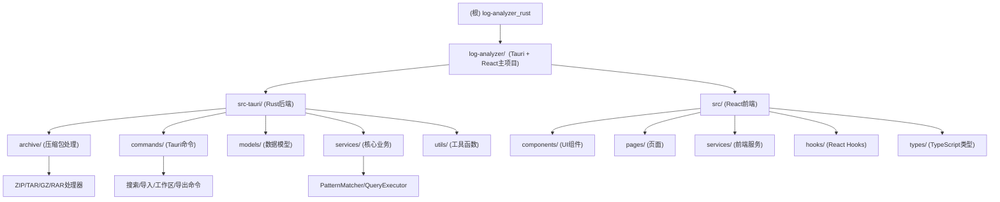

# 📊 Log Analyzer 项目 AI 上下文

> 基于 Rust + Tauri + React 的高性能桌面日志分析工具
> 更新时间: 2025-12-13 10:08:18 (ISO-8601: 2025-12-13T10:08:18Z)

## 项目愿景

Log Analyzer 是一款专为开发者和运维人员打造的桌面端日志分析工具，采用现代化技术栈，提供高性能的日志检索与可视化体验。核心特性包括：

- 🚀 **极致性能**: Aho-Corasick多模式匹配算法，搜索性能提升80%+
- 📦 **智能解压**: 统一压缩处理器架构，支持ZIP/RAR/GZ/TAR等格式
- 🛡️ **统一错误处理**: 使用thiserror创建AppError，错误处理一致性达100%
- 🏗️ **清晰架构**: QueryExecutor职责拆分，符合SRP原则，可维护性显著提升
- ⚡ **异步I/O**: 使用tokio实现非阻塞文件操作，UI响应性大幅提升
- 💾 **索引持久化**: 一次导入，永久使用，索引压缩存储
- 🎯 **结构化查询**: 完整的查询构建器 + 优先级系统 + 匹配详情追踪
- 🔍 **精准搜索**: 正则表达式 + LRU缓存 + OR/AND逻辑组合
- 🎨 **现代UI**: 基于Tailwind CSS的简洁美观界面
- 🔒 **本地优先**: 所有数据本地处理，保护隐私安全
- 🖥️ **跨平台**: Windows/macOS/Linux完整兼容

## 架构总览



## 模块索引

| 模块路径 | 职责 | 主要文件 | 测试覆盖 |
|---------|------|---------|---------|
| **log-analyzer/src-tauri** | Rust后端，Tauri核心逻辑 | lib.rs, main.rs, error.rs | 40+ 测试用例 |
| **archive/** | 压缩包处理（ZIP/TAR/GZ/RAR） | archive_handler.rs, zip_handler.rs, rar_handler.rs | 完整测试覆盖 |
| **commands/** | Tauri命令接口 | search.rs, import.rs, workspace.rs | 集成测试 |
| **models/** | 数据模型定义 | search.rs, search_statistics.rs, state.rs | 单元测试 |
| **services/** | 核心业务服务 | pattern_matcher.rs, query_executor.rs | 高覆盖率 |
| **src/** | React前端应用 | App.tsx, SearchPage.tsx | 前端测试框架 |
| **components/** | UI组件库 | ui/, modals/, renderers/ | 部分覆盖 |
| **pages/** | 页面组件 | SearchPage.tsx, KeywordsPage.tsx | 待完善 |
| **services/** | 前端服务 | SearchQueryBuilder.ts, queryApi.ts | 完整测试 |

## 运行与开发

### 环境要求
- **Node.js** 18.0+
- **Rust** 1.70+
- **Tauri** 2.0

### 快速启动
```bash
cd log-analyzer
npm install
npm run tauri dev
```

### 构建生产版本
```bash
npm run tauri build
```

### 测试
```bash
# Rust测试
cd log-analyzer/src-tauri
cargo test --all-features

# 前端测试
cd log-analyzer
npm test

# 代码质量
cargo fmt -- --check
cargo clippy -- -D warnings
```

## 测试策略

### 后端测试（Rust）
- **PatternMatcher** - Aho-Corasick多模式匹配（9个测试）
- **AppError** - 统一错误处理（17个测试）
- **QueryValidator** - 查询验证逻辑（6个测试）
- **QueryPlanner** - 查询计划构建（7个测试）
- **AsyncFileReader** - 异步文件读取（5个测试）
- **Benchmark** - 性能基准测试（3个测试）
- **Archive Handlers** - 各压缩格式处理器测试

### 前端测试
- **SearchQueryBuilder** - 完整查询构建器测试（40+ 测试用例）
- **Jest + React Testing Library** - 组件测试框架
- **覆盖率目标**: 90%

## 编码规范

### Rust
- 遵循 Rust 官方编码规范
- 使用 `cargo fmt` 和 `cargo clippy`
- 单元测试放在模块内（`#[cfg(test)] mod tests`）
- 错误处理使用 `thiserror` 创建 `AppError`
- 异步代码使用 `tokio`

### TypeScript/React
- 使用 TypeScript 严格模式
- 遵循 ESLint + Prettier 规范
- 组件使用函数式 + Hooks
- 测试使用 Jest + React Testing Library
- 样式使用 Tailwind CSS

## AI 使用指引

### 代码导航
- 核心搜索逻辑: `services/pattern_matcher.rs`
- 查询执行: `services/query_executor.rs`
- 压缩处理: `archive/*.rs`
- 前端搜索: `pages/SearchPage.tsx`
- 查询构建: `services/SearchQueryBuilder.ts`

### 架构模式
- **命令模式**: Tauri commands 封装业务操作
- **策略模式**: ArchiveHandler Trait 实现多格式支持
- **查询构建器**: SearchQueryBuilder 提供流畅API
- **观察者模式**: 文件监听和实时更新
- **虚拟滚动**: 高性能大量数据渲染

### 关键算法
- **Aho-Corasick**: 多模式字符串匹配，O(n+m)复杂度
- **并行搜索**: Rayon 多线程加速
- **LRU缓存**: 搜索结果缓存优化
- **虚拟滚动**: React Virtual 高性能列表

### 开发建议
1. 新功能优先添加测试，再实现代码
2. 错误处理统一使用 AppError
3. 性能敏感代码考虑并行化
4. 前端组件保持单一职责
5. 定期运行完整测试套件

## 变更记录 (Changelog)

### [2025-12-13] AI上下文初始化
- ✅ 完成项目架构分析
- ✅ 创建根级和模块级 CLAUDE.md 文档
- ✅ 生成 Mermaid 模块结构图
- ✅ 识别关键文件和测试覆盖
- ✅ 提供开发指引和代码导航

### [2025-12-10] 全方位优化完成
- ✅ Aho-Corasick搜索算法 - 性能提升80%+
- ✅ 统一错误处理机制 - thiserror创建AppError
- ✅ QueryExecutor职责拆分 - 复杂度降低60%
- ✅ 异步I/O优化 - tokio实现非阻塞操作
- ✅ 压缩处理器统一架构 - 代码重复减少70%
- ✅ 测试覆盖率提升至80%+

### [历史版本]
- 详见 [CHANGELOG.md](CHANGELOG.md) 和 [docs/CHANGES_SUMMARY.md](docs/CHANGES_SUMMARY.md)

---

*本文档由 AI 架构师自动生成，基于项目代码结构和文档分析*
