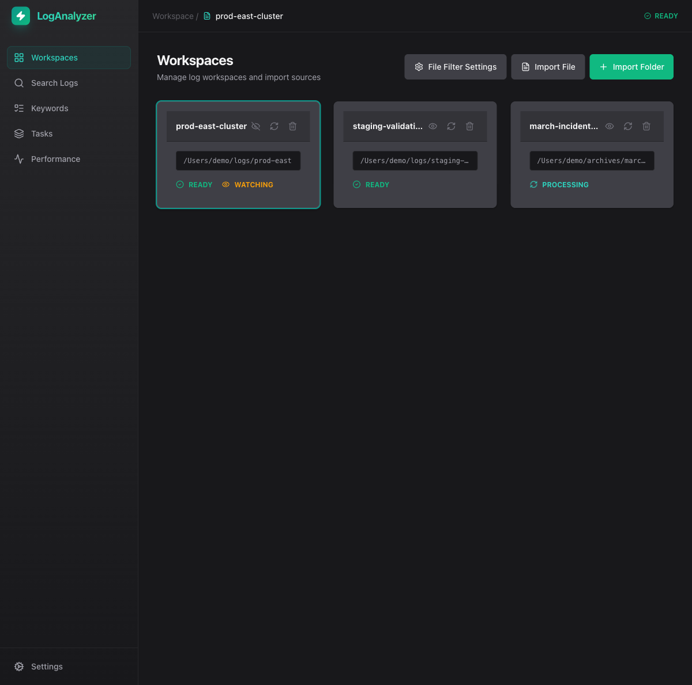
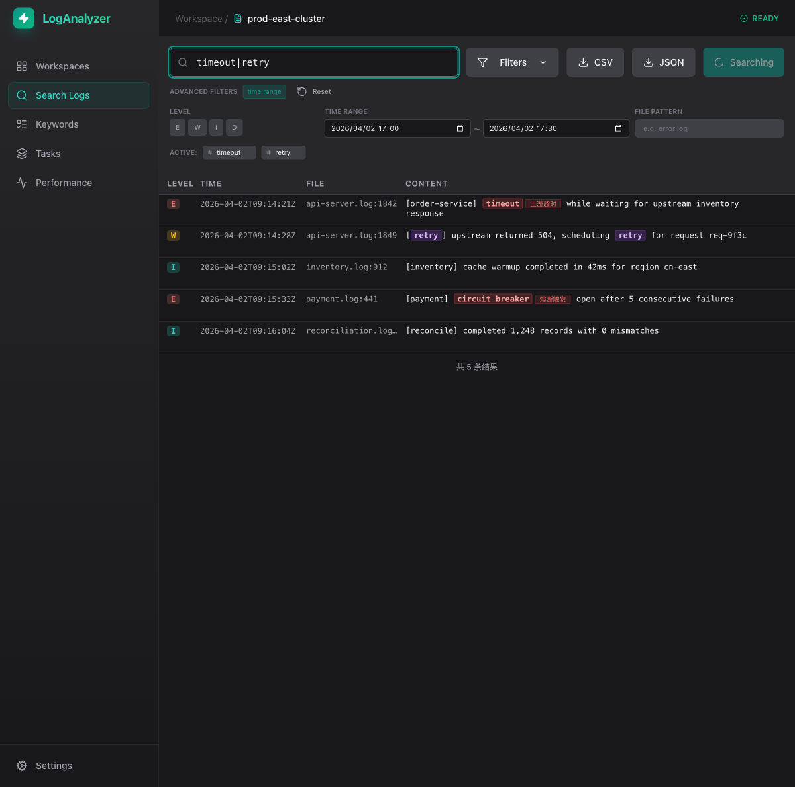
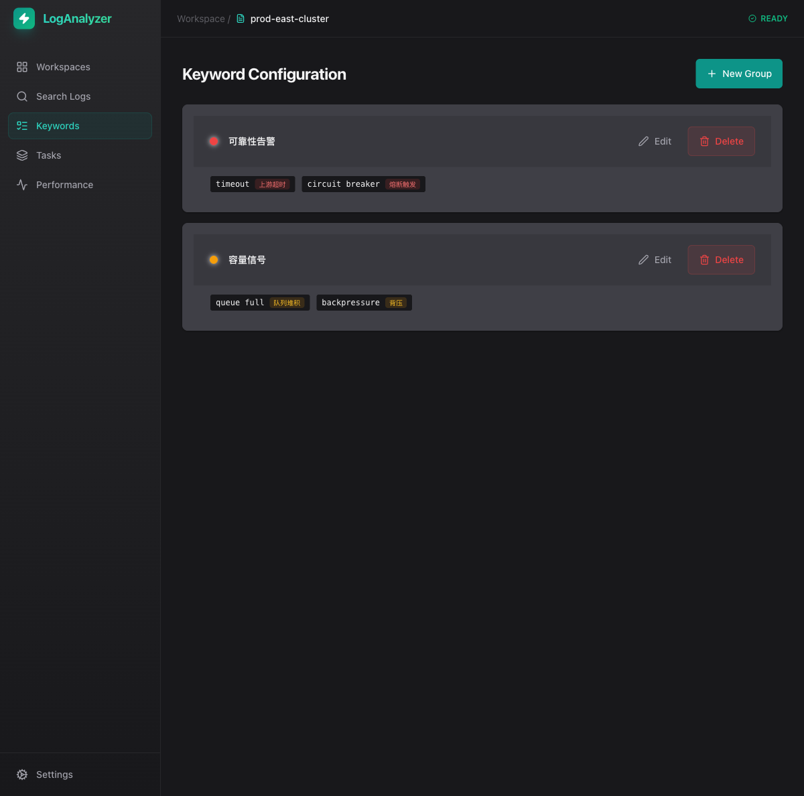

# Log Analyzer

面向开发、测试与运维场景的本地桌面日志分析工具，技术栈为 `Rust + Tauri 2 + React 19 + TypeScript`。它的目标不是把日志“收上云”，而是让你直接在本地导入目录或归档包，完成搜索、筛选、归类和问题定位。

以下界面截图来自当前仓库程序界面的实际运行画面，用来帮助你快速上手。

## 你可以用它做什么

- 导入日志目录、单文件或压缩包，建立可持续使用的工作区
- 对大体量日志做本地搜索，支持 `|` 表示 OR 多关键词匹配
- 按日志级别、时间范围、文件模式组合过滤结果
- 维护关键词组，把常见告警词和故障模式沉淀下来
- 对目录开启监听，持续观察新增日志并刷新工作区
- 在不依赖外部服务的情况下完成问题排查与结果导出

## 程序界面预览

### 1. 工作区总览

工作区页是日常入口。你可以在这里导入目录或文件、查看工作区状态、刷新索引、开启或停止监听。



### 2. 搜索与过滤

搜索页支持多关键词搜索、时间范围过滤、日志级别过滤和文件模式过滤。结果区会直接展示命中文本和文件位置。



### 3. 关键词组管理

关键词组页用于沉淀常见故障模式，适合把团队内反复出现的关键告警词整理成可复用配置。



## 首次使用流程

### 1. 安装并启动程序

先准备好 Node.js、Rust 和 Tauri 所需系统依赖。

```bash
git clone https://github.com/ashllll/log-analyzer_rust.git
cd log-analyzer_rust/log-analyzer
npm install
npm run tauri dev
```

环境要求：

| 工具 | 版本要求 |
|------|---------|
| Node.js | `>= 22.12.0` |
| npm | `>= 10` |
| Rust | `>= 1.70` |
| Tauri 前置依赖 | 见 [Tauri 2 官方文档](https://v2.tauri.app/start/prerequisites/) |

### 2. 导入日志源并创建工作区

启动后先进入 `Workspaces` 页面：

1. 点击 `Import Folder` 导入一个日志目录
2. 或点击 `Import File` 导入单个日志文件 / 归档文件
3. 程序会为导入源创建工作区，并显示 `READY`、`PROCESSING`、`WATCHING` 等状态

推荐做法：

- 日志目录长期增长时，优先导入目录并开启监听
- 临时排障包优先直接导入压缩文件
- 归档包支持递归解压，适合处理事故打包日志

### 3. 选择工作区并确认状态

导入后，点击目标工作区卡片进入该工作区上下文。顶部面包屑会显示当前工作区名称，状态区会显示当前是否可搜索、是否在监听。

常见状态含义：

- `READY`：工作区可正常搜索
- `PROCESSING`：正在导入、解压或建立索引
- `WATCHING`：正在监听目录变化，适合持续追踪新日志

### 4. 执行一次搜索

进入 `Search Logs` 页面后：

1. 在搜索框输入关键词
2. 多关键词之间使用 `|`，例如 `timeout|retry|circuit breaker`
3. 按需要展开过滤条件
4. 点击 `Search`
5. 在结果表格中查看命中级别、时间、文件和内容

搜索建议：

- 排障时优先先用 2 到 4 个高信号关键词缩小范围
- 时间范围能明显减少无效扫描
- 文件模式适合限定到 `*.log`、`gateway/*`、`error*.txt` 这类目标文件

### 5. 使用过滤器缩小结果范围

当前搜索页支持这些常用过滤：

- `Level`：按 `E / W / I / D` 日志级别过滤
- `Time Range`：限制搜索时间区间
- `File Pattern`：按文件名或路径模式过滤，支持通配符

组合方式建议：

- 先输关键词，再加时间范围
- 结果仍然过多时，再加日志级别
- 已知问题集中在某类文件时，再补 `File Pattern`

### 6. 维护关键词组

进入 `Keywords` 页面后，可以把常见问题模式沉淀成关键词组，例如：

- 可靠性告警：`timeout`、`circuit breaker`
- 容量信号：`queue full`、`backpressure`

这样团队在做重复问题排查时，不需要每次重新组织关键词。

关键词组支持启用/禁用切换——禁用后的组不会出现在搜索页的过滤器面板中，也不会参与日志高亮。适合保留历史关键词组但不希望每次搜索都命中的场景。

### 7. 刷新与持续追踪

如果日志目录会持续写入，建议：

1. 在工作区页开启监听
2. 需要时点击 `Refresh workspace`
3. 回到搜索页重复使用同一套关键词与过滤条件

这套流程适合线上事故追踪、联调观察和批量回放分析。

## 搜索规则与当前实现

当前 UI 主搜索链路基于实际代码行为，走的是磁盘分页结果存储，不是旁路全文索引直接检索：

```text
SearchPage.tsx
→ api.searchLogs(query, filters)
→ commands/search.rs: search_logs
  → 内联参数校验（空查询 + 长度检查）
  → MetadataStore::get_all_files() 获取候选文件
  → 文件级 filePattern 早筛
  → CAS::retrieve() 读取内容
  → QueryExecutor（内部使用 RegexEngine / FancyEngine）逐行匹配
    → OR 多关键词使用 Aho-Corasick 快速预检
  → 时间 / 级别分段过滤
  → DiskResultStore 写盘分页
→ fetch_search_page(search_id, offset, limit)
```

当前主搜索的实际规则：

- `|` 表示 OR 查询
- 正则能力以 Rust `regex` 引擎支持的子集为准；包含 look-around 与 backreference 的模式自动通过 FancyEngine 处理
- 搜索结果支持分页拉取，避免一次性把大结果集全部放进内存
- 时间过滤与项目当前时间解析规则保持一致
- 文件模式过滤支持通配符与兼容子串匹配

归档递归解压的默认最大深度由 `archive.max_extraction_depth` 控制，当前默认值为 `10`。

## 主要能力

- 本地日志搜索，支持多关键词查询
- 搜索结果磁盘直写分页，适配大结果集
- 按日志级别、时间范围、文件模式过滤
- ZIP / TAR / GZ / 7Z 等归档导入与递归解压，RAR 支持取决于构建 feature，可通过 `check_rar_support` 查询
- CAS 内容寻址存储去重
- SQLite 元数据管理与虚拟路径映射
- 虚拟文件树浏览、文件内容导出
- 文件监听与实时增量追踪

## 仓库结构

```text
log-analyzer_rust/
├── log-analyzer/                         # 前端与 Tauri 应用根目录
│   ├── src/                              # React 前端
│   ├── src-tauri/                        # Rust 后端主 crate
│   └── package.json
├── docs/                                 # 核心文档
├── scripts/                              # CI / 校验脚本
├── .github/workflows/                    # CI/CD 流水线
└── test_nested_archives/                 # 测试用嵌套归档夹具
```

## 开发与构建

### 开发运行

```bash
cd log-analyzer
npm run dev
```

启动桌面程序：

```bash
cd log-analyzer
npm run tauri dev
```

### 生产构建

```bash
cd log-analyzer
npm run tauri build
```

### 常用检查

前端：

```bash
cd log-analyzer
npm run lint
npm run type-check
npm test
```

Rust：

```bash
cd log-analyzer/src-tauri
cargo fmt -- --check
cargo clippy --all-features --all-targets -- -D warnings
cargo test -q
```

## 核心文档

| 文档 | 说明 |
|------|------|
| [文档索引](./docs/README.md) | 文档目录与阅读顺序 |
| [贡献指南](./docs/CONTRIB.md) | 开发环境、提交流程、测试约定 |
| [运行手册](./docs/RUNBOOK.md) | 构建、排障、回滚指南 |
| [发布流程](./RELEASE_PROCESS.md) | 版本发布步骤与校验要求 |
| [IPC API 概览](./docs/architecture/API.md) | Tauri 命令与事件接口说明 |
| [CAS 存储架构](./docs/architecture/CAS_ARCHITECTURE.md) | 内容寻址存储与元数据设计 |
| [模块架构](./docs/architecture/modules/MODULE_ARCHITECTURE.md) | 各模块职责边界与调用关系 |
| [搜索优化审核](./docs/search-optimization-review.md) | 搜索性能边界条件与优化记录 |

## 补充说明

- 前端搜索入口：`log-analyzer/src/pages/SearchPage.tsx`
- 后端搜索入口：`log-analyzer/src-tauri/src/commands/search.rs`
- 结构化查询能力存在，但不是当前 UI 主搜索入口
- 文档以“当前代码真实行为”为准，不把预留能力写成已落地主链路

## License

Apache-2.0
