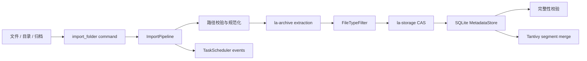

# 导入链路

导入不仅是复制文件。它要管理路径安全、归档提取、内容去重、元数据事务、任务进度、完整性检查和索引收敛。

## `ImportPipeline` 的职责

基础设施层的导入流水线统一承担：

- 工作区 id 与路径验证
- 源路径规范化和工作区目录准备
- TaskScheduler 创建、更新、完成与失败
- 工作区服务创建与 import 调用
- 失败后的资源清理
- 后台完整性校验
- Tantivy segment merge 收尾

因此 Tauri command 可以保持薄边界，只处理调用参数和返回任务 id。

## 安全提取

`la-archive` 对归档条目执行目标路径约束，防止 `../` 等路径穿越逃逸提取目录，并对符号链接保持防护。嵌套归档由提取编排器递归处理，但仍受资源与安全策略约束。

## CAS 与元数据

内容按 SHA-256 写入 CAS；工作区、虚拟路径、原始来源和索引信息写入 SQLite。这样同一份内容可以被不同路径或工作区引用，而不会重复占用对象存储。

## 失败语义

流水线会把失败写回任务状态，并清理未完成的工作区资源。后台完整性验证和索引合并属于导入成功后的收尾阶段，错误必须通过任务 / 事件链路可见，而不是静默丢失。

