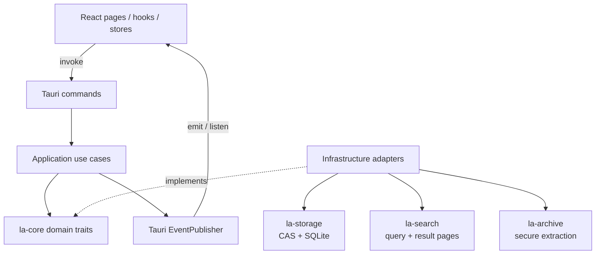

# 架构总览

Log Analyzer 采用 Tauri 2 桌面壳、React 前端和 Rust 后端。核心业务通过 Clean Architecture 分层：Tauri 命令负责边界校验，application use cases 负责编排，infrastructure 提供文件系统、数据库、事件与搜索适配器，domain traits 保持对 Tauri 和具体存储实现无感知。

## 运行时边界

| 层 | 位置 | 职责 |
| --- | --- | --- |
| 前端 | `log-analyzer/src/` | 页面、hooks、Zustand 状态、React Query 缓存与 Tauri 事件投影 |
| 命令边界 | `src-tauri/src/commands/` | `#[tauri::command]` 参数校验、状态解析与 use case 委托 |
| 应用层 | `src-tauri/src/application/` | 搜索、导入、监听、配置、导出与工作区用例 |
| 基础设施 | `src-tauri/src/infrastructure/` | domain trait 的具体适配器与运行时编排 |
| 引擎与工具 | `services/`、`utils/` | 查询规划、正则、过滤、文件监听、重试、取消等 |
| 领域与 workspace crates | `src-tauri/crates/` | 可独立测试和复用的核心模型、存储、搜索、归档能力 |

## Workspace crates

### `la-core`

定义 `LogSearcher`、`LogFileRepository`、`SearchResultRepository`、`ArchiveExtractor`、`EventPublisher`、`WorkspaceRepository`、`TaskScheduler` 等 domain traits，以及共享模型和 `AppError`。它不依赖 Tauri 或具体文件系统。

### `la-storage`

负责 SHA-256 内容寻址存储、SQLite `MetadataStore`、完整性检查与垃圾回收。内容对象和虚拟路径元数据分离。

### `la-search`

提供查询引擎、Tantivy 管理、命中高亮与 `DiskResultStore`。大结果集通过磁盘分页，避免把全部记录保存在进程内存。

### `la-archive`

负责 ZIP、TAR、GZ、7Z 与可选 RAR 提取，包含嵌套归档编排、路径穿越检查和符号链接防护。

## 关键设计约束

1. **Tauri Events 而非 WebSocket**：应用是桌面本地进程，没有额外网络服务层。
2. **离线优先**：核心运行链路不依赖远端 API。
3. **CAS 去重**：内容身份与用户看到的虚拟路径分离。
4. **阻塞工作隔离**：搜索和导入的 CPU / IO 密集部分不阻塞 Tauri async 事件循环。
5. **磁盘结果会话**：搜索结果按 `search_id` 生命周期写盘、分页和取消。
6. **边界先验证**：路径、工作区 id 与查询字符串在进入深层实现前完成校验。

## 继续阅读

- [搜索链路](./search.md)
- [导入链路](./import.md)
- [IPC 与状态同步](./ipc.md)
- [CAS 存储架构](./CAS_ARCHITECTURE.md)
- [项目结构](../development/structure.md)

