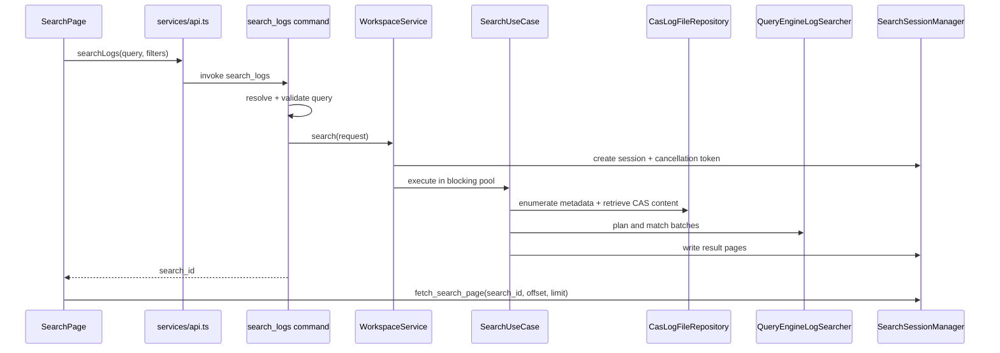

# 搜索链路

搜索从 React 页面发起，经 Tauri command 解析和验证后，由 `WorkspaceService` / `SearchUseCase` 编排。查询引擎按计划匹配内容，过滤器约束候选记录，结果最终进入 `DiskResultStore`。

## 查询规划

`QueryEngineLogSearcher` 根据查询形状选择更合适的匹配方式：

- 简单单模式可走 Memchr 路径。
- 多模式 OR 查询可使用 Aho-Corasick。
- 标准正则交给 Rust `regex`。
- look-around 模式使用 Fancy 引擎。

进入执行前，查询验证器会检查嵌套量词、重叠交替等高风险结构。

## 批处理与过滤

`SearchBatch` 分批处理文件与结果，避免无限累积。`CompiledSearchFilters` 把时间范围、日志级别掩码和文件路径规则编译为统一 domain `Filter`，在结果写盘前执行。

## 会话所有权

`SearchSessionManager` 统一管理：

- 新会话与 `search_id`
- cancellation token 注册与取消
- 结果分页读取
- token 清理与结果会话生命周期

这个边界让 `cancel_search` 和 `fetch_search_page` 不需要遍历工作区或猜测结果存储位置。

## 性能判断

搜索耗时通常由三个因素共同决定：扫描内容量、每行匹配成本、命中结果量。时间和文件模式过滤能减少输入，查询规划降低匹配成本，磁盘分页控制输出内存。

