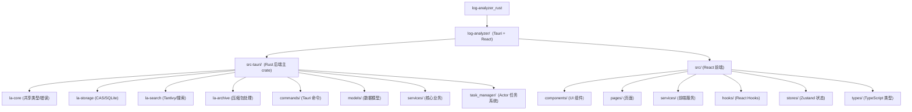

# 📊 Log Analyzer 项目 AI 上下文

> 基于 Rust + Tauri + React 的高性能桌面日志分析工具
> 更新时间: 2026-03-31

## 项目愿景

Log Analyzer 是一款专为开发者和运维人员打造的桌面端日志分析工具，采用现代化技术栈，提供高性能的日志检索与可视化体验。核心特性包括：

- 🚀 **极致性能**: Aho-Corasick 多模式匹配算法，搜索性能提升 80%+
- 📦 **智能解压**: 统一压缩处理器架构，支持 ZIP/TAR/GZ/RAR/7Z 等格式
- 🛡️ **统一错误处理**: 使用 `thiserror` 创建 `AppError`，错误处理一致性达 100%
- 🏗️ **清晰架构**: QueryExecutor 职责拆分，后端采用 Cargo Workspace 拆分为 4 个 crate
- ⚡ **异步 I/O**: 使用 tokio 实现非阻塞文件操作，UI 响应性大幅提升
- 💾 **索引持久化**: Tantivy 全文索引 + SQLite FTS5，一次导入永久使用
- 🎯 **结构化查询**: 完整的查询构建器 + 优先级系统 + 匹配详情追踪
- 🔍 **精准搜索**: 正则表达式 + LRU 缓存 + OR/AND 逻辑组合
- 🎨 **现代 UI**: React 19 + Tailwind CSS + Zustand 状态管理
- 🔒 **本地优先**: 所有数据本地处理，保护隐私安全
- 🖥️ **跨平台**: Windows / macOS / Linux 完整兼容

## 架构总览



## Cargo Workspace 结构

后端采用 **Workspace 架构**，核心逻辑拆分到 4 个 crate：

| Crate | 路径 | 职责 |
|-------|------|------|
| **la-core** | `crates/la-core/` | 共享错误类型 (`AppError`, `CommandError`)、数据模型、trait |
| **la-storage** | `crates/la-storage/` | CAS (`cas.rs`)、SQLite 元数据 (`metadata_store.rs`)、Saga 事务 (`coordinator.rs`) |
| **la-search** | `crates/la-search/` | Tantivy 索引、搜索管理器、`ReaderPool`、高亮引擎、流式构建器 |
| **la-archive** | `crates/la-archive/` | 压缩包处理 (ZIP/TAR/GZ/RAR/7Z)、安全检测、递归深度限制 |

主 crate `src-tauri` 通过 path 依赖引入以上 workspace crates。修改 crate 源码后，从 `src-tauri/` 运行 `cargo test --workspace` 测试全部。

## 运行与开发

### 环境要求
- **Node.js** 22.12.0+
- **Rust** 1.70+
- **Tauri** 2.0

### 快速启动
```bash
cd log-analyzer
npm install
npm run tauri dev
```

### 常用命令
```bash
# TypeScript 类型检查
npm run type-check

# ESLint
npm run lint

# 前端测试
npm test

# 构建生产版本
npm run tauri build

# Rust 测试（在 log-analyzer/src-tauri/ 下执行）
cargo test --workspace --all-features          # 全部测试（含 workspace crates）
cargo test --all-features pattern_matcher      # 单模块测试
cargo clippy --all-features --all-targets -- -D warnings
cargo fmt -- --check

# 推送前验证
npm run validate:ci
```

## AI 使用指引

### 代码导航
- 核心搜索逻辑: `crates/la-search/src/lib.rs`, `services/pattern_matcher.rs`
- 查询执行: `services/query_executor.rs`
- CAS 存储: `crates/la-storage/src/cas.rs`
- 压缩处理: `crates/la-archive/src/`
- 前端搜索: `pages/SearchPage.tsx`
- 状态管理: `stores/` (Zustand)

### 关键架构决策
- **事件系统**: 所有命令直接使用 `app_handle.emit()` 发送到前端，无中间 EventBus 层
- **锁策略**: AppState 使用 `parking_lot::Mutex`，“lock → clone → unlock → await” 模式
- **搜索结果**: `DiskResultStore` 写入磁盘临时文件，前端按需分页读取
- **前后端字段名**: 严格统一使用 `snake_case`

### 2026-03-31 集中修复要点
- `cache_key` 哈希逻辑补全，避免缓存污染
- 无界通道替换为有界通道 `tokio::sync::mpsc::channel(1000)`
- 孤儿文件清理竞态条件修复（数据库事务保证原子性）
- `ReaderPool.acquire()` 实现，支持并发搜索

---

*本文档为开发上下文速查，完整规范请参见根目录 [CLAUDE.md](../../CLAUDE.md)*
