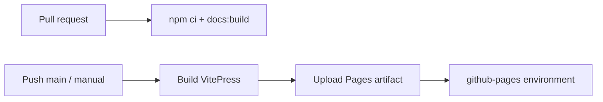

# CI 与 GitHub 工作流

仓库使用 GitHub Actions 执行跨平台测试、静态分析、覆盖率、性能回归、发布和文档部署。外部 action 必须固定到完整 40 位 commit SHA，避免可变 tag 带来的供应链漂移。

## 主要工作流

| Workflow | 作用 |
| --- | --- |
| `ci.yml` | Rust 多平台测试、前端验证、桌面 smoke build、集成测试 |
| `pr-validation.yml` | Pull request 的快速 / 针对性校验 |
| `codeql.yml` | CodeQL 安全分析 |
| `rust-coverage.yml` | Rust 覆盖率 |
| `benchmark.yml` | 基准测试 |
| `performance-regression.yml` | 性能回归检查 |
| `bump-and-tag.yml` | 版本提升与 tag 自动化 |
| `release.yml` | 桌面发行构建 |
| `docs-pages.yml` | 文档 PR 构建与 GitHub Pages 部署 |

## 文档 Pages 流程



- Pull request 只获得 `contents: read`，只验证构建。
- `main` 的相关路径变化或手动触发会构建 Pages artifact。
- deploy job 单独获得 `pages: write` 与 `id-token: write`。
- `pages` concurrency group 不取消正在进行的生产部署。
- 生产站点默认 base 为 `/log-analyzer_rust/`。

首次启用时，仓库管理员需要在 **Settings → Pages → Build and deployment → Source** 选择 **GitHub Actions**。

## Workflow invariant checker

`scripts/check_ci_workflows.mjs` 检查：

- YAML 不含 tab 缩进。
- 外部 actions 使用完整 SHA。
- Linux Tauri / Rust job 复用统一系统依赖 action。
- release、coverage 和版本脚本保持关键约束。

需要联网验证 action SHA 是否仍由上游引用时运行：

```bash
node scripts/check_ci_workflows.mjs --verify-remote
```

## 修改 CI 的原则

1. 先把公共系统依赖收敛到 composite action。
2. 给每个 job 最小 `GITHUB_TOKEN` 权限。
3. 固定 action SHA，并用注释保留可读的 major version。
4. 避免把发布权限暴露给 pull request job。
5. 本地运行 invariant checker 和相关格式检查。

