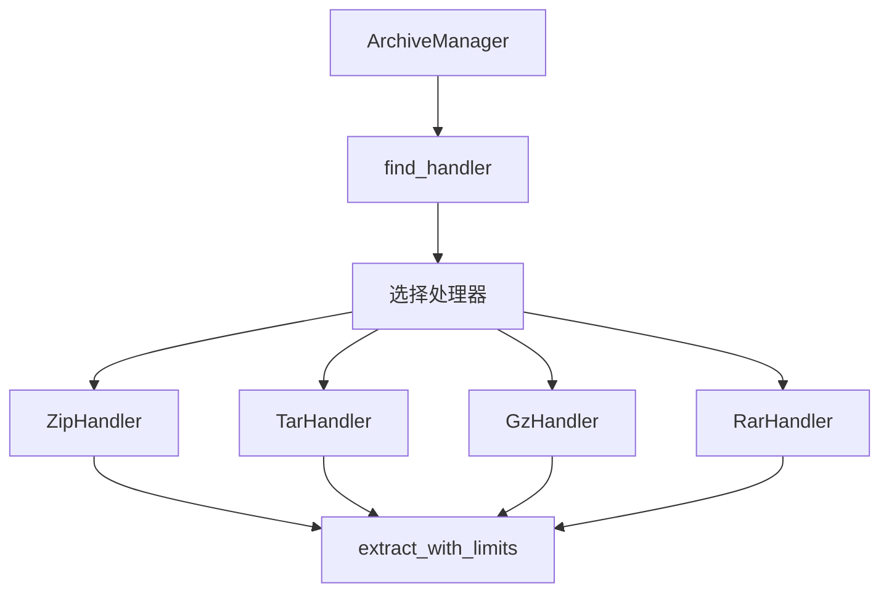
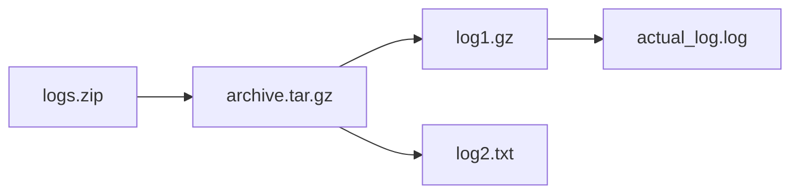

[根目录](../../../CLAUDE.md) > [src-tauri](../) > **archive (压缩包处理)**

# 压缩包处理模块文档

> 支持 ZIP/TAR/GZ/RAR 多格式递归解压

## 模块职责

Archive 模块负责统一处理各种压缩格式的日志文件，采用策略模式设计，支持：

- **多格式支持**: ZIP、TAR、TAR.GZ、TGZ、GZ、RAR
- **递归解压**: 自动处理嵌套压缩包
- **安全限制**: 文件大小/数量/总大小限制
- **统一接口**: ArchiveHandler Trait 标准化
- **错误处理**: 详细错误信息和路径追踪
- **跨平台**: 内置多平台 unrar 二进制

## 架构设计

### 核心Trait - ArchiveHandler

```rust
#[async_trait::async_trait]
pub trait ArchiveHandler {
    async fn extract_with_limits(
        &self,
        source: &Path,
        target_dir: &Path,
        max_file_size: u64,
        max_total_size: u64,
        max_file_count: usize,
    ) -> Result<ExtractionSummary>;

    fn can_handle(&self, path: &Path) -> bool;

    fn get_supported_extensions(&self) -> &'static [&'static str];
}
```

### 策略模式实现



## 支持的格式

### 1. ZIP 格式 - ZipHandler

**技术实现**: `zip` crate (0.6)

**特性**:
- 标准 ZIP 格式支持
- 密码保护文件检测
- 目录结构保持
- 多平台兼容性

**支持扩展名**: `.zip`, `.ZIP`

**示例**:
```rust
let handler = ZipHandler;
let summary = handler.extract_with_limits(
    Path::new("logs.zip"),
    Path::new("./extracted"),
    100 * 1024 * 1024,  // 100MB
    1024 * 1024 * 1024, // 1GB
    1000                 // 1000文件
).await?;
```

### 2. TAR 格式 - TarHandler

**技术实现**: `tar` crate (0.4) + `flate2` (1.0)

**支持格式**:
- 纯 TAR: `.tar`
- 压缩 TAR.GZ: `.tar.gz`, `.tgz`
- 压缩 TAR.GZ (大写): `.TAR.GZ`, `.TGZ`

**特性**:
- 自动检测压缩格式
- 保持目录结构
- 软链接处理
- 权限信息保留

**处理逻辑**:
1. 检查扩展名确定压缩类型
2. 使用对应解压策略
3. 过滤非日志文件（可选）

### 3. GZ 格式 - GzHandler

**技术实现**: `flate2` crate (1.0)

**支持格式**: `.gz`, `.GZ`

**特性**:
- 纯 gzip 文件处理
- 单文件解压
- 自动检测文件类型
- 内存高效解压

**注意**:
- 纯 GZ 格式仅解压单文件
- TAR.GZ 由 TarHandler 处理

### 4. RAR 格式 - RarHandler

**技术实现**: `unrar` crate (0.5) + 内置二进制

**支持格式**: `.rar`, `.RAR`

**特性**:
- 内置多平台 unrar 二进制
- 无需系统安装 RAR
- 支持 RAR4/5 格式
- 跨平台兼容性

**内置二进制**:
```
binaries/
├── unrar-x86_64-pc-windows-msvc.exe
├── unrar-x86_64-apple-darwin
├── unrar-aarch64-apple-darwin
└── unrar-x86_64-unknown-linux-gnu
```

**平台选择逻辑**:
```rust
fn get_unrar_path() -> Result<PathBuf> {
    let (arch, os, ext) = detect_platform();
    let binary_name = format!("unrar-{arch}-{os}{ext}");
    Ok(assets_dir().join("binaries").join(binary_name))
}
```

## 核心组件

### ArchiveManager - 处理器管理器

```rust
pub struct ArchiveManager {
    handlers: Vec<Box<dyn ArchiveHandler>>,
    max_file_size: u64,      // 单文件最大大小
    max_total_size: u64,     // 总大小限制
    max_file_count: usize,   // 文件数量限制
}
```

**核心方法**:

1. **find_handler** - 查找合适处理器
```rust
pub fn find_handler(&self, path: &Path) -> Option<&dyn ArchiveHandler> {
    self.handlers
        .iter()
        .find(|h| h.can_handle(path))
        .map(|h| h.as_ref())
}
```

2. **extract_archive** - 统一解压入口
```rust
pub async fn extract_archive(
    &self,
    source: &Path,
    target_dir: &Path,
) -> Result<ExtractionSummary> {
    let handler = self.find_handler(source)
        .ok_or_else(|| AppError::archive_error(...))?;

    handler.extract_with_limits(
        source, target_dir,
        self.max_file_size,
        self.max_total_size,
        self.max_file_count
    ).await
}
```

### ExtractionSummary - 解压摘要

```rust
pub struct ExtractionSummary {
    pub extracted_files: Vec<(PathBuf, u64)>,  // (路径, 大小)
    pub total_size: u64,
    pub file_count: usize,
    pub errors: Vec<String>,
    pub source_path: PathBuf,
}
```

**方法**:
- `add_file` - 添加提取文件
- `add_error` - 记录错误
- `is_empty` - 检查是否为空

## 安全特性

### 1. 文件大小限制
```rust
max_file_size: 100 * 1024 * 1024,  // 100MB
```
- 防止超大文件耗尽内存
- 大文件自动跳过并记录

### 2. 总大小限制
```rust
max_total_size: 1024 * 1024 * 1024,  // 1GB
```
- 防止解压耗尽磁盘空间
- 实时累计检查

### 3. 文件数量限制
```rust
max_file_count: 1000,  // 1000文件
```
- 防止目录遍历攻击
- 大量小文件保护

### 4. 路径安全
- 防止路径穿越攻击
- 相对路径规范化
- Windows UNC 路径支持

## 错误处理

### AppError 扩展
```rust
AppError::Archive {
    message: String,
    path: Option<PathBuf>,
}
```

**错误场景**:
- 不支持的压缩格式
- 文件损坏/无法读取
- 密码保护（暂不支持）
- 磁盘空间不足
- 权限不足

**错误上下文**:
```rust
pub fn with_context(self, context: impl Into<String>) -> Self {
    match self {
        AppError::Archive { message, path } => AppError::Archive {
            message: format!("{}: {}", context.into(), message),
            path,
        },
        other => other,
    }
}
```

## 递归解压

### 处理嵌套压缩包



**处理流程**:
1. 解压第一层压缩包
2. 扫描提取的文件
3. 检测新的压缩文件
4. 递归处理直到所有文件解压完成
5. 过滤出日志文件

**实现代码**:
```rust
pub async fn process_path_recursive_with_metadata(
    path: &Path,
    extracted_files: &mut Vec<ExtractedFile>,
    workspace_id: &str,
    file_metadata: &mut HashMap<String, FileMetadata>,
) -> Result<()> {
    // 1. 检测是否为压缩文件
    if let Some(handler) = archive_manager.find_handler(path) {
        // 2. 解压到临时目录
        let temp_dir = tempfile::tempdir()?;
        handler.extract_with_limits(...).await?;

        // 3. 递归处理解压的文件
        for entry in walkdir::WalkDir::new(temp_dir.path()) {
            let entry = entry?;
            if entry.file_type().is_file() {
                process_file(entry.path(), extracted_files, workspace_id, file_metadata).await?;
            }
        }
    } else {
        // 4. 直接处理普通文件
        process_file(path, extracted_files, workspace_id, file_metadata).await?;
    }

    Ok(())
}
```

## 测试策略

### 测试覆盖
- **单元测试**: 各处理器独立测试
- **集成测试**: 完整解压流程测试
- **边界测试**: 错误场景和限制测试

### TarHandler 测试示例
```rust
#[tokio::test]
async fn test_extract_tar_file() {
    let temp_dir = TempDir::new().unwrap();
    let tar_file = temp_dir.path().join("test.tar");

    // 创建测试 TAR 文件
    let data1 = b"This is test file 1";
    let data2 = b"This is test file 2 with more content";

    let header1 = Header::new_gnu();
    header1.set_path("file1.txt").unwrap();
    header1.set_size(data1.len() as u64).unwrap();
    header1.set_cksum();

    let header2 = Header::new_gnu();
    header2.set_path("file2.txt").unwrap();
    header2.set_size(data2.len() as u64).unwrap();
    header2.set_cksum();

    // 验证处理能力
    assert!(handler.can_handle(Path::new("test.tar")));
    assert!(handler.can_handle(Path::new("test.tar.gz")));
    assert!(!handler.can_handle(Path::new("test.gz"))); // 纯GZ由GzHandler处理
}
```

### ArchiveManager 测试示例
```rust
#[tokio::test]
async fn test_extract_unsupported_format() {
    let temp_dir = TempDir::new().unwrap();
    let source_file = temp_dir.path().join("test.txt");

    fs::write(&source_file, "test content").unwrap();

    let manager = ArchiveManager::new();
    let result = manager.extract_archive(&source_file, temp_dir.path()).await;

    assert!(result.is_err());
    if let Err(e) = result {
        assert!(matches!(e, AppError::Archive { .. }));
    }
}
```

## 性能优化

### 1. 流式处理
- 大文件分块读取
- 内存占用优化
- 避免一次性加载全部内容

### 2. 并行解压
- 多个压缩包并行处理
- 独立文件并行索引
- Rayon 线程池加速

### 3. 缓存机制
- 解压结果缓存
- 文件元数据缓存
- 处理器实例缓存

## 常见问题 (FAQ)

### Q: 如何添加新的压缩格式？
A:
1. 实现 `ArchiveHandler` Trait
2. 在 `ArchiveManager::new()` 中注册
3. 添加对应的测试用例
4. 更新文档

### Q: 密码保护的 ZIP 文件？
A: 当前版本不支持密码保护文件，检测到会跳过并记录警告。

### Q: RAR5 格式支持？
A: 使用 `unrar` crate 0.5 版本，已支持 RAR5 格式。

### Q: 如何调整安全限制？
A: 修改 `ArchiveManager::new()` 中的默认值：
```rust
max_file_size: 200 * 1024 * 1024,  // 200MB
max_total_size: 2 * 1024 * 1024 * 1024,  // 2GB
max_file_count: 2000,  // 2000文件
```

## 相关文件清单

### 核心文件
- `archive_handler.rs` - Handler Trait 定义
- `mod.rs` - 管理器和模块入口

### 具体处理器
- `zip_handler.rs` - ZIP 格式处理
- `tar_handler.rs` - TAR/TAR.GZ 处理
- `gz_handler.rs` - 纯 GZ 处理
- `rar_handler.rs` - RAR 格式处理

### 工具文件
- `processor.rs` - 递归处理工具

### 测试文件
- 各处理器内的 `#[cfg(test)] mod tests`
- `tests/` 目录下的集成测试

---

## 变更记录 (Changelog)

### [2025-12-13] AI上下文初始化
- ✅ 完整架构分析
- ✅ Handler Trait 设计梳理
- ✅ 各格式处理器功能总结
- ✅ 安全特性和测试策略整理

### [历史版本]
- 详见根目录 CHANGELOG.md

---

*本文档由 AI 架构师自动生成，基于压缩处理模块代码分析*
