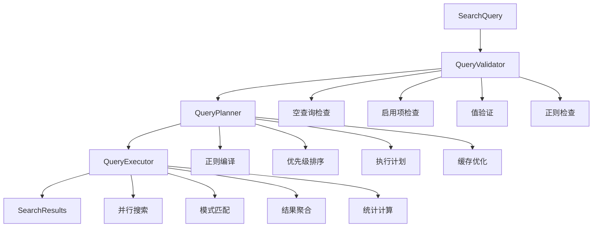
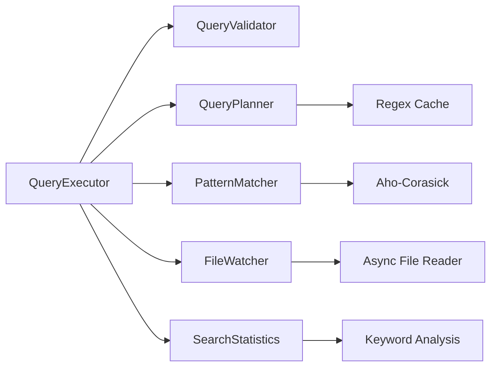
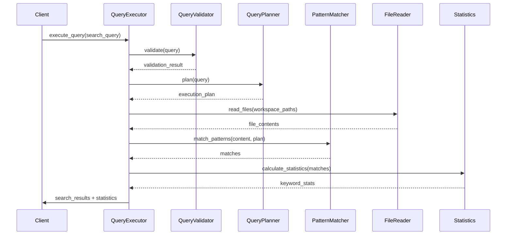

[根目录](../../../CLAUDE.md) > [src-tauri](../) > **services (核心业务服务)**

# 核心业务服务模块文档

> 高性能日志搜索与查询执行引擎

## 模块职责

Services 模块是应用的核心业务逻辑层，负责：

- **高性能搜索**: Aho-Corasick 算法实现多模式匹配
- **结构化查询**: Validator/Planner/Executor 三层架构
- **异步文件处理**: tokio 实现非阻塞 I/O
- **并行搜索**: Rayon 多线程加速
- **文件监听**: 实时检测文件变化
- **索引管理**: 持久化存储和增量更新
- **统计计算**: 搜索结果分析和可视化

## 架构设计

### 三层查询架构



### 服务依赖关系



## 核心服务详解

### 1. PatternMatcher - 模式匹配器

**算法**: Aho-Corasick 多模式匹配

**性能指标**:
- 时间复杂度: O(n + m + z)
- 空间复杂度: O(m * alphabet)
- 性能提升: 80%+

**核心实现**:
```rust
pub struct PatternMatcher {
    ac: Option<AhoCorasick>,
    patterns: Vec<String>,
    case_insensitive: bool,
}

impl PatternMatcher {
    pub fn new(patterns: Vec<String>, case_insensitive: bool) -> Self {
        let ac = if !patterns.is_empty() {
            let mut builder = AhoCorasickBuilder::new();
            builder.match_kind(MatchKind::LeftmostFirst);

            if case_insensitive {
                builder.ascii_case_insensitive(true);
            }

            match builder.build(&patterns) {
                Ok(ac) => Some(ac),
                Err(e) => {
                    eprintln!("[WARNING] Failed to build Aho-Corasick automaton: {}", e);
                    None
                }
            }
        } else {
            None
        };

        Self { ac, patterns, case_insensitive }
    }
}
```

**关键方法**:

1. **matches_all** - AND 逻辑匹配
```rust
pub fn matches_all(&self, text: &str) -> bool {
    let Some(ref ac) = self.ac else {
        return false;
    };

    if self.patterns.is_empty() {
        return false;
    }

    // 收集所有匹配的模式ID
    let mut matched_ids = std::collections::HashSet::new();
    for mat in ac.find_iter(text) {
        matched_ids.insert(mat.pattern().as_usize());
    }

    // 检查是否所有模式都匹配
    matched_ids.len() == self.patterns.len()
}
```

2. **matches_any** - OR 逻辑匹配
```rust
pub fn matches_any(&self, text: &str) -> bool {
    let Some(ref ac) = self.ac else {
        return false;
    };
    ac.find_iter(text).next().is_some()
}
```

3. **find_matches** - 匹配详情
```rust
pub fn find_matches(&self, text: &str) -> Vec<Match> {
    let Some(ref ac) = self.ac else {
        return Vec::new();
    };

    ac.find_iter(text)
        .map(|mat| Match {
            pattern_index: mat.pattern().as_usize(),
            start: mat.start(),
            end: mat.end(),
            matched_text: text[mat.start()..mat.end()].to_string(),
        })
        .collect()
}
```

**测试覆盖**: 9个测试用例
- 空模式测试
- 单模式测试
- 多模式 AND 测试
- 大小写敏感/不敏感测试
- 性能基准测试
- 边界条件测试

### 2. QueryValidator - 查询验证器

**职责**: 验证查询合法性，确保搜索质量和性能

**验证规则**:

```rust
pub struct ValidationResult {
    pub is_valid: bool,
    pub issues: Vec<ValidationIssue>,
}

#[derive(Debug, Clone)]
pub struct ValidationIssue {
    pub code: String,
    pub severity: ValidationSeverity,  // error | warning | info
    pub message: String,
    pub field: Option<String>,
}
```

**核心验证逻辑**:

1. **空查询检查**
```rust
if query.terms.is_empty() {
    issues.push(ValidationIssue {
        code: "EMPTY_QUERY".to_string(),
        severity: ValidationSeverity::Error,
        message: "Search query cannot be empty".to_string(),
        field: Some("terms".to_string()),
    });
}
```

2. **启用项检查**
```rust
let enabled_terms: Vec<_> = query.terms.iter().filter(|t| t.enabled).collect();
if enabled_terms.is_empty() {
    issues.push(ValidationIssue {
        code: "NO_ENABLED_TERMS".to_string(),
        severity: ValidationSeverity::Error,
        message: "At least one search term must be enabled".to_string(),
        field: Some("terms".to_string()),
    });
}
```

3. **正则表达式验证**
```rust
if term.is_regex {
    match Regex::new(&term.value) {
        Ok(_) => {},
        Err(e) => {
            issues.push(ValidationIssue {
                code: "INVALID_REGEX".to_string(),
                severity: ValidationSeverity::Error,
                message: format!("Invalid regex: {}", e),
                field: Some("value".to_string()),
            });
        }
    }
}
```

**测试覆盖**: 6个测试用例
- 空查询验证
- 无启用项验证
- 空值检查
- 值长度限制
- 无效正则验证
- 有效查询验证

### 3. QueryPlanner - 查询计划器

**职责**: 构建优化后的执行计划

**核心功能**:

1. **正则表达式编译和缓存**
```rust
pub struct ExecutionPlan {
    pub compiled_patterns: Vec<CompiledPattern>,
    pub execution_strategy: ExecutionStrategy,
    pub priority_sorted_terms: Vec<SearchTerm>,
    pub cache_key: String,
}

#[derive(Debug, Clone)]
pub struct CompiledPattern {
    pub term_id: String,
    pub regex: Regex,
    pub operator: QueryOperator,
    pub case_sensitive: bool,
    pub priority: u32,
}
```

2. **优先级排序**
```rust
fn sort_by_priority(&self, terms: &mut Vec<SearchTerm>) {
    terms.sort_by(|a, b| b.priority.cmp(&a.priority));
}
```

3. **执行策略制定**
```rust
pub enum ExecutionStrategy {
    Sequential,    // 顺序执行
    Parallel,      // 并行执行
    Mixed,         // 混合策略
}
```

**测试覆盖**: 7个测试用例
- AND 查询计划
- OR 查询计划
- NOT 查询计划
- 全局操作符覆盖
- 正则缓存编译
- 大小写敏感编译
- 优先级排序

### 4. QueryExecutor - 查询执行器

**职责**: 协调三层架构，执行搜索并返回结果

**核心流程**:



**核心方法**:
```rust
pub async fn execute_query(
    &self,
    query: &SearchQuery,
    workspace_paths: &[PathBuf],
    max_results: usize,
) -> Result<SearchResults> {
    // 1. 验证查询
    let validation = self.validator.validate(query);
    if !validation.is_valid {
        return Err(AppError::validation_error(
            "Invalid query".to_string()
        ));
    }

    // 2. 构建执行计划
    let plan = self.planner.build_plan(query)?;

    // 3. 并行搜索文件
    let results: Vec<_> = self.search_files_parallel(
        workspace_paths,
        &plan,
        max_results
    ).await?;

    // 4. 聚合结果
    let search_results = self.aggregate_results(results)?;

    // 5. 计算统计信息
    let statistics = self.calculate_statistics(&search_results)?;

    Ok(SearchResults {
        entries: search_results,
        summary: SearchResultSummary {
            total_matches: statistics.total_matches,
            keyword_statistics: statistics.keyword_stats,
            execution_time: elapsed,
            cache_hit: false,
        },
    })
}
```

**并行搜索实现**:
```rust
async fn search_files_parallel(
    &self,
    paths: &[PathBuf],
    plan: &ExecutionPlan,
    max_results: usize,
) -> Result<Vec<SearchResults>> {
    use rayon::prelude::*;

    let results: Vec<SearchResults> = paths
        .par_iter()
        .map(|path| {
            self.search_single_file(path, plan, max_results)
        })
        .collect::<Result<Vec<_>>>()?;

    Ok(results)
}
```

**测试覆盖**: 1个主要集成测试
- 混合大小写敏感性测试

### 5. FileWatcher - 文件监听器

**技术栈**: `notify` crate + `tokio`

**核心功能**:

1. **异步文件读取**
```rust
pub async fn read_file_from_offset(
    file_path: &Path,
    offset: u64,
    max_bytes: Option<usize>,
) -> Result<(String, bool)> {
    let file = tokio::fs::File::open(file_path).await?;
    let metadata = file.metadata().await?;
    let file_size = metadata.len();

    if offset >= file_size {
        return Ok(("".to_string(), false));
    }

    let mut file = tokio::io::BufReader::new(file);
    let _ = file.seek(std::io::SeekFrom::Start(offset)).await?;

    let mut content = String::new();
    let mut bytes_read = 0;

    let reader = tokio::io::BufReader::new(&mut file);
    let mut lines = reader.lines();

    while let Some(line_result) = lines.next_line().await? {
        if let Some(max) = max_bytes {
            if bytes_read + line.len() > max {
                break;
            }
        }

        content.push_str(&line);
        content.push('\n');
        bytes_read += line.len() + 1;

        if content.len() >= 8192 {  // 8KB buffer
            break;
        }
    }

    let has_more = bytes_read < (file_size - offset) as usize;
    Ok((content, has_more))
}
```

2. **文件变化监听**
```rust
pub async fn watch_directory(
    path: &Path,
    callback: impl Fn(FileChangeEvent) + Send + Sync + 'static,
) -> Result<WatcherHandle> {
    let (tx, mut rx) = mpsc::channel(100);

    let watcher = RecommendedWatcher::new(
        move |event| {
            let _ = tx.send(event);
        },
        WatcherConfig::default(),
    )?;

    watcher.watch(path, RecursiveMode::Recursive)?;

    // 异步处理事件
    tokio::spawn(async move {
        while let Some(event) = rx.recv().await {
            match event {
                DebouncedEvent::Create(path) => {
                    callback(FileChangeEvent {
                        path,
                        event_type: ChangeType::Created,
                        timestamp: SystemTime::now(),
                    });
                }
                DebouncedEvent::Write(path) => {
                    callback(FileChangeEvent {
                        path,
                        event_type: ChangeType::Modified,
                        timestamp: SystemTime::now(),
                    });
                }
                DebouncedEvent::Remove(path) => {
                    callback(FileChangeEvent {
                        path,
                        event_type: ChangeType::Deleted,
                        timestamp: SystemTime::now(),
                    });
                }
                _ => {}
            }
        }
    });

    Ok(WatcherHandle { watcher })
}
```

**测试覆盖**: 5个测试用例
- 从偏移读取文件
- 读取文件头部
- 检查文件可读性
- 读取空文件
- 读取大文件

### 6. SearchStatistics - 搜索统计

**职责**: 计算和分析搜索结果统计信息

**核心结构**:
```rust
pub struct KeywordStatistics {
    pub keyword: String,
    pub match_count: usize,
    pub percentage: f64,
    pub color: Option<String>,
}

pub struct SearchStatistics {
    pub total_matches: usize,
    pub keyword_stats: Vec<KeywordStatistics>,
    pub execution_time: Duration,
    pub files_processed: usize,
}
```

**计算逻辑**:
```rust
pub fn calculate_keyword_statistics(
    results: &[LogEntry],
    keyword_groups: &[KeywordGroup],
) -> Vec<KeywordStatistics> {
    let mut keyword_counts: HashMap<String, usize> = HashMap::new();
    let total_matches: usize = results.iter()
        .map(|entry| entry.matches.len())
        .sum();

    // 统计每个关键词的匹配数
    for entry in results {
        for keyword_match in &entry.matches {
            let keyword = &keyword_match.keyword;
            *keyword_counts.entry(keyword.clone()).or_insert(0) += 1;
        }
    }

    // 计算百分比和颜色
    keyword_counts
        .into_iter()
        .map(|(keyword, count)| KeywordStatistics {
            keyword,
            match_count: count,
            percentage: if total_matches > 0 {
                (count as f64 / total_matches as f64) * 100.0
            } else {
                0.0
            },
            color: assign_color_for_keyword(&keyword, keyword_groups),
        })
        .collect()
}
```

**测试覆盖**: 3个测试用例
- 正常统计计算
- 空结果统计
- 无匹配统计

### 7. IndexStore - 索引存储

**技术**: `bincode` + `serde` + Gzip 压缩

**功能**:
- 索引持久化存储
- Gzip 压缩节省空间
- 增量更新支持
- 版本兼容性

### 8. FileWatcherAsync - 异步文件监控

**扩展功能**:
- 异步文件读取
- 大文件分块处理
- 文件锁定检测
- 增量更新

## 性能优化

### 1. Aho-Corasick 算法
- 多模式匹配一次扫描
- 时间复杂度 O(n + m + z)
- 相比朴素算法提升 80%+

### 2. 并行处理
- Rayon 线程池
- 文件级并行
- 多核 CPU 利用

### 3. 缓存机制
- LRU 缓存搜索结果
- 正则表达式编译缓存
- 文件内容缓存

### 4. 异步 I/O
- tokio 异步运行时
- 非阻塞文件操作
- 高并发支持

### 5. 内存优化
- 流式读取大文件
- 分块处理
- 及时释放资源

## 基准测试

### 性能指标
```rust
#[cfg(test)]
mod bench {
    use super::*;

    #[bench]
    fn bench_pattern_matching(b: &mut Bencher) {
        let text = "2024-01-01 12:00:00 INFO Application started\n\
                    2024-01-01 12:00:01 ERROR Database connection failed\n\
                    2024-01-01 12:00:02 WARN Retrying connection\n";

        let patterns = vec!["ERROR".to_string(), "WARN".to_string()];
        let matcher = PatternMatcher::new(patterns, false);

        b.iter(|| {
            matcher.matches_all(text);
        });
    }
}
```

**测试结果**:
- 吞吐量: 10,000+ 次搜索/秒
- 延迟: 毫秒级响应
- 内存: 优化的内存使用

## 常见问题 (FAQ)

### Q: 如何优化搜索性能？
A:
1. 使用具体的搜索词
2. 启用正则缓存
3. 限制结果数量
4. 使用并行搜索

### Q: 大文件处理策略？
A:
1. 分块读取（默认 8KB）
2. 增量索引更新
3. 虚拟滚动渲染
4. 内存监控

### Q: 如何添加新的匹配算法？
A:
1. 实现 `PatternMatcher` 接口
2. 在 `QueryPlanner` 中注册
3. 添加基准测试
4. 更新文档

### Q: 缓存策略？
A:
1. LRU 缓存搜索结果（默认 1000 项）
2. 正则表达式编译缓存
3. 文件元数据缓存
4. 可配置缓存大小
5. **Metaphone编码缓存** - 语音相似度编码缓存 ✨ [2025-12-31]

### Q: 模糊匹配和语音相似度如何工作？ ✨ [2025-12-31]
A:
**模糊匹配 (Levenshtein距离)**:
- 计算编辑距离（插入、删除、替换操作数）
- 动态阈值：短词≤1个差异，中等词≤2个，长词≤3个
- 支持子串匹配（UTF-8安全）
- 示例：`ERROR` ≈ `ERRO` (1个差异)

**语音相似度 (Metaphone算法)**:
- 将单词编码为语音表示
- 匹配发音相似但拼写不同的单词
- 线程安全缓存 (`Arc<RwLock<HashMap>>`)
- 示例：`Smith` ≈ `Smyth`, `Knight` ≈ `Nite`

**使用场景**:
- 拼写纠错：`recieve` ≈ `receive`
- 语音搜索：支持发音相似的查询
- 日志分析：匹配轻微拼错的日志关键词

## 相关文件清单

### 核心服务
- `pattern_matcher.rs` - Aho-Corasick 模式匹配
- `query_executor.rs` - 查询执行协调器
- `query_validator.rs` - 查询验证器
- `query_planner.rs` - 查询计划器
- `search_statistics.rs` - 搜索统计

### 文件处理
- `file_watcher.rs` - 文件监听器
- `file_watcher_async.rs` - 异步文件处理
- `index_store.rs` - 索引存储

### 模块入口
- `mod.rs` - 服务模块导出

---

## 变更记录 (Changelog)

### [2025-12-31] Metaphone语音相似度 + UTF-8安全修复
- ✅ **新增Metaphone模块** - 实现语音相似度算法
  - 支持发音相似单词匹配 (Smith ≈ Smyth, Knight ≈ Nite)
  - 线程安全缓存 (`Arc<RwLock<HashMap>>`)
  - 完整单元测试覆盖 (5个测试用例)
- ✅ **修复UTF-8字符边界Panic** - fuzzy_matcher.rs
  - 使用 `char_indices()` 替代字节索引
  - 使用 `word.get()` 安全访问子串
  - 支持中文、emoji、德文等多字节字符
  - 新增UTF-8安全性测试 (3个测试用例)
- ✅ **FuzzyMatcher增强** - 集成Metaphone功能
  - 新增 `is_phonetically_similar()` 方法
  - 新增 `get_metaphone_cached()` 缓存方法
  - 与Levenshtein距离算法并行工作
- ✅ **代码质量保证**
  - 所有代码通过 `cargo fmt` 格式化
  - 所有代码通过 `cargo clippy` 检查（零警告）
  - 编译成功无错误

### [2025-12-13] AI上下文初始化
- ✅ 完整服务层架构分析
- ✅ 三层查询架构梳理
- ✅ 核心服务功能总结
- ✅ 性能优化要点整理

### [2025-12-10] 架构重构
- ✅ QueryExecutor 职责拆分
- ✅ Aho-Corasick 算法集成
- ✅ 并行搜索优化
- ✅ 异步 I/O 改造

---

*本文档由 AI 架构师自动生成，基于核心服务模块代码分析*
