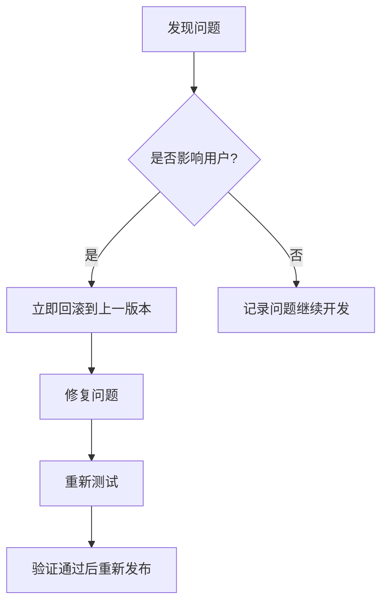

# 归档模块重构迁移策略

本文档详细描述了归档模块重构的迁移策略，确保在重构过程中不影响现有功能。

## 目录

1. [概述](#1-概述)
2. [向后兼容性策略](#2-向后兼容性策略)
3. [分阶段迁移计划](#3-分阶段迁移计划)
4. [测试策略](#4-测试策略)
5. [风险评估与缓解](#5-风险评估与缓解)
6. [回滚策略](#6-回滚策略)
7. [检查清单](#7-检查清单)

---

## 1. 概述

### 1.1 背景

基于以下已完成的设计文档：
- `plans/archive_module_refactoring_plan.md` - 架构分析
- `plans/archive_trait_redesign.md` - Trait 重构设计
- `plans/extraction_engine_refactoring.md` - 提取引擎重构设计

### 1.2 当前 API 依赖

归档模块被以下组件依赖：

| 组件 | 文件路径 | 依赖的 API |
|------|----------|------------|
| ArchiveManager | `archive/mod.rs` | `extract_with_limits` |
| ExtractionEngine | `archive/extraction_engine.rs` | `extract_with_limits`, `extract_archive` |
| Processor | `archive/processor.rs` | `extract_archive_async`, `ArchiveManager` |
| ExtractionOrchestrator | `archive/extraction_orchestrator.rs` | `extract_archive` |
| ExtractionService | `archive/extraction_service.rs` | `extract_with_limits` |
| Actors/Extractor | `archive/actors/extractor.rs` | `extract_with_limits` |
| 测试文件 | 多个 | `extract_with_limits`, `extract_archive` |

### 1.3 核心 API 变更

**当前 API:**
```rust
async fn extract_with_limits(
    &self,
    source: &Path,
    target_dir: &Path,
    max_file_size: u64,        // 参数1
    max_total_size: u64,        // 参数2
    max_file_count: usize,      // 参数3
) -> Result<ExtractionSummary>;
```

**新 API:**
```rust
async fn extract(
    &self,
    source: &Path,
    target_dir: &Path,
    config: &ExtractionConfig,
) -> Result<ExtractionSummary>;
```

---

## 2. 向后兼容性策略

### 2.1 API 兼容性方案

#### 2.1.1 使用 `#[deprecated]` 标记旧接口

在 `archive_handler.rs` 中为旧方法添加废弃标记：

```rust
#[async_trait]
pub trait ArchiveHandler: Send + Sync {
    /// 检查是否能处理该文件
    fn can_handle(&self, path: &Path) -> bool;

    /// 提取压缩文件内容（带配置 - 推荐使用）
    async fn extract(
        &self,
        source: &Path,
        target_dir: &Path,
        config: &ExtractionConfig,
    ) -> Result<ExtractionSummary>;

    /// 提取压缩文件内容（带安全限制参数）
    /// 
    /// # Deprecated
    /// 
    /// 请使用 `extract(source, target_dir, config)` 方法。
    /// 此方法将在版本 2.0 中移除。
    /// 
    /// # 参数
    /// 
    /// * `max_file_size` - 单个文件最大大小（字节）
    /// * `max_total_size` - 解压后总大小限制（字节）
    /// * `max_file_count` - 解压文件数量限制
    #[deprecated(
        since = "1.5.0",
        note = "请使用 extract(source, target, &ExtractionConfig) 方法"
    )]
    async fn extract_with_limits(
        &self,
        source: &Path,
        target_dir: &Path,
        max_file_size: u64,
        max_total_size: u64,
        max_file_count: usize,
    ) -> Result<ExtractionSummary>;
}
```

#### 2.1.2 保留旧方法作为包装器

在 trait 默认实现中保留旧方法，内部调用新方法：

```rust
#[async_trait]
pub trait ArchiveHandler: Send + Sync {
    // 新方法 - 推荐使用
    async fn extract(
        &self,
        source: &Path,
        target_dir: &Path,
        config: &ExtractionConfig,
    ) -> Result<ExtractionSummary>;

    // 旧方法 - 作为包装器保留
    #[deprecated(since = "1.5.0", note = "使用 extract 方法代替")]
    async fn extract_with_limits(
        &self,
        source: &Path,
        target_dir: &Path,
        max_file_size: u64,
        max_total_size: u64,
        max_file_count: usize,
    ) -> Result<ExtractionSummary> {
        // 将旧参数转换为配置对象
        let config = ExtractionConfig::with_limits(max_file_size, max_total_size, max_file_count);
        self.extract(source, target_dir, &config).await
    }
}
```

#### 2.1.3 Trait 方法变更处理

使用 trait 继承来组织变更：

```rust
/// 基础 Trait - 定义核心接口
#[async_trait]
pub trait ArchiveHandler: Send + Sync {
    fn can_handle(&self, path: &Path) -> bool;
    async fn extract(&self, source: &Path, target_dir: &Path, config: &ExtractionConfig) -> Result<ExtractionSummary>;
    fn file_extensions(&self) -> Vec<&str>;
    async fn list_contents(&self, path: &Path) -> Result<Vec<ArchiveEntry>>;
    async fn read_file(&self, path: &Path, file_name: &str) -> Result<String>;
}

/// 扩展 Trait - 包含带参数的旧方法（已废弃）
#[async_trait]
pub trait ArchiveHandlerLegacy: ArchiveHandler {
    #[deprecated(since = "1.5.0", note = "使用 extract 方法代替")]
    async fn extract_with_limits(
        &self,
        source: &Path,
        target_dir: &Path,
        max_file_size: u64,
        max_total_size: u64,
        max_file_count: usize,
    ) -> Result<ExtractionSummary>;
}
```

### 2.2 数据兼容性

#### 2.2.1 配置文件格式变更处理

```rust
/// 提取配置 - 支持版本化配置
#[derive(Clone, Debug, Serialize, Deserialize)]
pub struct ExtractionConfig {
    /// 配置版本（用于兼容性处理）
    #[serde(default = "default_version")]
    pub version: u32,
    
    /// 单个文件最大大小（字节）
    pub max_file_size: u64,
    /// 解压后总大小限制（字节）
    pub max_total_size: u64,
    /// 解压文件数量限制
    pub max_file_count: usize,
    /// 最大解压深度
    pub max_depth: u32,
    /// 安全配置
    pub security_config: SecurityConfig,
}

impl Default for ExtractionConfig {
    fn default() -> Self {
        Self {
            version: CURRENT_VERSION,
            max_file_size: 100 * 1024 * 1024,   // 100MB
            max_total_size: 1024 * 1024 * 1024, // 1GB
            max_file_count: 1000,
            max_depth: 10,
            security_config: SecurityConfig::default(),
        }
    }
}

impl ExtractionConfig {
    /// 从旧格式迁移
    pub fn migrate_from_v1(max_file_size: u64, max_total_size: u64, max_file_count: usize) -> Self {
        Self {
            version: CURRENT_VERSION,
            max_file_size,
            max_total_size,
            max_file_count,
            max_depth: 10,
            security_config: SecurityConfig::default(),
        }
    }
}
```

#### 2.2.2 提取元数据兼容性

```rust
/// 提取摘要 - 保持向后兼容
#[derive(Debug, Clone, Serialize, Deserialize)]
pub struct ExtractionSummary {
    /// 提取的文件数量
    pub files_extracted: usize,
    /// 提取的总大小（字节）
    pub total_size: u64,
    /// 错误信息列表
    pub errors: Vec<String>,
    /// 提取的文件路径列表
    pub extracted_files: Vec<PathBuf>,
    /// 跳过的文件数量（新增字段）
    #[serde(default)]
    pub skipped_files: usize,
}

impl ExtractionSummary {
    /// 从旧版本转换
    pub fn from_legacy(errors: Vec<String>, extracted_files: Vec<PathBuf>, total_size: u64) -> Self {
        Self {
            files_extracted: extracted_files.len(),
            total_size,
            errors,
            extracted_files,
            skipped_files: 0,
        }
    }
}
```

#### 2.2.3 错误类型兼容性

```rust
use thiserror::Error;

/// 提取错误枚举 - 统一错误处理
#[derive(Error, Debug)]
pub enum ExtractionError {
    #[error("文件大小 {actual} bytes 超过限制 {max} bytes")]
    FileSizeExceeded { max: u64, actual: u64 },

    #[error("总大小 {actual} bytes 超过限制 {max} bytes")]
    TotalSizeExceeded { max: u64, actual: u64 },

    #[error("文件数量 {actual} 超过限制 {max}")]
    FileCountExceeded { max: usize, actual: usize },

    #[error("深度 {actual} 超过限制 {max}")]
    DepthExceeded { max: u32, actual: u32 },

    #[error("路径安全违规: {0}")]
    PathSecurityViolated(String),

    #[error("不支持的压缩格式: {0}")]
    UnsupportedFormat(String),

    #[error("IO错误: {0}")]
    IoError(#[from] std::io::Error),

    #[error("提取错误: {0}")]
    ExtractionFailed(String),
}

// 为旧版 String 错误提供转换
impl From<String> for ExtractionError {
    fn from(s: String) -> Self {
        ExtractionError::ExtractionFailed(s)
    }
}
```

---

## 3. 分阶段迁移计划

### 3.1 整体流程图


### 3.2 Phase 1: 基础设施（低风险）

**目标**: 创建新的配置和错误类型，不修改现有功能

#### 步骤 1.1: 创建 ExtractionConfig 结构体

**文件**: `archive/extraction_config.rs`

```rust
// 新增文件
#[derive(Clone, Debug, Default, Serialize, Deserialize)]
pub struct ExtractionConfig {
    pub version: u32,
    pub max_file_size: u64,
    pub max_total_size: u64,
    pub max_file_count: usize,
    pub max_depth: u32,
    pub max_read_size: u64,
    pub security_config: SecurityConfig,
}

impl ExtractionConfig {
    pub fn default_limits() -> Self { ... }
    pub fn with_limits(max_file_size: u64, max_total_size: u64, max_file_count: usize) -> Self { ... }
}
```

**任务清单**:
- [ ] 创建 `archive/extraction_config.rs`
- [ ] 添加 `SecurityConfig` 结构体
- [ ] 实现默认值和构建器方法
- [ ] 添加序列化/反序列化支持

#### 步骤 1.2: 创建 ExtractionError 枚举

**文件**: `archive/extraction_error.rs`

**任务清单**:
- [ ] 使用 thiserror 创建错误枚举
- [ ] 实现错误转换 trait
- [ ] 添加错误上下文方法

#### 步骤 1.3: 创建 ExtractionContext 结构体

**文件**: `archive/extraction_context.rs`

**任务清单**:
- [ ] 创建上下文结构体
- [ ] 实现限制检查逻辑
- [ ] 实现文件跟踪逻辑

#### 步骤 1.4: 添加单元测试

**任务清单**:
- [ ] 为 ExtractionConfig 编写测试
- [ ] 为 ExtractionError 编写测试
- [ ] 为 ExtractionContext 编写测试

### 3.3 Phase 2: Handler 迁移（中风险）

**目标**: 更新 Trait 定义并迁移各个 Handler

#### 步骤 2.1: 更新 ArchiveHandler Trait

**文件**: `archive/archive_handler.rs`

```rust
#[async_trait]
pub trait ArchiveHandler: Send + Sync {
    fn can_handle(&self, path: &Path) -> bool;

    // 新方法 - 推荐
    async fn extract(
        &self,
        source: &Path,
        target_dir: &Path,
        config: &ExtractionConfig,
    ) -> Result<ExtractionSummary>;

    // 旧方法 - 保留作为包装器
    #[deprecated(since = "1.5.0", note = "使用 extract 方法代替")]
    async fn extract_with_limits(
        &self,
        source: &Path,
        target_dir: &Path,
        max_file_size: u64,
        max_total_size: u64,
        max_file_count: usize,
    ) -> Result<ExtractionSummary> {
        let config = ExtractionConfig::with_limits(max_file_size, max_total_size, max_file_count);
        self.extract(source, target_dir, &config).await
    }

    fn file_extensions(&self) -> Vec<&str>;
    async fn list_contents(&self, path: &Path) -> Result<Vec<ArchiveEntry>>;
    async fn read_file(&self, path: &Path, file_name: &str) -> Result<String>;
}
```

**任务清单**:
- [ ] 在 ArchiveHandler trait 中添加 `extract` 方法
- [ ] 保留 `extract_with_limits` 作为默认实现
- [ ] 添加 `#[deprecated]` 属性
- [ ] 更新 ExtractionSummary 添加新字段
- [ ] 运行现有测试确保兼容

#### 步骤 2.2: 迁移 ZipHandler

**文件**: `archive/zip_handler.rs`

**任务清单**:
- [ ] 实现新的 `extract` 方法
- [ ] 使用 ExtractionContext 进行限制检查
- [ ] 移除重复的安全检查代码
- [ ] 集成测试验证

#### 步骤 2.3: 迁移其他 Handler

按以下顺序迁移：
1. TarHandler - 复用较多逻辑
2. GzHandler - 有流式处理经验
3. RarHandler
4. SevenZHandler

**任务清单**:
- [ ] 迁移 TarHandler
- [ ] 迁移 GzHandler
- [ ] 迁移 RarHandler
- [ ] 迁移 SevenZHandler

#### 步骤 2.4: 集成测试

**任务清单**:
- [ ] 测试所有 Handler 的新 API
- [ ] 测试向后兼容性（旧 API 仍可用）
- [ ] 测试错误处理

### 3.4 Phase 3: 引擎重构（高风险）

**目标**: 更新上层组件使用新 API

#### 步骤 3.1: 更新 ArchiveManager

**文件**: `archive/mod.rs`

```rust
impl ArchiveManager {
    pub async fn extract_archive(
        &self,
        source: &Path,
        target_dir: &Path,
    ) -> Result<ExtractionSummary> {
        let handler = self.find_handler(source).ok_or_else(|| ...)?;
        
        // 使用新 API
        let config = ExtractionConfig {
            max_file_size: self.max_file_size,
            max_total_size: self.max_total_size,
            max_file_count: self.max_file_count,
            ..Default::default()
        };
        
        handler.extract(source, target_dir, &config).await
    }
}
```

**任务清单**:
- [ ] 更新 `extract_archive` 使用新 API
- [ ] 保留旧方法作为委托
- [ ] 测试所有 Handler 仍然工作

#### 步骤 3.2: 更新 ExtractionEngine

**文件**: `archive/extraction_engine.rs`

**任务清单**:
- [ ] 更新 `extract_archive` 方法
- [ ] 更新内部调用点
- [ ] 性能基准测试

#### 步骤 3.3: 更新 Processor

**文件**: `archive/processor.rs`

**任务清单**:
- [ ] 更新 `process_path_with_cas` 使用新 API
- [ ] 更新 `process_path_recursive_with_metadata`
- [ ] 集成测试

#### 步骤 3.4: 性能测试

**任务清单**:
- [ ] 运行基准测试
- [ ] 对比重构前后性能
- [ ] 确保无性能回退

### 3.5 Phase 4: 清理（收尾）

**目标**: 移除废弃代码，完成迁移

#### 步骤 4.1: 移除废弃代码

**任务清单**:
- [ ] 审查所有 `#[deprecated]` 标记
- [ ] 移除不再需要的包装器方法
- [ ] 清理未使用的代码

#### 步骤 4.2: 最终验证

**任务清单**:
- [ ] 运行所有测试
- [ ] 运行 Clippy 检查
- [ ] 运行格式化检查
- [ ] 手动集成测试

#### 步骤 4.3: 文档更新

**任务清单**:
- [ ] 更新 AGENTS.md
- [ ] 更新 API 文档
- [ ] 更新 CHANGELOG

---

## 4. 测试策略

### 4.1 回归测试计划

#### 4.1.1 预先准备的测试

| 测试类型 | 测试内容 | 覆盖目标 |
|----------|----------|----------|
| 单元测试 | ExtractionConfig 构建和验证 | 100% |
| 单元测试 | ExtractionError 错误转换 | 100% |
| 单元测试 | ExtractionContext 限制检查 | 100% |
| 集成测试 | Handler extract 方法 | 各格式 80%+ |
| 集成测试 | 向后兼容包装器 | 所有旧 API |
| 性能测试 | 提取性能基准 | 对比前后差异 |

#### 4.1.2 测试覆盖率要求

```rust
// 目标覆盖率
const TARGET_COVERAGE: f32 = 80.0;

// 需要覆盖的核心模块
const COVERAGE_TARGETS: &[&str] = &[
    "archive_handler",
    "extraction_config", 
    "extraction_context",
    "extraction_error",
    "zip_handler",
    "tar_handler",
    "gz_handler",
];
```

#### 4.1.3 边界 Case 测试

```rust
#[tokio::test]
async fn test_extract_config_edge_cases() {
    // 测试零值
    let config = ExtractionConfig::with_limits(0, 0, 0);
    assert_eq!(config.max_file_size, 0);
    
    // 测试最大值
    let config = ExtractionConfig::with_limits(u64::MAX, u64::MAX, usize::MAX);
    
    // 测试溢出情况
}

#[tokio::test]
async fn test_extract_with_limits_backward_compat() {
    // 确保旧 API 仍然工作
    let handler = ZipHandler::new();
    let result = handler
        .extract_with_limits(
            &source,
            &target,
            100_000_000,  // 100MB
            1_000_000_000, // 1GB
            1000,
        )
        .await;
    
    assert!(result.is_ok());
}
```

### 4.2 兼容性测试

#### 4.2.1 API 兼容性验证

```rust
#[test]
fn test_api_compatibility() {
    // 验证 trait 方法存在
    let handler: Box<dyn ArchiveHandler> = Box::new(ZipHandler::new());
    
    // 新 API 可用
    assert!(handler.extract(&Path::new("test.zip"), &Path::new("target"), &ExtractionConfig::default()).await.is_ok());
    
    // 旧 API 仍可用（带警告）
    #[allow(deprecated)]
    assert!(handler.extract_with_limits(
        &Path::new("test.zip"),
        &Path::new("target"),
        100_000_000,
        1_000_000_000,
        1000
    ).await.is_ok());
}
```

#### 4.2.2 数据格式兼容性测试

```rust
#[test]
fn test_config_serialization() {
    // 测试 JSON 序列化/反序列化
    let config = ExtractionConfig::default();
    let json = serde_json::to_string(&config).unwrap();
    let decoded: ExtractionConfig = serde_json::from_str(&json).unwrap();
    
    assert_eq!(config.max_file_size, decoded.max_file_size);
}

#[test]
fn test_summary_backward_compat() {
    // 测试旧格式的摘要仍能正确解析
    let legacy_json = r#"{"files_extracted": 5, "total_size": 1024, "errors": [], "extracted_files": []}"#;
    let summary: ExtractionSummary = serde_json::from_str(legacy_json).unwrap();
    
    assert_eq!(summary.files_extracted, 5);
    assert_eq!(summary.skipped_files, 0); // 新字段有默认值
}
```

#### 4.2.3 性能基准对比

```rust
#[bench]
fn bench_extract_old_api(b: &mut Bencher) {
    // 旧 API 性能
    b.iter(|| {
        handler.extract_with_limits(&source, &target, 100_000_000, 1_000_000_000, 1000)
    });
}

#[bench]
fn bench_extract_new_api(b: &mut Bencher) {
    // 新 API 性能
    let config = ExtractionConfig::with_limits(100_000_000, 1_000_000_000, 1000);
    b.iter(|| {
        handler.extract(&source, &target, &config)
    });
}
```

---

## 5. 风险评估与缓解

### 5.1 风险识别与缓解措施

| 风险 ID | 风险描述 | 影响 | 概率 | 严重性 | 缓解措施 |
|---------|----------|------|------|--------|----------|
| R1 | API 破坏导致编译失败 | 高 | 低 | 🔴 | 保留旧方法作为默认实现 |
| R2 | 运行时 panic | 高 | 低 | 🔴 | 充分测试，添加错误处理 |
| R3 | 性能回退 | 高 | 低 | 🟠 | 基准测试对比 |
| R4 | 并发安全问题 | 高 | 中 | 🔴 | 保持 Send + Sync bounds |
| R5 | 数据丢失 | 高 | 低 | 🔴 | 版本化配置，迁移函数 |
| R6 | 测试遗漏边界 case | 中 | 中 | 🟡 | 增加边界 case 测试 |
| R7 | 文档不同步 | 低 | 中 | 🟢 | 最后检查文档 |

### 5.2 风险详细分析

#### R1: API 破坏

**原因**: 移除旧方法或改变方法签名

**缓解措施**:
1. 保留旧方法作为默认实现
2. 使用 `#[deprecated]` 标记
3. 在一个独立的 commit 中移除废弃代码

**验证方法**:
```bash
# 确保旧代码仍能编译
cargo build 2>&1 | grep -i "deprecated" | head -20
```

#### R3: 性能回退

**原因**: 新增的对象创建或上下文切换开销

**缓解措施**:
1. 提取配置使用 `Arc<ExtractionConfig>` 共享
2. 避免不必要的克隆
3. 基准测试对比

**验证方法**:
```bash
# 运行性能基准测试
cargo bench
# 对比新旧实现性能
```

#### R4: 并发问题

**原因**: 移除 trait bounds 或改变线程模型

**缓解措施**:
1. 保持 `Send + Sync` trait bounds
2. 使用 `spawn_blocking` 处理 CPU 密集型操作
3. 多线程场景测试

**验证方法**:
```rust
// 确保 handler 满足并发要求
fn assert_send_sync<T: Send + Sync>() {}
assert_send_sync::<ZipHandler>();
```

---

## 6. 回滚策略

### 6.1 快速回滚方案

#### 6.1.1 代码级别回滚

```bash
# 使用 git 回滚到上一版本
git revert <commit-hash>

# 或使用 git reset（推荐用于未推送的更改）
git reset --hard HEAD~1
```

#### 6.1.2 特性开关回滚

```rust
// 在代码中添加特性开关
#[cfg(feature = "legacy_extraction")]
async fn extract_with_limits(...) { /* 旧实现 */ }

#[cfg(not(feature = "legacy_extraction"))]
async fn extract_with_limits(...) { 
    // 调用新实现
    let config = ExtractionConfig::with_limits(...);
    self.extract(source, target_dir, &config).await
}
```

### 6.2 数据迁移回滚

#### 6.2.1 配置格式回滚

```rust
impl ExtractionConfig {
    /// 从新格式降级到旧格式
    pub fn downgrade(&self) -> LegacyConfig {
        LegacyConfig {
            max_file_size: self.max_file_size,
            max_total_size: self.max_total_size,
            max_file_count: self.max_file_count,
        }
    }
}
```

#### 6.2.2 数据库迁移回滚

```sql
-- 如有数据库变更，提供回滚脚本
ALTER TABLE extraction_config DROP COLUMN IF EXISTS new_column;
```

### 6.3 紧急修复流程



**紧急修复步骤**:
1. 确认问题影响范围
2. 如影响严重，立即执行 `git revert`
3. 本地验证修复
4. 运行完整测试套件
5. 提交修复并发布

---

## 7. 检查清单

### 7.1 Phase 1 检查清单

- [ ] `archive/extraction_config.rs` 已创建
- [ ] `archive/extraction_error.rs` 已创建
- [ ] `archive/extraction_context.rs` 已创建
- [ ] ExtractionConfig 单元测试覆盖 80%+
- [ ] ExtractionError 单元测试覆盖 80%+
- [ ] ExtractionContext 单元测试覆盖 80%+
- [ ] 代码通过 `cargo fmt`
- [ ] 代码通过 `cargo clippy`

### 7.2 Phase 2 检查清单

- [ ] ArchiveHandler trait 已更新
- [ ] `extract` 方法已添加到所有 Handler
- [ ] `extract_with_limits` 已标记为 `#[deprecated]`
- [ ] ZipHandler 迁移完成并测试通过
- [ ] TarHandler 迁移完成并测试通过
- [ ] GzHandler 迁移完成并测试通过
- [ ] RarHandler 迁移完成并测试通过
- [ ] SevenZHandler 迁移完成并测试通过
- [ ] 向后兼容性测试通过

### 7.3 Phase 3 检查清单

- [ ] ArchiveManager 使用新 API
- [ ] ArchiveManager 旧方法仍可用
- [ ] ExtractionEngine 使用新 API
- [ ] Processor 使用新 API
- [ ] 所有集成测试通过
- [ ] 性能基准测试通过（无回退）

### 7.4 Phase 4 检查清单

- [ ] 所有废弃代码已移除
- [ ] 文档已更新（AGENTS.md, CHANGELOG.md）
- [ ] 所有测试通过
- [ ] CI/CD 管道通过
- [ ] 手动集成测试通过
- [ ] 版本号已更新

### 7.5 发布前检查

- [ ] 完整的回归测试套件通过
- [ ] 性能基准测试无回退
- [ ] 文档已更新
- [ ] CHANGELOG.md 已更新
- [ ] 版本号已更新
- [ ] Git 标签已创建

---

## 附录 A: 相关文件清单

| 文件路径 | 操作 | 说明 |
|----------|------|------|
| `archive/extraction_config.rs` | 新增 | 配置结构体 |
| `archive/extraction_error.rs` | 新增 | 错误枚举 |
| `archive/extraction_context.rs` | 新增 | 提取上下文 |
| `archive/archive_handler.rs` | 修改 | 更新 trait 定义 |
| `archive/zip_handler.rs` | 修改 | 迁移到新 API |
| `archive/tar_handler.rs` | 修改 | 迁移到新 API |
| `archive/gz_handler.rs` | 修改 | 迁移到新 API |
| `archive/rar_handler.rs` | 修改 | 迁移到新 API |
| `archive/sevenz_handler.rs` | 修改 | 迁移到新 API |
| `archive/mod.rs` | 修改 | 更新 ArchiveManager |
| `archive/extraction_engine.rs` | 修改 | 更新引擎 |
| `archive/processor.rs` | 修改 | 更新处理器 |

---

## 附录 B: 版本历史

| 版本 | 日期 | 变更 |
|------|------|------|
| 1.0 | 2024-01-01 | 初始版本 |
| 1.5 | 待定 | 重构版本（添加新 API） |

---

*本文档基于 `plans/archive_trait_redesign.md` 和 `plans/extraction_engine_refactoring.md` 设计文档生成。*
