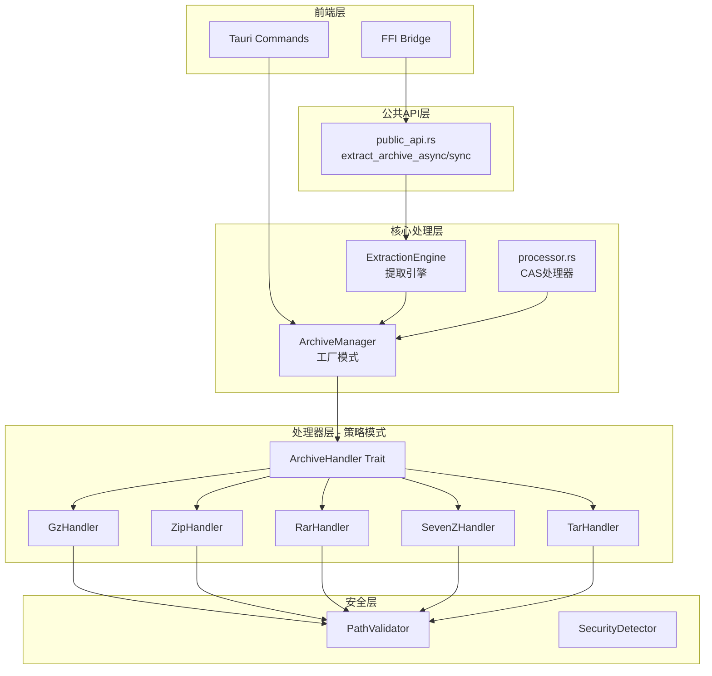
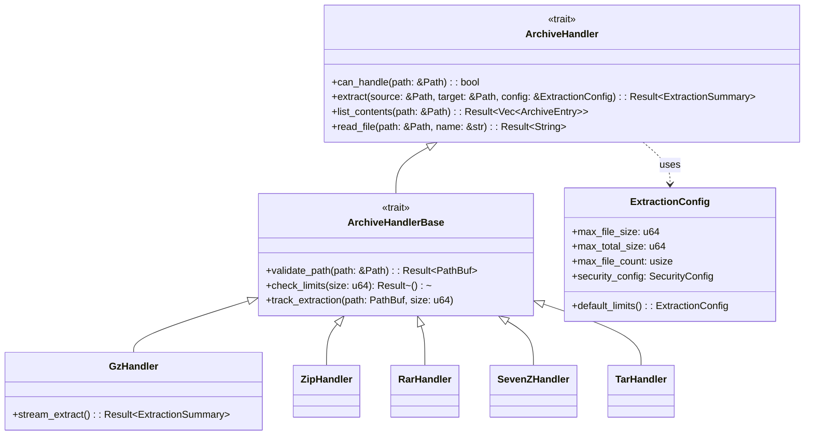

# 日志分析器归档处理模块架构分析与重构方案

## 1. 架构概览

### 1.1 当前架构图



### 1.2 模块依赖关系

| 模块 | 依赖项 | 被依赖项 |
|------|--------|----------|
| `archive_handler.rs` | `error.rs` | 所有 handlers, `mod.rs` |
| `mod.rs` | 所有 handlers | `processor.rs`, `public_api.rs` |
| `gz_handler.rs` | `archive_handler`, `path_security` | `mod.rs` |
| `zip_handler.rs` | `archive_handler`, `path_security` | `mod.rs` |
| `rar_handler.rs` | `archive_handler`, `path_security` | `mod.rs` |
| `sevenz_handler.rs` | `archive_handler`, `path_security` | `mod.rs` |
| `tar_handler.rs` | `archive_handler`, `path_security` | `mod.rs` |
| `processor.rs` | `ArchiveManager`, `public_api` | `commands/import.rs` |
| `public_api.rs` | `extraction_engine` | `processor.rs` |

### 1.3 数据流分析

```
1. 用户导入 → Tauri Command / FFI
2. processor.rs 识别压缩文件 → ArchiveManager
3. ArchiveManager.find_handler() → 具体 Handler
4. Handler.extract_with_limits() → 提取文件
5. 递归处理嵌套压缩包
6. CAS存储 → 元数据持久化
```

## 2. 设计模式分析

### 2.1 识别的设计模式

| 模式 | 实现位置 | 说明 |
|------|----------|------|
| **策略模式 (Strategy)** | `ArchiveHandler` trait | 不同压缩格式使用统一接口处理 |
| **工厂模式 (Factory)** | `ArchiveManager::find_handler()` | 根据文件扩展名创建对应处理器 |
| **模板方法 (Template Method)** | `ArchiveHandler` 默认实现 | `extract()` 调用 `extract_with_limits()` |
| **建造者模式 (Builder)** | `ExtractionPolicy` | 配置提取策略（部分实现） |

### 2.2 模式使用的优缺点

#### 策略模式 - 优点
- ✅ 统一的 `ArchiveHandler` 接口便于扩展新格式
- ✅ 调用方无需关心具体格式实现
- ✅ 支持运行时动态选择处理器

#### 策略模式 - 缺点
- ❌ 每个 handler 重复实现安全检查逻辑
- ❌ 缺乏抽象基类复用公共代码
- ❌ 参数传递繁琐（5个限制参数）

#### 工厂模式 - 优点
- ✅ `ArchiveManager` 集中管理所有 handler
- ✅ 自动检测文件格式

#### 工厂模式 - 缺点
- ❌ `find_handler` 函数和 `ArchiveManager` 重复创建 handler 列表
- ❌ handler 实例无状态，每次使用都新建

## 3. 问题清单

| 优先级 | 问题类型 | 具体位置 | 问题描述 | 影响 |
|--------|----------|----------|----------|------|
| 🔴 高 | 代码重复 | 所有 handler | 安全检查逻辑在每个 handler 中重复实现 | 维护困难，容易遗漏 |
| 🔴 高 | 参数过多 | `extract_with_limits` | 5个参数：max_file_size, max_total_size, max_file_count... | API 使用不便，容易传错 |
| 🔴 高 | 异步/同步混合 | `rar_handler.rs`, `sevenz_handler.rs` | 使用 `spawn_blocking` 但缺乏统一策略 | 线程池耗尽风险 |
| 🟡 中 | 错误处理不一致 | `commands/archive.rs` | 返回 `String` 错误而非 `AppError` | 错误信息丢失结构化 |
| 🟡 中 | 未使用代码 | `archive_handler.rs` | `ExtractionError` 结构体标记 `#[allow(dead_code)]` | 代码冗余 |
| 🟡 中 | 魔法数字 | `gz_handler.rs` | 1MB, 10MB, 100MB 等阈值硬编码 | 难以统一调整 |
| 🟡 中 | 重复逻辑 | `mod.rs` | `find_handler` 函数和 `ArchiveManager.find_handler` 重复 | 维护两份相同代码 |
| 🟢 低 | 导入顺序 | 多个文件 | 未完全遵循 AGENTS.md 的导入顺序规范 | 代码风格不一致 |
| 🟢 低 | trait 方法 | `ArchiveHandler` | `extract()` 方法实际上未被使用 | 可以移除或标记废弃 |

### 3.1 详细问题分析

#### 3.1.1 代码重复示例

**所有 handler 都重复实现相同的限制检查逻辑：**

```rust
// zip_handler.rs, rar_handler.rs, sevenz_handler.rs, tar_handler.rs 都包含类似代码：
if size > max_file_size
    || summary.total_size + size > max_total_size
    || summary.files_extracted + 1 > max_file_count
{
    // 跳过或错误处理
}
```

#### 3.1.2 参数过多问题

```rust
async fn extract_with_limits(
    &self,
    source: &Path,
    target_dir: &Path,
    max_file_size: u64,
    max_total_size: u64,
    max_file_count: usize,
) -> Result<ExtractionSummary>;
```

应该使用配置对象：
```rust
async fn extract_with_config(
    &self,
    source: &Path,
    target_dir: &Path,
    config: &ExtractionConfig,
) -> Result<ExtractionSummary>;
```

## 4. 重构方案

### 4.1 短期改进（低风险）

#### 4.1.1 提取公共安全检查逻辑

创建 `ExtractionContext` 结构体封装检查逻辑：

```rust
pub struct ExtractionContext {
    pub config: ExtractionConfig,
    pub summary: ExtractionSummary,
}

impl ExtractionContext {
    pub fn check_limits(&self, file_size: u64) -> Result<()> {
        // 统一实现
    }
}
```

#### 4.1.2 统一错误处理

修改 `commands/archive.rs` 返回 `Result<T, AppError>`：

```rust
pub async fn list_archive_contents(
    archive_path: String
) -> Result<ArchiveContentResult, AppError> {
    // 使用 ? 传播错误
}
```

### 4.2 中期重构（结构调整）

#### 4.2.1 引入 `ArchiveHandlerBase` 默认实现

```rust
pub trait ArchiveHandlerBase: ArchiveHandler {
    async fn extract_entry_with_limits(&self, ...) -> Result<()> {
        // 默认实现安全检查和限制逻辑
    }
}
```

#### 4.2.2 重构 `ExtractionConfig`

```rust
#[derive(Clone, Debug)]
pub struct ExtractionConfig {
    pub limits: ExtractionLimits,
    pub security: SecurityConfig,
    pub progress: ProgressConfig,
}

#[derive(Clone, Debug)]
pub struct ExtractionLimits {
    pub max_file_size: u64,
    pub max_total_size: u64,
    pub max_file_count: usize,
    pub max_depth: u32,
}
```

#### 4.2.3 合并 `find_handler` 实现

```rust
// 移除独立的 find_handler 函数
// ArchiveManager::find_handler 返回 Box<dyn ArchiveHandler>
impl ArchiveManager {
    pub fn find_handler(&self, path: &Path) -> Option<Box<dyn ArchiveHandler>> {
        // 统一实现
    }
}
```

### 4.3 长期优化（架构升级）

#### 4.3.1 引入 Handler 注册机制

```rust
pub struct ArchiveHandlerRegistry {
    handlers: Vec<Arc<dyn ArchiveHandler>>,
}

impl ArchiveHandlerRegistry {
    pub fn register(&mut self, handler: Arc<dyn ArchiveHandler>) {
        self.handlers.push(handler);
    }
    
    pub fn find_handler(&self, path: &Path) -> Option<Arc<dyn ArchiveHandler>> {
        // 支持优先级排序
    }
}
```

#### 4.3.2 异步流式提取接口

```rust
pub trait StreamingArchiveHandler: ArchiveHandler {
    fn extract_stream(
        &self,
        source: &Path,
        target_dir: &Path,
        config: &ExtractionConfig,
    ) -> impl Stream<Item = Result<ExtractionEvent>>;
}

pub enum ExtractionEvent {
    FileExtracted { path: PathBuf, size: u64 },
    Progress { current: usize, total: usize },
    Warning { message: String },
    Complete,
}
```

## 5. 代码示例

### 5.1 Before / After 对比

#### 问题：重复的安全检查代码

**Before (zip_handler.rs):**
```rust
let would_exceed_limits = size > max_file_size
    || summary.total_size + size > max_total_size
    || summary.files_extracted + 1 > max_file_count;

if would_exceed_limits {
    if size > max_file_size {
        warn!(...);
    } else if summary.total_size + size > max_total_size {
        warn!(...);
    } else {
        warn!(...);
    }
    continue;
}
```

**After (使用 ExtractionLimiter):**
```rust
// 在基类 trait 中实现
pub trait ArchiveHandlerWithLimits: ArchiveHandler {
    fn limiter(&self) -> ExtractionLimiter;
    
    async fn extract_with_limits(&self, ...) -> Result<ExtractionSummary> {
        let limiter = self.limiter();
        
        for entry in entries {
            if let Err(e) = limiter.check_and_track(entry.size).await {
                warn!(file = %entry.name, error = %e, "Skipping file due to limit");
                continue;
            }
            // 提取逻辑
        }
        
        Ok(limiter.summary())
    }
}
```

#### 问题：参数过多的函数签名

**Before:**
```rust
async fn extract_with_limits(
    &self,
    source: &Path,
    target_dir: &Path,
    max_file_size: u64,
    max_total_size: u64,
    max_file_count: usize,
) -> Result<ExtractionSummary>;
```

**After:**
```rust
#[derive(Clone, Debug, Default)]
pub struct ExtractionConfig {
    pub max_file_size: u64,
    pub max_total_size: u64,
    pub max_file_count: usize,
}

impl ExtractionConfig {
    pub fn default_limits() -> Self {
        Self {
            max_file_size: 100 * 1024 * 1024,    // 100MB
            max_total_size: 1024 * 1024 * 1024,  // 1GB
            max_file_count: 1000,
        }
    }
}

async fn extract(&self, source: &Path, target: &Path, config: &ExtractionConfig) 
    -> Result<ExtractionSummary>;
```

### 5.2 新架构类图



## 6. 实施建议

### 6.1 重构顺序建议

1. **Phase 1: 基础设施**
   - [ ] 创建 `ExtractionConfig` 结构体
   - [ ] 创建 `ArchiveHandlerBase` trait
   - [ ] 添加单元测试确保行为一致

2. **Phase 2: Handler 重构**
   - [ ] 迁移 `ZipHandler` 到新的基类 trait
   - [ ] 迁移 `TarHandler`
   - [ ] 迁移 `GzHandler`
   - [ ] 迁移 `RarHandler` 和 `SevenZHandler`

3. **Phase 3: API 清理**
   - [ ] 更新 `ArchiveManager` 接口
   - [ ] 删除 `find_handler` 独立函数
   - [ ] 更新 `commands/archive.rs` 错误处理

4. **Phase 4: 验证**
   - [ ] 运行所有 archive 相关测试
   - [ ] 进行手动集成测试
   - [ ] 性能基准对比

### 6.2 风险点提示

| 风险 | 影响 | 缓解措施 |
|------|------|----------|
| 重构引入 bug | 高 | 保持充分的单元测试覆盖，逐步迁移 |
| 性能回退 | 中 | 重构前后进行基准测试对比 |
| API 不兼容 | 中 | 使用 deprecated 属性标记旧接口，保留向后兼容 |
| 并发问题 | 高 | 保持 `Send + Sync` trait bound，使用 `spawn_blocking` 策略不变 |

### 6.3 测试策略

```rust
// 每个 handler 需要测试：
#[tokio::test]
async fn test_handler_extract_with_limits() {
    // 1. 正常提取
    // 2. 大小限制触发
    // 3. 数量限制触发
    // 4. 路径遍历防护
}

// 集成测试：
#[tokio::test]
async fn test_nested_archive_extraction() {
    // 测试嵌套压缩包处理
}

// 基准测试：
#[bench]
fn bench_zip_extraction(b: &mut Bencher) {
    // 对比重构前后性能
}
```

## 7. 总结

### 当前架构评分

| 维度 | 评分 | 说明 |
|------|------|------|
| 可扩展性 | ⭐⭐⭐⭐ | Trait 设计便于添加新格式 |
| 可维护性 | ⭐⭐ | 代码重复严重，需要清理 |
| 安全性 | ⭐⭐⭐⭐ | 路径验证和限制检查完善 |
| 性能 | ⭐⭐⭐ | GZ handler 有流式优化，其他可改进 |
| 测试覆盖 | ⭐⭐⭐ | 有测试但需要补充更多边界 case |

### 重构收益预期

- **代码量减少**: 预计减少 20-30% 重复代码
- **维护性提升**: 统一安全检查逻辑，修改只需一处
- **API 易用性**: 配置对象替代多个参数
- **扩展性**: 新 handler 实现更简单

### 建议优先级

1. 🔴 **立即执行**: 提取公共安全检查逻辑
2. 🟡 **近期执行**: 重构参数传递方式
3. 🟢 **中期规划**: 引入 handler 注册机制和流式接口
