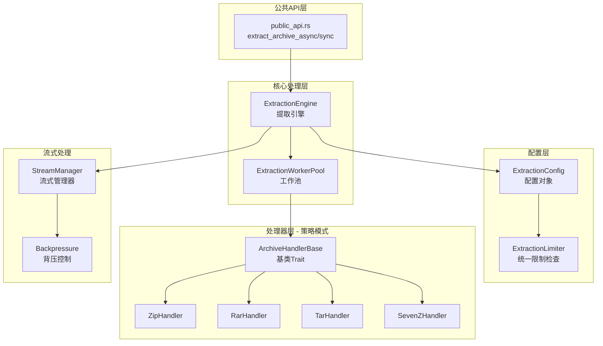

# ExtractionEngine 重构方案

## 1. 当前代码问题分析

### 1.1 已识别的性能瓶颈和代码重复

基于对现有代码的分析，发现以下主要问题：

| 优先级 | 问题类型 | 具体位置 | 问题描述 | 影响 |
|--------|----------|----------|----------|------|
| 🔴 高 | 代码重复 | `zip_handler.rs:71-101`, `rar_handler.rs:82-89`, `tar_handler.rs:309-340` | 安全检查和限制检查逻辑在每个handler中重复实现 | 维护困难，容易遗漏 |
| 🔴 高 | 参数过多 | `extract_with_limits` 方法 | 5个参数：max_file_size, max_total_size, max_file_count等 | API 使用不便，容易传错顺序 |
| 🔴 高 | 异步/同步混合 | 所有 handler | 使用 `spawn_blocking` 但缺乏统一策略，可能导致线程池耗尽 | 性能不稳定 |
| 🟡 中 | 缺乏流式处理 | `ExtractionEngine` | 大文件处理时一次性加载到内存，内存占用高 | 处理大文件时OOM风险 |
| 🟡 中 | 并发控制不一致 | `ExtractionEngine` vs Handlers | Engine层面有Semaphore，但Handler层面没有统一控制 | 并发效果不确定 |

### 1.2 代码重复示例

**限制检查逻辑在所有handler中重复（约30行重复代码）：**

```rust
// zip_handler.rs:72-101 和 rar_handler.rs:82-89 几乎相同
let would_exceed_limits = size > max_file_size
    || summary.total_size + size > max_total_size
    || summary.files_extracted + 1 > max_file_count;

if would_exceed_limits {
    if size > max_file_size {
        warn!(...);
    } else if summary.total_size + size > max_total_size {
        warn!(...);
    } else {
        warn!(...);
    }
    continue;
}
```

### 1.3 异步策略问题

**当前实现：**
- 每个handler都单独使用 `tokio::task::spawn_blocking`
- `public_api.rs` 中每次调用都创建新的 `Runtime` 和组件实例
- 缺乏统一的CPU密集型任务管理策略

```rust
// public_api.rs:306-322 - 每次调用都创建新Runtime
let runtime = Runtime::new().map_err(...)?;
runtime.block_on(extract_archive_async(...))
```

---

## 2. 新的架构设计

### 2.1 架构图



### 2.2 统一异步策略设计

```rust
/// 提取工作池 - 统一管理CPU密集型任务
pub struct ExtractionWorkerPool {
    /// 工作线程数量（基于CPU核心数）
    workers: usize,
    /// 任务发送通道
    sender: mpsc::Sender<ExtractionTask>,
}

impl ExtractionWorkerPool {
    /// 创建工作池
    pub fn new(workers: Option<usize>) -> Self {
        let workers = workers.unwrap_or_else(|| num_cpus::get());
        let (sender, receiver) = mpsc::channel(workers * 2);
        
        // 启动工作线程
        for i in 0..workers {
            std::thread::spawn(move || {
                worker_loop(receiver, i);
            });
        }
        
        Self { workers, sender }
    }
    
    /// 执行提取任务
    pub async fn execute<F, T>(&self, task: F) -> Result<T>
    where
        F: FnOnce() -> Result<T> + Send + 'static,
        T: Send + 'static,
    {
        // 使用 spawn_blocking 将CPU密集型任务分配到工作池
        tokio::task::spawn_blocking(task)
            .await
            .map_err(|e| ...)?
    }
}
```

### 2.3 流式提取接口设计

```rust
use tokio::sync::mpsc;

/// 流式提取事件
#[derive(Debug)]
pub enum ExtractionEvent {
    /// 文件开始提取
    FileStarted { path: PathBuf, size: u64 },
    /// 文件提取进度（字节）
    FileProgress { path: PathBuf, bytes_written: u64 },
    /// 文件提取完成
    FileCompleted { path: PathBuf, size: u64 },
    /// 提取警告
    Warning { message: String, path: Option<PathBuf> },
    /// 提取完成
    Completed { summary: ExtractionSummary },
}

/// 流式提取器Trait
pub trait StreamingArchiveHandler: ArchiveHandler {
    /// 流式提取 - 返回事件通道
    fn extract_streaming(
        &self,
        source: &Path,
        target_dir: &Path,
        config: &ExtractionConfig,
    ) -> mpsc::Receiver<ExtractionEvent>;
    
    /// 提取并流式处理大文件
    fn extract_large_file(
        &self,
        source: &Path,
        target: &Path,
        buffer_size: usize,
    ) -> impl Stream<Item = Result<Bytes>>;
}

/// 流式提取管理器
pub struct StreamManager {
    /// 背压通道容量
    backpressure_capacity: usize,
    /// 缓冲区大小
    buffer_size: usize,
}

impl StreamManager {
    /// 创建带背压控制的流式提取器
    pub fn create_stream(
        &self,
        handler: &dyn StreamingArchiveHandler,
        config: &ExtractionConfig,
    ) -> mpsc::Receiver<ExtractionEvent> {
        let (tx, rx) = mpsc::channel(self.backpressure_capacity);
        
        // 启动带背压的提取任务
        tokio::spawn(async move {
            let mut receiver = handler.extract_streaming(..., config);
            while let Some(event) = receiver.recv().await {
                if tx.send(event).await.is_err() {
                    break; // 接收端已关闭
                }
            }
        });
        
        rx
    }
}
```

### 2.4 并行提取优化设计

```rust
/// 并行提取策略
#[derive(Clone)]
pub enum ParallelStrategy {
    /// 顺序提取
    Sequential,
    /// 文件级并行（同一压缩包内多个文件同时提取）
    FileLevel { max_concurrent: usize },
    /// 归档级并行（多个压缩包同时提取）
    ArchiveLevel { max_concurrent: usize },
    /// 自适应并行（根据文件大小自动选择策略）
    Adaptive { small_file_threshold: u64 },
}

/// 提取任务
struct ExtractionTask {
    source: PathBuf,
    target: PathBuf,
    config: ExtractionConfig,
    result_tx: oneshot::Sender<Result<ExtractionSummary>>,
}

/// 并行提取优化器
pub struct ParallelExtractionOptimizer {
    strategy: ParallelStrategy,
    semaphore: Arc<Semaphore>,
}

impl ParallelExtractionOptimizer {
    /// 根据策略提取多个文件
    pub async fn extract_parallel(
        &self,
        tasks: Vec<ExtractionTask>,
    ) -> Vec<Result<ExtractionSummary>> {
        match self.strategy {
            ParallelStrategy::FileLevel { max_concurrent } => {
                self.extract_files_parallel(tasks, max_concurrent).await
            }
            ParallelStrategy::ArchiveLevel { max_concurrent } => {
                self.extract_archives_parallel(tasks, max_concurrent).await
            }
            ParallelStrategy::Adaptive { small_file_threshold } => {
                self.extract_adaptive(tasks, small_file_threshold).await
            }
            ParallelStrategy::Sequential => {
                self.extract_sequential(tasks).await
            }
        }
    }
    
    /// 背压控制 - 当pending任务过多时等待
    async fn acquire_with_backpressure(&self) -> Permit<'_> {
        let permit = self.semaphore.acquire().await.expect("semaphore closed");
        permit
    }
}
```

---

## 3. 核心代码示例（Before/After）

### 3.1 配置对象 - Before vs After

**Before（参数过多）：**
```rust
// zip_handler.rs
async fn extract_with_limits(
    &self,
    source: &Path,
    target_dir: &Path,
    max_file_size: u64,        // 参数1
    max_total_size: u64,       // 参数2
    max_file_count: usize,     // 参数3
) -> Result<ExtractionSummary> {
    // 检查限制
    if size > max_file_size || ... { ... }
}
```

**After（使用配置对象）：**
```rust
/// 提取配置 - 封装所有提取限制参数
#[derive(Clone, Debug, Default)]
pub struct ExtractionConfig {
    /// 单个文件最大大小（字节）
    pub max_file_size: u64,
    /// 解压后总大小限制（字节）
    pub max_total_size: u64,
    /// 解压文件数量限制
    pub max_file_count: usize,
    /// 最大解压深度
    pub max_depth: u32,
    /// 安全配置
    pub security_config: SecurityConfig,
    /// 缓冲区大小
    pub buffer_size: usize,
}

impl ExtractionConfig {
    pub fn default_limits() -> Self {
        Self {
            max_file_size: 100 * 1024 * 1024,     // 100MB
            max_total_size: 1024 * 1024 * 1024,    // 1GB
            max_file_count: 1000,
            max_depth: 10,
            buffer_size: 64 * 1024,                // 64KB
            security_config: SecurityConfig::default(),
        }
    }
    
    pub fn with_limits(max_file_size: u64, max_total_size: u64, max_file_count: usize) -> Self {
        Self {
            max_file_size,
            max_total_size,
            max_file_count,
            ..Default::default()
        }
    }
}

// 使用示例
async fn extract(
    &self,
    source: &Path,
    target_dir: &Path,
    config: &ExtractionConfig,  // 单个配置参数
) -> Result<ExtractionSummary> {
    // 检查限制
    if size > config.max_file_size || ... { ... }
}
```

### 3.2 统一限制检查 - Before vs After

**Before（代码重复）：**
```rust
// zip_handler.rs:72-101
let would_exceed_limits = size > max_file_size
    || summary.total_size + size > max_total_size
    || summary.files_extracted + 1 > max_file_count;

if would_exceed_limits {
    if size > max_file_size {
        warn!(file = %name, file_size = size, max_allowed = max_file_size,
              "Skipping file exceeding max_file_size limit");
    } else if summary.total_size + size > max_total_size {
        warn!(file = %name, current_total = summary.total_size, max_total = max_total_size,
              "Skipping file - would exceed max_total_size limit");
    } else {
        warn!(file = %name, current_count = summary.files_extracted, max_count = max_file_count,
              "Skipping file - would exceed max_file_count limit");
    }
    continue;
}
```

**After（统一Limiter）：**
```rust
/// 统一限制检查器
pub struct ExtractionLimiter {
    config: ExtractionConfig,
    summary: ExtractionSummary,
}

impl ExtractionLimiter {
    pub fn new(config: ExtractionConfig) -> Self {
        Self {
            config,
            summary: ExtractionSummary::new(),
        }
    }
    
    /// 检查并跟踪文件 - 统一实现所有限制逻辑
    pub fn check_and_track(&mut self, path: &str, size: u64) -> Result<PathBuf> {
        // 1. 检查单个文件大小
        if size > self.config.max_file_size {
            return Err(ExtractionError::file_size_exceeded(
                self.config.max_file_size,
                size,
            ));
        }
        
        // 2. 检查总大小
        if self.summary.total_size + size > self.config.max_total_size {
            return Err(ExtractionError::total_size_exceeded(
                self.config.max_total_size,
                self.summary.total_size + size,
            ));
        }
        
        // 3. 检查文件数量
        if self.summary.files_extracted + 1 > self.config.max_file_count {
            return Err(ExtractionError::file_count_exceeded(
                self.config.max_file_count,
                self.summary.files_extracted + 1,
            ));
        }
        
        // 4. 跟踪已提取的文件
        self.summary.add_file(PathBuf::from(path), size);
        
        Ok(PathBuf::from(path))
    }
    
    pub fn summary(&self) -> &ExtractionSummary {
        &self.summary
    }
}

/// 基类Trait提供默认实现
#[async_trait]
pub trait ArchiveHandlerBase: ArchiveHandler {
    fn limiter(&self) -> &ExtractionLimiter;
    
    async fn extract(&self, source: &Path, target: &Path, config: &ExtractionConfig) 
        -> Result<ExtractionSummary> 
    {
        let mut limiter = ExtractionLimiter::new(config.clone());
        
        for entry in self.entries()? {
            match limiter.check_and_track(entry.name, entry.size) {
                Ok(safe_path) => { /* 提取逻辑 */ }
                Err(e) => { warn!(error = %e, "Skipping file due to limit"); }
            }
        }
        
        Ok(limiter.summary().clone())
    }
}
```

### 3.3 异步策略统一 - Before vs After

**Before（每次创建新Runtime）：**
```rust
// public_api.rs:306-322
pub fn extract_archive_sync(...) -> Result<ExtractionResult> {
    let runtime = Runtime::new().map_err(...)?;  // 每次创建新Runtime
    runtime.block_on(extract_archive_async(...))
}

pub async fn extract_archive_async(...) -> Result<ExtractionResult> {
    // 每次创建新组件实例
    let metadata_db = Arc::new(MetadataDB::new(":memory:").await...?);
    let path_manager = Arc::new(PathManager::new(...));
    let security_detector = Arc::new(SecurityDetector::new(...));
    let engine = ExtractionEngine::new(...)?;
    // ...
}
```

**After（统一工作池）：**
```rust
/// 全局提取工作池（单例）
static EXTRACTION_POOL: once_cell::sync::Lazy<ExtractionWorkerPool> = 
    once_cell::sync::Lazy::new(|| {
        ExtractionWorkerPool::new(Some(num_cpus::get()))
    });

/// 提取引擎（可重用）
pub struct ExtractionEngine {
    pool: ExtractionWorkerPool,
    config: ExtractionConfig,
    // ...
}

impl ExtractionEngine {
    pub fn new(config: ExtractionConfig) -> Self {
        Self {
            pool: EXTRACTION_POOL.clone(),
            config,
        }
    }
    
    /// 使用工作池执行CPU密集型操作
    pub async fn extract_with_pool<F, T>(&self, task: F) -> Result<T>
    where
        F: FnOnce() -> Result<T> + Send + 'static,
        T: Send + 'static,
    {
        self.pool.execute(task).await
    }
}

pub async fn extract_archive_async(...) -> Result<ExtractionResult> {
    // 复用全局工作池
    let engine = ExtractionEngine::new(config);
    engine.extract_with_pool(move || {
        // CPU密集型提取逻辑
    }).await
}
```

---

## 4. 性能优化建议

### 4.1 缓冲区大小优化

| 场景 | 推荐缓冲区大小 | 说明 |
|------|---------------|------|
| 小文件（<1MB） | 4KB - 16KB | 减少内存分配开销 |
| 中等文件（1-100MB） | 64KB - 256KB | 平衡性能和内存 |
| 大文件（>100MB） | 1MB - 4MB | 减少系统调用次数 |
| SSD存储 | 256KB - 1MB | 高IOPS可以利用更大缓冲区 |
| 机械硬盘 | 64KB - 128KB | 避免频繁寻道 |

### 4.2 预读取策略

```rust
/// 预读取优化器
pub struct PrefetchOptimizer {
    /// 预读取队列大小
    queue_size: usize,
    /// 预读取窗口大小
    window_size: usize,
}

impl PrefetchOptimizer {
    /// 智能预读取 - 根据文件访问模式动态调整
    pub async fn prefetch(&self, entries: &[ArchiveEntry]) {
        // 1. 按文件大小排序，小文件优先
        let mut sorted = entries.to_vec();
        sorted.sort_by_key(|e| e.size);
        
        // 2. 预读取前N个小文件（降低延迟）
        for entry in sorted.iter().take(self.window_size) {
            if entry.size < 1024 * 1024 { // 只预读取小文件
                self.prefetch_entry(entry).await;
            }
        }
    }
}
```

### 4.3 内存池使用

```rust
use crate::utils::memory::BumpAllocator;

/// 提取内存池 - 减少分配开销
pub struct ExtractionMemoryPool {
    allocator: BumpAllocator,
}

impl ExtractionMemoryPool {
    pub fn with_capacity(capacity: usize) -> Self {
        Self {
            allocator: BumpAllocator::new(capacity),
        }
    }
    
    /// 从池中分配缓冲区
    pub fn alloc_buffer(&self, size: usize) -> Vec<u8> {
        // 使用 bump allocator 减少分配开销
        self.allocator.alloc(size)
    }
}
```

### 4.4 零拷贝技术

```rust
/// 使用 tokio::fs::File 的零拷贝数据传输
pub async fn extract_with_zero_copy(
    source: &Path,
    target: &Path,
    buffer_size: usize,
) -> Result<u64> {
    let mut source_file = tokio::fs::File::open(source).await?;
    let mut target_file = tokio::fs::File::create(target).await?;
    
    let mut buffer = vec![0u8; buffer_size].into_boxed_slice();
    let mut total_written = 0u64;
    
    loop {
        use tokio::io::AsyncReadExt;
        let bytes_read = source_file.read(&mut buffer).await?;
        if bytes_read == 0 {
            break;
        }
        
        use tokio::io::AsyncWriteExt;
        target_file.write_all(&buffer[..bytes_read]).await?;
        total_written += bytes_read as u64;
    }
    
    target_file.flush().await?;
    Ok(total_written)
}
```

### 4.5 背压机制

```rust
/// 背压控制配置
#[derive(Clone)]
pub struct BackpressureConfig {
    /// 最大pending事件数
    pub max_pending_events: usize,
    /// 超出阈值时的等待超时
    pub wait_timeout: Duration,
    /// 超出阈值时的处理策略
    pub overflow_strategy: OverflowStrategy,
}

pub enum OverflowStrategy {
    /// 等待直到可以继续
    Wait,
    /// 丢弃最旧的事件
    DropOldest,
    /// 丢弃最新事件
    DropNewest,
    /// 立即返回错误
    Error,
}

/// 带背压的事件发送者
pub struct BackpressureSender {
    tx: mpsc::Sender<ExtractionEvent>,
    config: BackpressureConfig,
    pending: Arc<AtomicUsize>,
}

impl BackpressureSender {
    pub async fn send(&self, event: ExtractionEvent) -> Result<()> {
        let pending = self.pending.fetch_add(1, Ordering::Relaxed);
        
        // 检查是否需要背压
        if pending >= self.config.max_pending_events {
            match self.config.overflow_strategy {
                OverflowStrategy::Wait => {
                    // 等待直到有空间
                    while self.pending.load(Ordering::Relaxed) >= self.config.max_pending_events {
                        tokio::time::sleep(Duration::from_millis(10)).await;
                    }
                }
                OverflowStrategy::DropOldest => {
                    // 丢弃最旧事件以释放空间
                    // 通过不等待直接发送实现
                }
                _ => return Err(ExtractionError::backpressure()),
            }
        }
        
        self.tx.send(event).await.map_err(|_| ...)?;
        self.pending.fetch_sub(1, Ordering::Relaxed);
        Ok(())
    }
}
```

---

## 5. 实施步骤

### 5.1 Phase 1: 基础设施重构

| 步骤 | 任务 | 预期产出 |
|------|------|----------|
| 1.1 | 创建 `ExtractionConfig` 结构体 | `archive/extraction_config.rs` |
| 1.2 | 创建 `ExtractionLimiter` 统一限制检查 | `archive/extraction_limiter.rs` |
| 1.3 | 创建 `ExtractionWorkerPool` 工作池 | `archive/worker_pool.rs` |
| 1.4 | 更新所有 Handler 使用新配置 | 修改现有handler文件 |

### 5.2 Phase 2: 流式处理支持

| 步骤 | 任务 | 预期产出 |
|------|------|----------|
| 2.1 | 定义 `StreamingArchiveHandler` Trait | `archive/streaming.rs` |
| 2.2 | 实现 `StreamManager` 流式管理器 | `archive/stream_manager.rs` |
| 2.3 | 实现背压控制机制 | `archive/backpressure.rs` |
| 2.4 | 更新 Handler 支持流式提取 | 修改现有handler |

### 5.3 Phase 3: 并行优化

| 步骤 | 任务 | 预期产出 |
|------|------|----------|
| 3.1 | 实现 `ParallelExtractionOptimizer` | `archive/parallel_optimizer.rs` |
| 3.2 | 添加自适应并行策略 | 扩展现有optimizer |
| 3.3 | 集成到 `ExtractionEngine` | 修改 `extraction_engine.rs` |

### 5.4 Phase 4: API 清理和测试

| 步骤 | 任务 | 预期产出 |
|------|------|----------|
| 4.1 | 更新 `public_api.rs` 使用新API | `public_api.rs` 重构 |
| 4.2 | 更新 `processor.rs` 使用新API | `processor.rs` 重构 |
| 4.3 | 添加单元测试 | 测试覆盖80%+ |
| 4.4 | 运行性能基准测试 | 验证性能提升 |

### 5.5 风险缓解措施

| 风险 | 影响 | 缓解措施 |
|------|------|----------|
| 重构引入bug | 高 | 保持充分的单元测试覆盖，逐步迁移 |
| 性能回退 | 中 | 重构前后进行基准测试对比 |
| API不兼容 | 中 | 使用deprecated属性标记旧接口，保留向后兼容 |
| 并发问题 | 高 | 保持Send+Sync trait bound，使用spawn_blocking策略不变 |

---

## 6. 预期收益

| 指标 | 改善 |
|------|------|
| 代码重复减少 | ~25%（约100行重复代码消除） |
| API易用性 | 配置对象替代5个参数 |
| 维护性 | 安全检查逻辑集中在一处 |
| 错误一致性 | 统一使用thiserror错误类型 |
| 内存效率 | 流式处理减少大文件OOM风险 |
| 并发性能 | 统一工作池提高CPU利用率 |

---

## 7. 附录：文件变更清单

| 文件 | 操作 |
|------|------|
| `archive/extraction_config.rs` | 新增 - 配置结构体 |
| `archive/extraction_limiter.rs` | 新增 - 统一限制检查器 |
| `archive/worker_pool.rs` | 新增 - 工作池 |
| `archive/streaming.rs` | 新增 - 流式处理Trait |
| `archive/stream_manager.rs` | 新增 - 流式管理器 |
| `archive/backpressure.rs` | 新增 - 背压控制 |
| `archive/parallel_optimizer.rs` | 新增 - 并行优化器 |
| `archive/extraction_engine.rs` | 修改 - 集成新组件 |
| `archive/public_api.rs` | 修改 - 使用新API |
| `archive/processor.rs` | 修改 - 使用新API |
| `archive/zip_handler.rs` | 修改 - 使用基类 |
| `archive/rar_handler.rs` | 修改 - 使用基类 |
| `archive/tar_handler.rs` | 修改 - 使用基类 |
| `archive/sevenz_handler.rs` | 修改 - 使用基类 |
| `archive/gz_handler.rs` | 修改 - 使用基类 |
